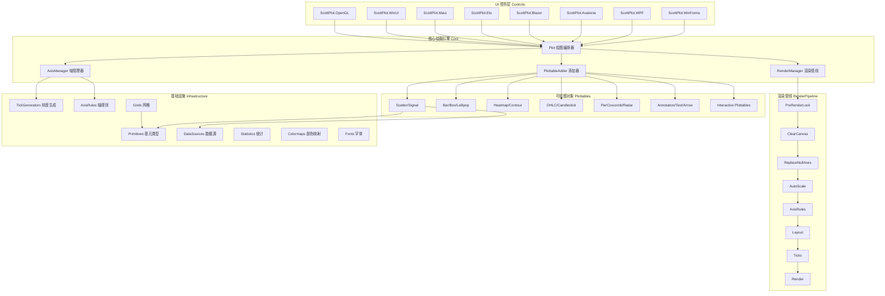
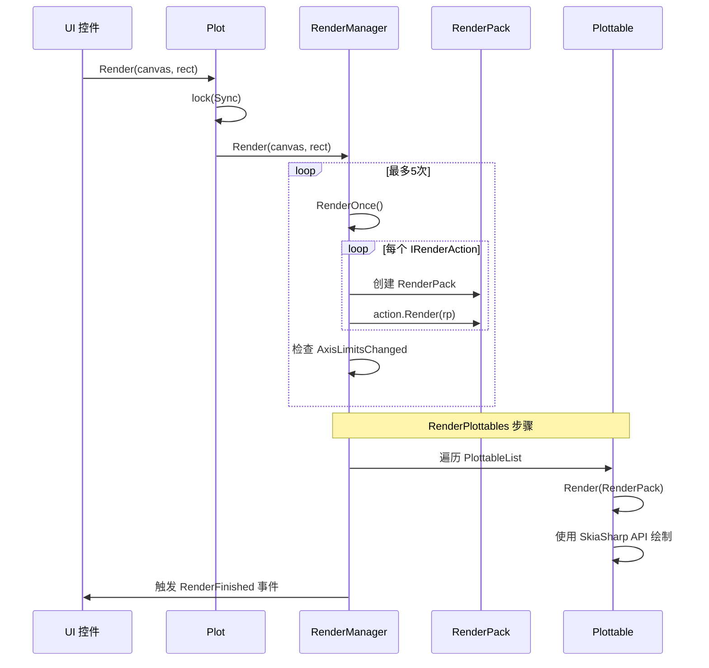

# ScottPlot 软件架构文档

## 1. 项目概览

ScottPlot 是一个免费、开源的 .NET 绘图库（v5.1.59），基于 **SkiaSharp** 进行高性能 2D 渲染，支持跨多种 .NET UI 框架的交互式图表展示。

| 属性 | 说明 |
|------|------|
| 语言 | C# 12 |
| 目标框架 | net462, netstandard2.0, net8.0, net9.0, net10.0 |
| 渲染引擎 | SkiaSharp 3.119.0 + HarfBuzz |
| 许可证 | MIT |
| 解决方案 | [`src/ScottPlot5/ScottPlot5.sln`](src/ScottPlot5/ScottPlot5.sln) |
| 主项目 | [`src/ScottPlot5/ScottPlot5/ScottPlot.csproj`](src/ScottPlot5/ScottPlot5/ScottPlot.csproj) |

---

## 2. 整体架构图



---

## 3. 核心类详解

### 3.1 Plot — 绘图编排器

[`Plot.cs`](src/ScottPlot5/ScottPlot5/Plot.cs) 是面向用户的顶层 API，掌管整个绘图生命周期：

```csharp
public class Plot : IDisposable
{
    public List<IPlottable> PlottableList { get; }    // 所有可绘图对象
    public PlottableAdder Add { get; }                 // 添加 plottable 的便捷门面
    public RenderManager RenderManager { get; }        // 渲染管线
    public AxisManager Axes { get; }                   // 轴管理
    public LayoutManager Layout { get; }               // 布局管理
    public Legend Legend { get; set; }                 // 图例
    public object Sync { get; }                        // 线程同步锁
    public IPlotControl? PlotControl { get; set; }     // 宿主 UI 控件引用
    // ...
}
```

**关键职责**：
- 维护 `PlottableList` 列表（CRUD、排序）
- 提供像素 ↔ 坐标转换（`GetPixel` / `GetCoordinates`）
- 提供交互式手柄查询（`GetInteractiveHandle`）
- 输出图像：PNG/SVG/JPEG/BMP/WebP/SVG XML
- 样式设置：`SetStyle()` / `GetStyle()` / `Font`

### 3.2 PlottableAdder — 添加器门面

[`PlottableAdder.cs`](src/ScottPlot5/ScottPlot5/PlottableAdder.cs) 是一个 **~1580 行**的 Helper 类，为每种 Plottable 类型提供便捷的 `Add.Xxx()` 工厂方法。通过 `plot.Add.Scatter(xs, ys)` 风格调用。

- 使用 `IPalette` 自动为新添加的 plottable 分配颜色
- 所有方法 **必须按字母序排列**（由单元测试强制检查）

### 3.3 AxisManager — 轴管理器

[`AxisManager.cs`](src/ScottPlot5/ScottPlot5/AxisManager.cs) 管理所有轴、面板、网格和自动缩放。

```
AxisManager
├── XAxes: List<IXAxis>          // 水平轴集合
├── YAxes: List<IYAxis>          // 垂直轴集合
├── Panels: List<IPanel>         // 辅助面板（如颜色条）
├── Title: TitlePanel            // 标题面板
├── DefaultGrid: DefaultGrid     // 默认网格
├── CustomGrids: List<IGrid>     // 自定义网格
├── Rules: List<IAxisRule>       // 轴规则（锁定、方形缩放等）
├── AutoScaler: IAutoScaler      // 自动缩放策略
└── LinkedAxisRules              // 跨 Plot 轴联动
```

**关键操作**：`AutoScale()`, `SetLimits()`, `Pan()`, `Zoom()`, `SquareUnits()`, `Link()`

### 3.4 RenderManager — 渲染管线

[`RenderManager.cs`](src/ScottPlot5/ScottPlot5/Rendering/RenderManager.cs) 实现了一个 **可扩展的 IRenderAction 管道**，按顺序执行 24 个渲染步骤。

**渲染流程（按执行顺序）**：

| # | RenderAction | 说明 |
|---|-------------|------|
| 1 | `PreRenderLock` | 触发预渲染锁事件 |
| 2 | `ClearCanvas` | 清空画布 |
| 3 | `ReplaceNullAxesWithDefaults` | 未设置轴的 plottable 关联默认轴 |
| 4 | `AutoScaleUnsetAxes` | 自动缩放未设置范围的轴 |
| 5 | `ContinuouslyAutoscale` | 持续自动缩放（如果启用） |
| 6 | `ExecutePlottableAxisManagers` | 执行 plottable 级轴管理 |
| 7 | `ApplyAxisRulesBeforeLayout` | 布局前应用轴规则 |
| 8 | `CalculateLayout` | 计算布局和 DataRect |
| 9 | `RenderFigureBackground` | 渲染图形背景 |
| 10 | `ApplyAxisRulesAfterLayout` | 布局后应用轴规则 |
| 11 | `RegenerateTicks` | 重新生成刻度 |
| 12 | `RenderStartingEvent` | 触发 RenderStarting 事件 |
| 13 | `RenderDataBackground` | 渲染数据区背景 |
| 14 | `StoreGLState` | 保存 OpenGL 状态 |
| 15 | `RenderGridsBelowPlottables` | 渲染底层网格 |
| 16 | `RestoreGLState` | 恢复 OpenGL 状态 |
| 17 | `RenderPlottables` | **渲染所有 plottable** |
| 18 | `RenderGridsAbovePlottables` | 渲染顶层网格 |
| 19 | `RenderLegends` | 渲染图例 |
| 20 | `RenderPanels` | 渲染面板 |
| 21 | `RenderBorders` | 渲染边框 |
| 22 | `RenderZoomRectangle` | 渲染缩放矩形 |
| 23 | `SyncGLPlottables` | 同步 OpenGL plottable |
| 24 | `RenderPlottablesLast` | 最后渲染的 plottable |
| 25 | `RenderBenchmark` | 性能基准信息 |

**重要机制**：
- `Render()` 最多重试 **5 次**，每次检测 `AxisLimitsChanged` 是否仍需更新
- `RenderActions` 列表为 **public**，外部可注入自定义渲染行为
- `Sync` 对象提供线程安全的渲染锁

### 3.5 IPlottable — 可绘图对象接口

所有绘图元素必须实现 [`IPlottable`](src/ScottPlot5/ScottPlot5/Interfaces/IPlottable.cs)：

```csharp
public interface IPlottable
{
    bool IsVisible { get; set; }
    IAxes Axes { get; set; }
    AxisLimits GetAxisLimits();
    void Render(RenderPack rp);
    IEnumerable<LegendItem> LegendItems { get; }
}
```

---

## 4. 项目分层结构

```
src/ScottPlot5/
├── ScottPlot5/            ← 核心库（NuGet 包: ScottPlot）
│   ├── Plot.cs            ← 顶层 API 入口
│   ├── PlottableAdder.cs  ← 添加 plottable 的门面
│   ├── AxisManager.cs     ← 轴管理
│   ├── Plottables/        ← 60+ 种绘图类型
│   ├── Primitives/        ← 100+ 种基元值类型
│   ├── Rendering/         ← 渲染管线 + RenderActions
│   ├── DataSources/       ← 类型化数据源
│   ├── TickGenerators/    ← 刻度生成器（数值/日期/金融/对数）
│   ├── Statistics/        ← 统计分析（直方图/回归/KDE）
│   ├── Interactivity/     ← 交互系统（鼠标动作/用户动作）
│   ├── Interfaces/        ← 50+ 接口定义
│   ├── Colormaps/         ← 30+ 颜色映射方案
│   ├── Palettes/          ← 调色板
│   ├── Stylers/           ← 样式设置器
│   ├── Fonts/             ← 字体系统
│   ├── Grids/             ← 网格
│   ├── Panels/            ← 面板（颜色条等）
│   ├── AxisPanels/        ← 轴面板
│   ├── AxisRules/         ← 轴规则
│   ├── AxisLimitManagers/ ← 轴限制管理器
│   ├── AutoScalers/       ← 自动缩放策略
│   ├── LayoutEngines/     ← 布局引擎
│   ├── PathStrategies/    ← 路径策略
│   ├── ArrowShapes/       ← 箭头形状
│   ├── Hatches/           ← 填充图案
│   ├── Finance/           ← 金融指标（布林带/均线）
│   ├── StarAxes/          ← 星形图轴
│   ├── Triangulation/     ← 三角剖分
│   ├── Reporting/         ← 报表生成
│   └── Notices/           ← 第三方依赖声明
│
├── ScottPlot5 Controls/   ← 跨平台 UI 控件（各自独立 NuGet 包）
│   ├── ScottPlot.WinForms/
│   ├── ScottPlot.WPF/
│   ├── ScottPlot.Avalonia/
│   ├── ScottPlot.Blazor/
│   ├── ScottPlot.Eto/
│   ├── ScottPlot.Maui/
│   ├── ScottPlot.WinUI/
│   └── ScottPlot.OpenGL/  ← OpenGL 加速渲染
│
├── ScottPlot5 Cookbook/   ← 示例代码 + 网页生成
├── ScottPlot5 Demos/      ← 演示应用
├── ScottPlot5 Benchmarks/ ← 性能基准测试
├── ScottPlot5 Tests/      ← 单元测试 + 图形化测试
└── ScottPlot5 Sandbox/    ← 开发沙箱项目
```

---

## 5. 控件层架构

每个 UI 控件遵循统一的模式：

```
XxxPlot.cs         ← 主控件（公开 API）
XxxPlotBase.cs     ← 基类（处理渲染循环、鼠标交互）
XxxPlotExtensions.cs ← 扩展方法（Pixel ↔ Coordinates 转换）
XxxPlotMenu.cs     ← 右键菜单
XxxPlotGL.cs       ← OpenGL 加速版本（可选）
XxxPlotViewer.cs   ← 独立图像查看器（可选）
```

以 WPF 控件为例（[`WpfPlot.cs`](src/ScottPlot5/ScottPlot5%20Controls/ScottPlot.WPF/WpfPlot.cs)）：
- 继承 `WpfPlotBase`，WpfPlotBase 继承 `SKElement`（SkiaSharp WPF 控件）
- 持有 `Plot` 实例，在 `OnPaintSurface` 中调用 `Plot.Render()`
- 通过 `IPlotControl` 接口实现标准交互（鼠标拖拽/滚轮缩放等）

---

## 6. 数据流与渲染流程



---

## 7. 关键技术决策

| 决策 | 说明 |
|------|------|
| **SkiaSharp 渲染** | 不依赖平台 GDI/GPU API，保证跨平台一致性 |
| **IRenderAction 管道** | 可扩展的渲染步骤，用户可注入自定义行为 |
| **PlottableAdder 门面** | 统一所有 Plottable 的创建入口，自动颜色分配 |
| **Axes 与 Plottable 解耦** | 每个 Plottable 通过 `IAxes` 引用自己的 X/Y 轴，支持多轴绘图 |
| **线程安全** | `Plot.Sync` 锁保护渲染与数据修改的竞态条件 |
| **OpenGL 可选加速** | `ScottPlot.OpenGL` 包提供 GL 渲染路径，仅影响特定 Plottable |
| **强名称签名** | 使用 `Key.snk` 签名程序集 |
| **隐式 using 禁用** | `ImplicitUsings=disable`，需要显式 using |

---

## 8. NuGet 包结构

| 包名 | 项目路径 | 说明 |
|------|----------|------|
| `ScottPlot` | ScottPlot5/ | 核心绘图库 |
| `ScottPlot.WinForms` | Controls/ScottPlot.WinForms/ | WinForms 控件 |
| `ScottPlot.WPF` | Controls/ScottPlot.WPF/ | WPF 控件 |
| `ScottPlot.Avalonia` | Controls/ScottPlot.Avalonia/ | Avalonia 控件 |
| `ScottPlot.Blazor` | Controls/ScottPlot.Blazor/ | Blazor 控件 |
| `ScottPlot.Eto` | Controls/ScottPlot.Eto/ | Eto.Forms 控件 |
| `ScottPlot.Maui` | Controls/ScottPlot.Maui/ | MAUI 控件 |
| `ScottPlot.WinUI` | Controls/ScottPlot.WinUI/ | WinUI 控件 |
| `ScottPlot.OpenGL` | Controls/ScottPlot.OpenGL/ | OpenGL 加速扩展 |
