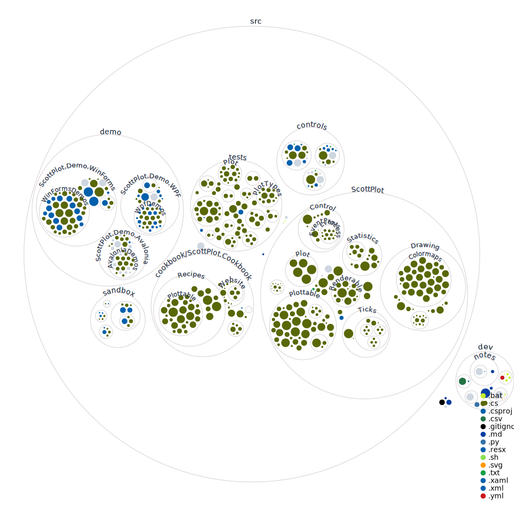

# Contribute to ScottPlot

**ScottPlot welcomes contributions from the open-source community!** Bug reports, questions, and feature suggestions are welcome as [issues](https://github.com/swharden/ScottPlot/issues) or [discussions](https://github.com/swharden/ScottPlot/discussions/categories/q-a).

## Pull Requests

**Consider creating an issue to discuss your pull request _before_ investing a lot of work into it.** This is an opportunity to ensure your modifications (and their timing) will be consistent with the direction ScottPlot is going, also a good chance to get feedback and suggestions that may improve your implementation.

**If your code is not auto-formatted, the build will fail** when you create your pull request. Use [autoformat.bat](src/autoformat.bat) or run these commands to autoformat the entire code base:

```sh
dotnet tool update -g dotnet-format
dotnet format
```

## Code Diagram

