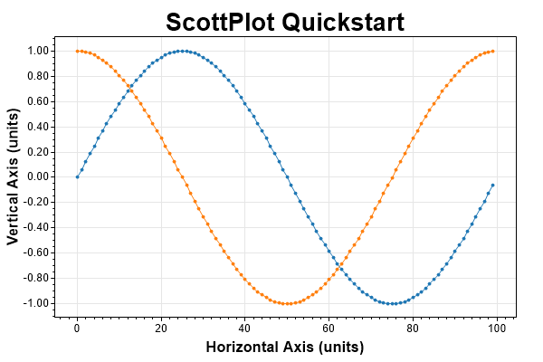

# ScottPlot

**ScottPlot is an open-source interactive graphing library for .NET written in C#.** It was written to simplify the task of interactively displaying data on a graph that you can left-click-drag to pan and right-click-drag to zoom. ScottPlot works in Windows Forms (as a user control) or in console applications (as a portable class library). [Compiled demos](demos) are available so you can see what using ScottPlot is like without messing around with source code.


### Interactive Plotting of Large Data Sets
A primary goal of ScottPlot is to allow interactive display of evenly-spaced data containing millions points. ScottPlot has a signal plotting method which is optimized for highspeed display of large arrays with evenly spaced data ideal for plotting signals (e.g., WAV files).


## Quickstart: Windows Forms
To create a Windows Form Application to interactively display data with ScottPlot, perform these steps:

* Create a new project (Windows Forms App)
* Add ScottPlot to your solution
  * Download this repository to your computer
  * File -> Add -> Existing Project
  * Select `/src/ScottPlot/ScottPlot.csproj`
  * Build -> Rebuild Solution
* Drag/Drop the ScottPlotUC (from the toolbox) onto your form
* Resize the plot as needed (or set its docking mode to fill)
* Add the code below to your startup sequence.
* Press F5 to run

```cs
// create some data to plot
int pointCount = 100;
double[] dataXs = new double[pointCount];
double[] dataSin = new double[pointCount];
double[] dataCos = new double[pointCount];
for (int i = 0; i < pointCount; i++)
{
	dataXs[i] = i;
	dataSin[i] = Math.Sin(i * 2 * Math.PI / pointCount);
	dataCos[i] = Math.Cos(i * 2 * Math.PI / pointCount);
}

// plot the data
scottPlotUC1.plt.data.AddScatter(dataXs, dataSin);
scottPlotUC1.plt.data.AddScatter(dataXs, dataCos);
scottPlotUC1.plt.settings.AxisFit();
scottPlotUC1.plt.settings.title = "ScottPlot Quickstart";
scottPlotUC1.Render();
```


## Quickstart: Console Applications
While the previous example uses the ScottPlotUC (user control) to provide interactive graphing for GUI applications, this example shows how to instantiate the ScottPlot class directly, add data, and save the output as a PNG file. This method can be used for console applications.

```cs
// create some data to plot
int pointCount = 100;
double[] dataXs = new double[pointCount];
double[] dataSin = new double[pointCount];
double[] dataCos = new double[pointCount];
for (int i = 0; i < pointCount; i++)
{
    dataXs[i] = i;
    dataSin[i] = Math.Sin(i * 2 * Math.PI / pointCount);
    dataCos[i] = Math.Cos(i * 2 * Math.PI / pointCount);
}

// plot the data
ScottPlot.Plot plt = new ScottPlot.Plot(600, 400);
plt.data.AddScatter(dataXs, dataSin);
plt.data.AddScatter(dataXs, dataCos);
plt.settings.AxisFit();
plt.settings.title = "ScottPlot Quickstart";
plt.figure.Save("quickstart2.png");
```



## Supports Windows Forms and WPF Applications
* Most [demos](demos) and [examples](/doc/) demonstrate ScottPlot in Windows Forms
* To see how to use ScottPlot with WPF check out [/doc/wpf/](/doc/wpf/)
* The [ScottPlot Cookbook](doc) demonstrates much of what ScottPlot can do.
* Additional demos are in the [demos](demos) folder

## Core Concepts & Features
* Simplistic API does not require documentation with a predictive IDE
  * `plt.data` - methods to add or remove data
  * `plt.settings` - control colors, labels, and axis limits
  * `plt.figure` - to get a bitmap buffer or save the graph as a file
* No dependencies (just the standard .NET libraries)
* ScottPlot can interactively display large datasets (10+ million points)
* Windows Forms Applications can use the ScottPlotUC user control
* Console Applications can use the ScottPlot class (like the [test suite](/test/) does)
* Free, open-source, permissive [license](LICENSE)
