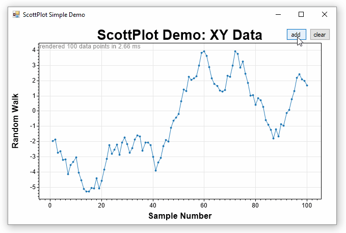
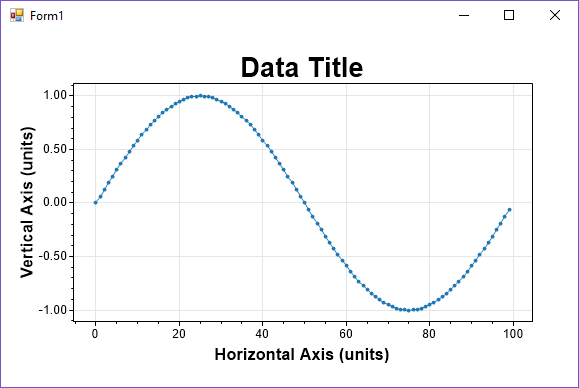
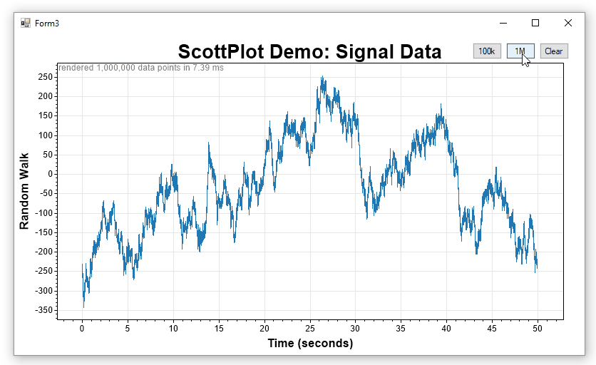

# ScottPlot

**ScottPlot is an open-source interactive graphing library for .NET written in C#.** It was written to simplify the task of interactively displaying data on a graph that you can left-click-drag to pan and right-click-drag to zoom. ScottPlot is provided with a Windows Forms user control for easy interactive graphing, but it can also be used in console applications.



[Compiled demos](demos) are available so you can see what using ScottPlot is like without messing around with source code.

## Quickstart
To create a Windows Form Application to display data with ScottPlot, perform these steps:

* Create a new project (Windows Forms App)
* Add ScottPlot to your solution
  * Download this repository to your computer
  * File -> Add -> Existing Project
  * Select `/src/ScottPlot/ScottPlot.csproj`
  * Build -> Rebuild Solution
* Drag/Drop the ScottPlotUC (from the toolbox) onto your form
* Resize the plot as needed (or set its docking mode to fill)
* Add the code below to your startup sequence.
* Press F5 to run

```cs
// create some data to plot
int pointCount = 100;
double[] dataXs = new double[pointCount];
double[] dataSin = new double[pointCount];
double[] dataCos = new double[pointCount];
for (int i = 0; i < pointCount; i++)
{
	dataXs[i] = i;
	dataSin[i] = Math.Sin(i * 2 * Math.PI / pointCount);
	dataCos[i] = Math.Cos(i * 2 * Math.PI / pointCount);
}

// plot the data
scottPlotUC1.plt.data.AddScatter(dataXs, dataSin);
scottPlotUC1.plt.data.AddScatter(dataXs, dataCos);
scottPlotUC1.plt.settings.AxisFit();
scottPlotUC1.plt.settings.title = "ScottPlot Quickstart";
scottPlotUC1.Render();
```



## Additional Examples
The [ScottPlot Cookbook](doc) demonstrates much of what ScottPlot can do.

## Core Concepts & Features
* No dependencies (just the standard .NET libraries)
* Windows Forms Applications can use the ScottPlotUC user control
* Console Applications can use the ScottPlot class (like the [test suite](/tests/) does)
* Simplistic API does not require documentation with a predictive IDE
  * `plt.data` - methods to add or remove data
  * `plt.settings` - control colors, labels, and axis limits
  * `plt.figure` - to get a bitmap buffer or save the graph as a file
* ScottPlot can interactively display large datasets (10+ million points)


