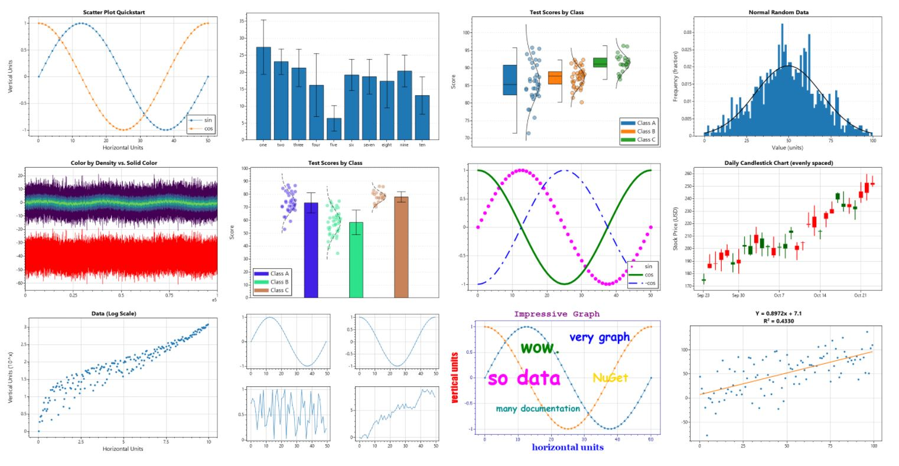

# ScottPlot

**ScottPlot is a free and open-source plotting library for .NET** that makes it easy to interactively display large datasets. The [**ScottPlot Cookbook**](https://scottplot.net/cookbook/5.0/) demonstrates how to create line plots, bar charts, pie graphs, scatter plots, and more with just a few lines of code. The **[ScottPlot Demo](https://scottplot.net/demo/)** shows how to create plots in GUI environments with advanced interactive behaviors. ScottPlot supports 
    [Windows Forms](https://scottplot.net/quickstart/winforms/), 
    [WPF](https://scottplot.net/quickstart/wpf/),
    [Console](https://scottplot.net/quickstart/console/),
    [Blazor](https://scottplot.net/quickstart/blazor/),
    [Avalonia](https://scottplot.net/quickstart/avalonia/),
    [Eto](https://scottplot.net/quickstart/eto/),
    [Notebooks](https://scottplot.net/quickstart/notebook/),
    and [more](https://scottplot.net/quickstart/)!

### Visit https://ScottPlot.NET for documentation and additional information

**Contributing:** We welcome contributions from the community! We invite contributions from anyone, including developers who may be new to contributing to open-source projects. Visit https://ScottPlot.net/contributing/ to get started!

**License:** ScottPlot was created by [Scott W Harden](https://swharden.com/about/) and enhanced by [many contributions](https://scottplot.net/changelog/) from the [open-source community](https://scottplot.net/contributors/). It is provided under the permissive [MIT license](LICENSE) and is free to modify and use for any purpose.

If you enjoy ScottPlot ***give us a star!*** ⭐ 