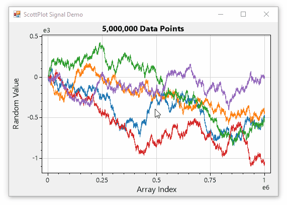
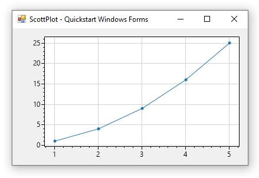

# ScottPlot

[](https://github.com/ScottPlot/ScottPlot/actions/workflows/ci-ScottPlot-v4.yaml)
[](https://www.nuget.org/packages/ScottPlot/)
[](https://www.nuget.org/packages/ScottPlot/)
[](LICENSE)

**ScottPlot is a free and open-source plotting library for .NET** that makes it easy to interactively display large datasets. The [**ScottPlot Cookbook**](https://scottplot.net/cookbook) demonstrates how to create line plots, bar charts, pie graphs, scatter plots, and more with just a few lines of code.

* **[ScottPlot Cookbook](https://scottplot.net/cookbook)** 👈 _Learn how to use ScottPlot_

* **[ScottPlot Demo](https://scottplot.net/demo/)** 👈 _See what ScottPlot can do_

* **Quickstart:** [**WinForms**](https://scottplot.net/quickstart/winforms/), [**WPF**](https://scottplot.net/quickstart/wpf/), [**Avalonia**](https://scottplot.net/quickstart/avalonia/), [**Console**](https://scottplot.net/quickstart/console/)

<div align='center'>

<a href='https://scottplot.net'></a>

<a href='https://scottplot.net/cookbook'></a>

</div>

### Questions and Feedback

* **Ask questions** in [Discussions](https://github.com/ScottPlot/ScottPlot/discussions/categories/q-a), [Issues](https://github.com/ScottPlot/ScottPlot/issues), or [on StackOverflow]((https://stackoverflow.com/questions/ask?tags=scottplot))

* [**Create an issue**](https://github.com/ScottPlot/ScottPlot/issues) for a feature suggestion or bug report

* If you enjoy ScottPlot **give us a star!** ⭐

### Quickstart

**Windows Forms:** Use NuGet to install [`ScottPlot.WinForms`](https://www.nuget.org/packages/ScottPlot.WinForms), drag/drop a `FormsPlot` onto your form, then add the following to your start-up sequence:

```cs
double[] xs = new double[] {1, 2, 3, 4, 5};
double[] ys = new double[] {1, 4, 9, 16, 25};
formsPlot1.Plot.AddScatter(xs, ys);
```



**More Quickstarts:**
* [**Console Application** Quickstart](https://scottplot.net/quickstart/console/)
* [**Windows Forms** Quickstart](https://scottplot.net/quickstart/winforms/)
* [**WPF** Quickstart](https://scottplot.net/quickstart/wpf/)
* [**Avalonia** Quickstart](https://scottplot.net/quickstart/avalonia/)

### Plot in the Cloud with ScottPlot

**This figure is an example of ScottPlot running in the cloud.** Every hour an [Azure Function](https://azure.microsoft.com/en-us/services/functions/) hits the [GitHub API](https://docs.github.com/en/rest) to get an updated list of stargazers, then uses ScottPlot to create a figure from this data and saves it to web-accessible blob storage. Since this automatically-generated plot is just a static image accessible by a URL, it can be displayed in places where JavaScript is not permitted (like in this readme file). Creating plots as images on a server allows dynamic plots to be displayed in many interesting places!


<p align="center">
  <a href="https://stargraph.z20.web.core.windows.net/scottplot-stars.png?" target="_blank">
    
  </a>
</p>

<p align="center">
  <a href="https://nugetppt.z20.web.core.windows.net/plots/scottplot.png?" target="_blank">
    
  </a>
</p>

**Try it out!** Give us a star and come back in an hour and your name will appear [here](https://stargraph.z20.web.core.windows.net/scottplot-stars.png)

### Developer Notes

* **Minimum Supported Platforms:** .NET Core 2.0 and .NET Framework 4.6.1 ([see details](https://swharden.com/scottplot/#supported-platforms))

* **Active development is focused on** topics listed in the pinned _Triaged Tasks and Features_ [issues](https://github.com/ScottPlot/ScottPlot/issues).

* **Contributions are welcome!** See [contributing.md](CONTRIBUTING.md) to get started

### About ScottPlot

ScottPlot was created by [Scott W Harden](https://swharden.com/about/) (with many contributions from the open-source community) and is provided under the permissive [MIT license](LICENSE).