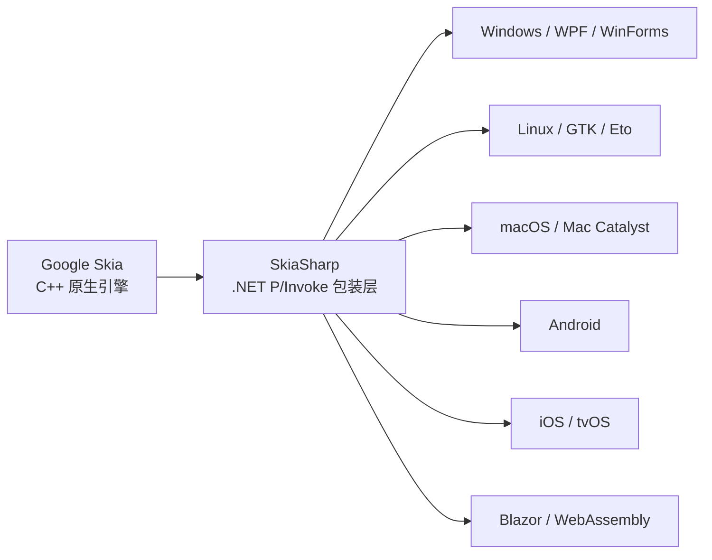

# SkiaSharp 介绍

## 1. 什么是 SkiaSharp?

**SkiaSharp** 是 Google 开发的开源 2D 图形库 **Skia** 的 .NET 跨平台绑定，为 .NET 生态系统提供高性能的 2D 渲染能力。



SkiaSharp 是 Google Skia 图形引擎在 .NET 世界的镜像。Skia 本身是 **Chrome、Android、Flutter、Firefox** 等产品背后的 2D 图形引擎——这意味着你看到的几乎所有网页和移动应用界面，底层都可能有 Skia 的身影。

---

## 2. 关键特性

| 特性 | 说明 |
|------|------|
| **跨平台** | 一套 API，覆盖 Windows / Linux / macOS / Android / iOS / Blazor WebAssembly |
| **高性能** | 基于 C++ 原生 Skia 引擎，GPU 加速（OpenGL / Vulkan / Metal 后端） |
| **丰富的绘制 API** | 路径、形状、文本、图像、渐变、着色器、滤镜等 |
| **文本渲染** | 内置 HarfBuzz 文本整形引擎，支持复杂文字布局 |
| **像素完美** | 不依赖平台 GDI+ / Direct2D / CoreGraphics，保证跨平台像素一致性 |
| **文件格式** | 支持 PNG、JPEG、WebP、SVG、PDF 等多种输出格式 |

---

## 3. 在 ScottPlot 中的角色

从 [`ARCHITECTURE.md`](ARCHITECTURE.md) 可以看到，ScottPlot 使用 **SkiaSharp 3.119.0 + HarfBuzz** 作为其唯一渲染引擎（[第 11 行](ARCHITECTURE.md#L11)）：

```
┌─────────────────────────────────────────────────────┐
│                  ScottPlot 架构                       │
│                                                       │
│  UI 控件 (WPF/WinForms/Avalonia/Blazor...)            │
│       │                                               │
│       ▼                                               │
│  Plot (顶层 API)                                      │
│       │                                               │
│       ▼                                               │
│  RenderManager (渲染管线，25 步)                       │
│       │                                               │
│       ▼                                               │
│  ┌──────────────────────┐                             │
│  │     SkiaSharp        │  ← 所有像素绘制             │
│  │  (SKCanvas/SKPaint/  │     都在这里完成             │
│  │   SKBitmap/SKPath)   │                             │
│  └──────────────────────┘                             │
│       │                                               │
│       ▼                                               │
│  输出: PNG / JPEG / BMP / SVG / WebP                  │
└─────────────────────────────────────────────────────┘
```

每个 `IPlottable`（Scatter、Bar、Heatmap 等 60+ 种绘图类型）的 [`Render()`](src/ScottPlot5/ScottPlot5/Interfaces/IPlottable.cs) 方法接收一个 `RenderPack`，其中包含 `SKCanvas` 对象，随后通过 SkiaSharp API 进行实际绘制。

---

## 4. 为什么选择 SkiaSharp？

ScottPlot 需要支持 **5 个目标框架**（`net462`、`netstandard2.0`、`net8.0`、`net9.0`、`net10.0`）和 **8 种 UI 框架**（WPF、WinForms、Avalonia、Blazor、Eto、MAUI、WinUI、OpenGL），SkiaSharp 是唯一能在**所有平台使用同一套渲染代码**的方案。

| 传统方案 | 局限 |
|----------|------|
| `System.Drawing`（GDI+） | 仅 Windows 可用，已被微软标记为废弃 |
| WPF Direct2D | 仅 Windows 可用 |
| macOS CoreGraphics | 仅 macOS 可用 |
| **SkiaSharp** | **全部平台可用，像素级一致** |

---

## 5. 与 WPF 的集成示例

以 ScottPlot WPF 控件为例（[`WpfPlotBase.cs`](src/ScottPlot5/ScottPlot5%20Controls/ScottPlot.WPF/WpfPlotBase.cs)），WPF 基类继承自 SkiaSharp 提供的 `SKElement`：

```
WpfPlot ⟹ WpfPlotBase ⟹ SKElement (SkiaSharp.WPF)
                                │
                                ▼
                     OnPaintSurface() 中调用
                     Plot.Render(skCanvas, rect)
```

SkiaSharp 为每个 UI 框架都提供了原生画布宿主控件（`SKElement` / `SKGLControl` / `SKCanvasView`），使得 ScottPlot 无需关心平台差异。

---

## 6. OpenGL 加速变体

ScottPlot 还提供了 [`ScottPlot.OpenGL`](src/ScottPlot5/ScottPlot5%20Controls/ScottPlot.OpenGL/) 包，利用 SkiaSharp 的 **GPU 后端**（`GRContext` + OpenGL）来加速某些 plottable 的渲染。渲染管线中专门的 `StoreGLState` / `RestoreGLState` 步骤负责在 GL 渲染和 Skia 软件渲染之间正确切换状态。

---

## 7. 核心 SkiaSharp 类型速查

| 类型 | 说明 |
|------|------|
| `SKCanvas` | 画布——所有绘制命令的接收者 |
| `SKPaint` | 画笔——定义颜色、粗细、样式、抗锯齿等 |
| `SKPath` | 路径——构建复杂几何形状 |
| `SKBitmap` | 位图——像素缓冲区 |
| `SKSurface` | 表面——渲染目标 |
| `SKImage` | 图像——不可变的图片表示 |
| `SKTypeface` | 字体——文本渲染的字体描述 |
| `SKColor` | 颜色——ARGB 颜色值 |
| `SKShader` | 着色器——渐变、平铺等高级填充 |

### ScottPlot 中的使用规范

按照 ScottPlot 项目惯例，painter 对象需要使用 `using` 语句确保正确释放：

```csharp
using Paint paint = Paint.NewDisposablePaint();
```

---

## 8. 总结

> SkiaSharp 本质上就是 **"Chrome 浏览器的渲染引擎，打包成了 .NET 能用的库"**。它让 ScottPlot 这类 .NET 项目能以统一的代码，在所有平台上生成像素级别一致的图表。
