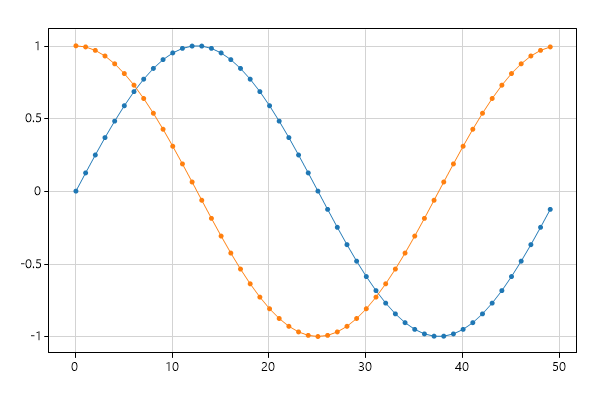
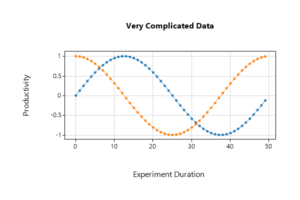

# ScottPlot Cookbook

_This cookbook was automatically generated by [/cookbook/src](/cookbook/src)_

##  Scatter Sin

```cs
var plt = new ScottPlot.Plot(600, 400);
plt.PlotScatter(dataXs, dataSin);
plt.PlotScatter(dataXs, dataCos);
plt.SaveFig(fileName);
```



##  Automatic Margins

```cs
var plt = new ScottPlot.Plot(600, 400);
plt.PlotScatter(dataXs, dataSin);
plt.PlotScatter(dataXs, dataCos);
plt.AxisAuto(0, .5); // no horizontal padding, 50% vertical padding
plt.SaveFig(fileName);
```


##  Defined Axis Limits

```cs
var plt = new ScottPlot.Plot(600, 400);
plt.PlotScatter(dataXs, dataSin);
plt.PlotScatter(dataXs, dataCos);
plt.Axis(2, 8, .2, 1.1); // x1, x2, y1, y2
plt.SaveFig(fileName);
```


##  Zoom and Pan

```cs
var plt = new ScottPlot.Plot(600, 400);
plt.PlotScatter(dataXs, dataSin);
plt.PlotScatter(dataXs, dataCos);
plt.AxisZoom(2, 2);
plt.AxisPan(-10, .5);
plt.SaveFig(fileName);
```


##  Legend

```cs
var plt = new ScottPlot.Plot(600, 400);
plt.PlotScatter(dataXs, dataSin, label: "first");
plt.PlotScatter(dataXs, dataCos, label: "second");
plt.Legend(location: ScottPlot.legendLocation.lowerLeft);
plt.SaveFig(fileName);
```


##  Custom Marker Shapes

```cs
var plt = new ScottPlot.Plot(600, 400);
plt.PlotScatter(dataXs, dataSin, label: "sin", markerShape: ScottPlot.MarkerShape.openCircle);
plt.PlotScatter(dataXs, dataCos, label: "cos", markerShape: ScottPlot.MarkerShape.filledSquare);
plt.Legend();
plt.SaveFig(fileName);
```


## Styling Scatter Plots

```cs
var plt = new ScottPlot.Plot(600, 400);
plt.PlotScatter(dataXs, dataSin, color: Color.Magenta, lineWidth: 0, markerSize: 10);
plt.PlotScatter(dataXs, dataCos, color: Color.Green, lineWidth: 5, markerSize: 0);
plt.AxisAuto(0); // no horizontal margin (default 10% vertical margin)
plt.SaveFig(fileName);
```


## Plot XY Data

```cs
var plt = new ScottPlot.Plot(600, 400);
plt.PlotScatter(dataRandom1, dataRandom2);
plt.SaveFig(fileName);
```


## Plot Lines Only

```cs
var plt = new ScottPlot.Plot(600, 400);
plt.PlotScatter(dataRandom1, dataRandom2, markerSize: 0);
plt.PlotScatter(dataRandom3, dataRandom4, markerSize: 0);
plt.SaveFig(fileName);
```


## Plot Points Only

```cs
var plt = new ScottPlot.Plot(600, 400);
plt.PlotScatter(dataRandom1, dataRandom2, lineWidth: 0);
plt.PlotScatter(dataRandom3, dataRandom4, lineWidth: 0);
plt.SaveFig(fileName);
```


## Styling XY Plots

```cs
var plt = new ScottPlot.Plot(600, 400);
plt.PlotScatter(dataRandom1, dataRandom2, color: Color.Magenta, lineWidth: 3, markerSize: 15);
plt.PlotScatter(dataRandom3, dataRandom4, color: Color.Green, lineWidth: 3, markerSize: 15);
plt.SaveFig(fileName);
```


##  Custom LineStyles

```cs
var plt = new ScottPlot.Plot(600, 400);
plt.PlotScatter(dataRandom1, dataRandom2, label: "dash", lineStyle: ScottPlot.LineStyle.Dash);
plt.PlotScatter(dataRandom3, dataRandom4, label: "dash dot dot", lineStyle: ScottPlot.LineStyle.DashDotDot);
plt.Legend();
plt.SaveFig(fileName);
```


## Plotting Points

```cs
var plt = new ScottPlot.Plot(600, 400);
plt.PlotScatter(dataXs, dataSin);
plt.PlotScatter(dataXs, dataCos);
plt.PlotPoint(25, 0.8);
plt.PlotPoint(30, 0.3, color: Color.Magenta, markerSize: 15);
plt.SaveFig(fileName);
```


## Plotting Text

```cs
var plt = new ScottPlot.Plot(600, 400);
plt.PlotScatter(dataXs, dataSin);
plt.PlotScatter(dataXs, dataCos);
plt.PlotPoint(25, 0.8);
plt.PlotPoint(30, 0.3, color: Color.Magenta, markerSize: 15);
plt.PlotText("important point", 25, 0.8);
plt.PlotText("more important", 30, .3, fontSize: 16, bold: true, alignment: ScottPlot.TextAlignment.upperCenter);
plt.SaveFig(fileName);
```


## Clearing Plots

```cs
var plt = new ScottPlot.Plot(600, 400);
plt.PlotScatter(dataXs, dataSin);
plt.PlotScatter(dataXs, dataCos);
plt.Clear();
plt.PlotScatter(dataRandom3, dataRandom4);
plt.SaveFig(fileName);
```


## Modifying Plotted Data

```cs
var plt = new ScottPlot.Plot(600, 400);
plt.PlotScatter(dataXs, dataSin);
plt.PlotScatter(dataXs, dataCos);

// Even after an array is given to ScottPlot plotted, its contents 
// can be updated and they will be displayed at the next render.
// This is epsecially useful to know for creating live data displays.
for (int i = 10; i < 20; i++)
{
    dataSin[i] = i / 10.0;
    dataCos[i] = 2 * i / 10.0;
}

plt.SaveFig(fileName);

PrepareDataSmall(); // hide
```


## Small Plot

```cs
var plt = new ScottPlot.Plot(200, 150);
plt.PlotScatter(dataXs, dataSin);
plt.PlotScatter(dataXs, dataCos);
plt.SaveFig(fileName);
```


##  Title and Axis Labels

```cs
var plt = new ScottPlot.Plot(600, 400);
plt.PlotScatter(dataXs, dataSin);
plt.PlotScatter(dataXs, dataCos);

plt.Title("Very Complicated Data");
plt.XLabel("Experiment Duration");
plt.YLabel("Productivity");

plt.SaveFig(fileName);
```


##  Extra Padding

```cs
var plt = new ScottPlot.Plot(600, 400);
plt.PlotScatter(dataXs, dataSin);
plt.PlotScatter(dataXs, dataCos);

plt.Title("Very Complicated Data");
plt.XLabel("Experiment Duration");
plt.YLabel("Productivity");

plt.TightenLayout(padding: 40);

plt.SaveFig(fileName);
```



## Custom Colors

```cs
var plt = new ScottPlot.Plot(600, 400);

Color figureBgColor = ColorTranslator.FromHtml("#001021");
Color dataBgColor = ColorTranslator.FromHtml("#021d38");
plt.Style(figBg: figureBgColor, dataBg: dataBgColor);
plt.Grid(color: ColorTranslator.FromHtml("#273c51"));
plt.Ticks(color: Color.LightGray);
plt.PlotScatter(dataXs, dataSin);
plt.PlotScatter(dataXs, dataCos);
plt.Title("Very Complicated Data", color: Color.White);
plt.XLabel("Experiment Duration", color: Color.LightGray);
plt.YLabel("Productivity", color: Color.LightGray);
plt.SaveFig(fileName);
```


## Frameless Plot

```cs
var plt = new ScottPlot.Plot(600, 400);
Color figureBgColor = ColorTranslator.FromHtml("#001021");
Color dataBgColor = ColorTranslator.FromHtml("#021d38");
plt.Style(figBg: figureBgColor, dataBg: dataBgColor);
plt.Grid(color: ColorTranslator.FromHtml("#273c51"));
plt.Ticks(displayTicksX: false, displayTicksY: false);
plt.Frame(drawFrame: false);
plt.PlotScatter(dataXs, dataSin);
plt.PlotScatter(dataXs, dataCos);
plt.TightenLayout(padding: 0);
plt.SaveFig(fileName);
```


## Disable the Grid

```cs
var plt = new ScottPlot.Plot(600, 400);
plt.PlotScatter(dataXs, dataSin);
plt.PlotScatter(dataXs, dataCos);
plt.Grid(false);
plt.SaveFig(fileName);
```


## Corner Axis Frame

```cs
var plt = new ScottPlot.Plot(600, 400);
plt.PlotScatter(dataXs, dataSin);
plt.PlotScatter(dataXs, dataCos);
plt.Grid(false);
plt.Frame(right: false, top: false);
plt.SaveFig(fileName);
```


## Horizontal Ticks Only

```cs
var plt = new ScottPlot.Plot(600, 400);
plt.PlotScatter(dataXs, dataSin);
plt.PlotScatter(dataXs, dataCos);
plt.Grid(false);
plt.Ticks(displayTicksY: false);
plt.Frame(left: false, right: false, top: false);
plt.SaveFig(fileName);
```


## Very Large Numbers

```cs
Random rand = new Random(0);
int pointCount = 100;
double[] largeXs = ScottPlot.DataGen.Consecutive(pointCount, 1e17);
double[] largeYs = ScottPlot.DataGen.Random(rand, pointCount, 1e21);

var plt = new ScottPlot.Plot(600, 400);
plt.PlotScatter(largeXs, largeYs);
plt.SaveFig(fileName);
```


## Axis Exponent And Offset

```cs
double bigNumber = 9876;

var plt = new ScottPlot.Plot(600, 400);
plt.Title("panned far and really zoomed in");
plt.Axis(bigNumber, bigNumber + .00001, bigNumber, bigNumber + .00001);
plt.SaveFig(fileName);
```


## Very Large Images

```cs
var plt = new ScottPlot.Plot(2000, 1000);
plt.PlotScatter(dataXs, dataSin);
plt.PlotScatter(dataXs, dataCos);
plt.SaveFig(fileName);
```


##  Signal

```cs
// PlotSignal() is much faster than PlotScatter() for large arrays of evenly-spaed data.
// To plot more than 2GB of data, enable "gcAllowVeryLargeObjects" in App.config (Google it)

var plt = new ScottPlot.Plot(600, 400);
plt.Title("Displaying 10 million points with PlotSignal()");
plt.Benchmark();
plt.PlotSignal(tenMillionPoints, sampleRate: 20_000);
plt.SaveFig(fileName);
```


##  SignalConst

```cs
// SignalConst() is faster than PlotSignal() for very large data plots
// - its data cannot be modified after it is loaded
// - here threading was turned off so it renders properly in a console application
// - in GUI applications threading allows it to initially render faster

var plt = new ScottPlot.Plot(600, 400);
plt.Title("Displaying 10 million points with PlotSignalConst()");
plt.Benchmark();
plt.PlotSignalConst(tenMillionPoints, sampleRate: 20_000, useThreading: false);
plt.SaveFig(fileName);
```


## Signal Styling

```cs
var plt = new ScottPlot.Plot(600, 400);
plt.PlotSignal(oneMillionPoints, 20000, lineWidth: 3, color: Color.Red);
plt.SaveFig(fileName);
```


## Vertical and Horizontal Lines

```cs
var plt = new ScottPlot.Plot(600, 400);
plt.PlotScatter(dataXs, dataSin);
plt.PlotScatter(dataXs, dataCos);
plt.PlotVLine(17);
plt.PlotHLine(-.25, color: Color.Red, lineWidth: 3);
plt.SaveFig(fileName);
```


## Axis Spans

```cs
var plt = new ScottPlot.Plot(600, 400);

// things plotted after before spans are covered by them
plt.PlotScatter(dataXs, dataSin, label: "below",
    color: Color.Red, markerShape: ScottPlot.MarkerShape.filledCircle);

// vertical lines and horizontal spans both take X-axis positions
plt.PlotVLine(17, label: "vertical line");
plt.PlotVSpan(19, 27, label: "horizontal span", color: Color.Blue);

// horizontal lines and vertical spans both take Y-axis positions
plt.PlotHLine(-.6, label: "horizontal line");
plt.PlotHSpan(-.25, 0.33, label: "vertical span", color: Color.Green);

// things plotted after are displayed on top of the spans
plt.PlotScatter(dataXs, dataCos, label: "above",
    color: Color.Red, markerShape: ScottPlot.MarkerShape.filledSquare);

plt.Legend();

plt.SaveFig(fileName);
```


## StyleBlue1

```cs
var plt = new ScottPlot.Plot(600, 400);
plt.PlotScatter(dataXs, dataSin, label: "sin");
plt.PlotScatter(dataXs, dataCos, label: "cos");
plt.Title("Very Complicated Data");
plt.XLabel("Experiment Duration");
plt.YLabel("Productivity");
plt.Legend();
plt.Style(ScottPlot.Style.Blue1);
plt.SaveFig(fileName);
```


## StyleBlue2

```cs
var plt = new ScottPlot.Plot(600, 400);
plt.PlotScatter(dataXs, dataSin, label: "sin");
plt.PlotScatter(dataXs, dataCos, label: "cos");
plt.Title("Very Complicated Data");
plt.XLabel("Experiment Duration");
plt.YLabel("Productivity");
plt.Legend();
plt.Style(ScottPlot.Style.Blue2);
plt.SaveFig(fileName);
```


## StyleBlue3

```cs
var plt = new ScottPlot.Plot(600, 400);
plt.PlotScatter(dataXs, dataSin, label: "sin");
plt.PlotScatter(dataXs, dataCos, label: "cos");
plt.Title("Very Complicated Data");
plt.XLabel("Experiment Duration");
plt.YLabel("Productivity");
plt.Legend();
plt.Style(ScottPlot.Style.Blue3);
plt.SaveFig(fileName);
```


## StyleLight1

```cs
var plt = new ScottPlot.Plot(600, 400);
plt.PlotScatter(dataXs, dataSin, label: "sin");
plt.PlotScatter(dataXs, dataCos, label: "cos");
plt.Title("Very Complicated Data");
plt.XLabel("Experiment Duration");
plt.YLabel("Productivity");
plt.Legend();
plt.Style(ScottPlot.Style.Light1);
plt.SaveFig(fileName);
```


## StyleLight2

```cs
var plt = new ScottPlot.Plot(600, 400);
plt.PlotScatter(dataXs, dataSin, label: "sin");
plt.PlotScatter(dataXs, dataCos, label: "cos");
plt.Title("Very Complicated Data");
plt.XLabel("Experiment Duration");
plt.YLabel("Productivity");
plt.Legend();
plt.Style(ScottPlot.Style.Light2);
plt.SaveFig(fileName);
```


## StyleGray1

```cs
var plt = new ScottPlot.Plot(600, 400);
plt.PlotScatter(dataXs, dataSin, label: "sin");
plt.PlotScatter(dataXs, dataCos, label: "cos");
plt.Title("Very Complicated Data");
plt.XLabel("Experiment Duration");
plt.YLabel("Productivity");
plt.Legend();
plt.Style(ScottPlot.Style.Gray1);
plt.SaveFig(fileName);
```


## StyleGray2

```cs
var plt = new ScottPlot.Plot(600, 400);
plt.PlotScatter(dataXs, dataSin, label: "sin");
plt.PlotScatter(dataXs, dataCos, label: "cos");
plt.Title("Very Complicated Data");
plt.XLabel("Experiment Duration");
plt.YLabel("Productivity");
plt.Legend();
plt.Style(ScottPlot.Style.Gray2);
plt.SaveFig(fileName);
```


## StyleBlack

```cs
var plt = new ScottPlot.Plot(600, 400);
plt.PlotScatter(dataXs, dataSin, label: "sin");
plt.PlotScatter(dataXs, dataCos, label: "cos");
plt.Title("Very Complicated Data");
plt.XLabel("Experiment Duration");
plt.YLabel("Productivity");
plt.Legend();
plt.Style(ScottPlot.Style.Black);
plt.SaveFig(fileName);
```


## StyleDefault

```cs
var plt = new ScottPlot.Plot(600, 400);
plt.PlotScatter(dataXs, dataSin, label: "sin");
plt.PlotScatter(dataXs, dataCos, label: "cos");
plt.Title("Very Complicated Data");
plt.XLabel("Experiment Duration");
plt.YLabel("Productivity");
plt.Legend();
plt.Style(ScottPlot.Style.Default);
plt.SaveFig(fileName);
```


## StyleControl

```cs
var plt = new ScottPlot.Plot(600, 400);
plt.PlotScatter(dataXs, dataSin, label: "sin");
plt.PlotScatter(dataXs, dataCos, label: "cos");
plt.Title("Very Complicated Data");
plt.XLabel("Experiment Duration");
plt.YLabel("Productivity");
plt.Legend();
plt.Style(ScottPlot.Style.Control);
plt.SaveFig(fileName);
```


## Plotting With Errorbars

```cs
var plt = new ScottPlot.Plot(600, 400);
plt.Grid(false);

for (int plotNumber = 0; plotNumber < 3; plotNumber++)
{
    // create random data to plot
    Random rand = new Random(plotNumber);
    int pointCount = 20;
    double[] dataX = new double[pointCount];
    double[] dataY = new double[pointCount];
    double[] errorY = new double[pointCount];
    double[] errorX = new double[pointCount];
    for (int i = 0; i < pointCount; i++)
    {
        dataX[i] = i + rand.NextDouble();
        dataY[i] = rand.NextDouble() * 100 + 100 * plotNumber;
        errorX[i] = rand.NextDouble();
        errorY[i] = rand.NextDouble() * 10;
    }

    // demonstrate different ways to plot errorbars
    if (plotNumber == 0)
        plt.PlotScatter(dataX, dataY, lineWidth: 0, errorY: errorY, errorX: errorX,
            label: $"X and Y errors");
    else if (plotNumber == 1)
        plt.PlotScatter(dataX, dataY, lineWidth: 0, errorY: errorY,
            label: $"Y errors only");
    else
        plt.PlotScatter(dataX, dataY, errorY: errorY, errorX: errorX,
            label: $"Connected Errors");
}

plt.Title("Scatter Plot with Errorbars");
plt.Legend();
plt.SaveFig(fileName);
```


## Plot Bar Data

```cs
// create demo data to use for errorbars
double[] yErr = new double[dataSin.Length];
for (int i = 0; i < yErr.Length; i++)
    yErr[i] = dataSin[i] / 5 + .025;

var plt = new ScottPlot.Plot(600, 400);
plt.Title("Bar Plot With Error Bars");
plt.PlotBar(dataXs, dataSin, barWidth: .5, errorY: yErr, errorCapSize: 2);
plt.SaveFig(fileName);
```


## Plot Bar Data Fancy

```cs
// generate some more complex data
Random rand = new Random(0);
int pointCount = 10;
double[] Xs = new double[pointCount];
double[] dataA = new double[pointCount];
double[] errorA = new double[pointCount];
double[] XsB = new double[pointCount];
double[] dataB = new double[pointCount];
double[] errorB = new double[pointCount];
for (int i = 0; i < pointCount; i++)
{
    Xs[i] = i * 10;
    dataA[i] = rand.NextDouble() * 100;
    dataB[i] = rand.NextDouble() * 100;
    errorA[i] = rand.NextDouble() * 10;
    errorB[i] = rand.NextDouble() * 10;
}

var plt = new ScottPlot.Plot(600, 400);
plt.Title("Multiple Bar Plots");
plt.Grid(false);
// we customize barWidth and xOffset to squeeze grouped bars together
plt.PlotBar(Xs, dataA, errorY: errorA, label: "data A", barWidth: 3.2, xOffset: -2);
plt.PlotBar(Xs, dataB, errorY: errorB, label: "data B", barWidth: 3.2, xOffset: 2);
plt.Axis(null, null, 0, null);
plt.Legend();
plt.SaveFig(fileName);
```


## Step Plot

```cs
var plt = new ScottPlot.Plot(600, 400);
plt.PlotStep(dataXs, dataSin);
plt.PlotStep(dataXs, dataCos);
plt.SaveFig(fileName);
```


## Manual Grid Spacing

```cs
var plt = new ScottPlot.Plot(600, 400);
plt.PlotScatter(dataXs, dataSin);
plt.PlotScatter(dataXs, dataCos);
plt.Grid(xSpacing: 2, ySpacing: .1);
plt.SaveFig(fileName);
```


## Histogram

```cs
Random rand = new Random(0);
double[] values1 = ScottPlot.DataGen.RandomNormal(rand, pointCount: 1000, mean: 50, stdDev: 20);
var hist1 = new ScottPlot.Histogram(values1, min: 0, max: 100);

var plt = new ScottPlot.Plot(600, 400);
plt.Title("Histogram");
plt.YLabel("Count (#)");
plt.XLabel("Value (units)");
plt.PlotBar(hist1.bins, hist1.counts, barWidth: 1);
plt.Axis(null, null, 0, null);
plt.SaveFig(fileName);
```


## CPH

```cs
Random rand = new Random(0);
double[] values1 = ScottPlot.DataGen.RandomNormal(rand, pointCount: 1000, mean: 50, stdDev: 20);
double[] values2 = ScottPlot.DataGen.RandomNormal(rand, pointCount: 1000, mean: 45, stdDev: 25);
var hist1 = new ScottPlot.Histogram(values1, min: 0, max: 100);
var hist2 = new ScottPlot.Histogram(values2, min: 0, max: 100);

var plt = new ScottPlot.Plot(600, 400);
plt.Title("Cumulative Probability Histogram");
plt.YLabel("Probability (fraction)");
plt.XLabel("Value (units)");
plt.PlotStep(hist1.bins, hist1.cumulativeFrac, lineWidth: 1.5, label: "sample A");
plt.PlotStep(hist2.bins, hist2.cumulativeFrac, lineWidth: 1.5, label: "sample B");
plt.Legend();
plt.Axis(null, null, 0, 1);
plt.SaveFig(fileName);
```


## Candlestick

```cs
Random rand = new Random(0);
int pointCount = 60;
ScottPlot.OHLC[] ohlcs = ScottPlot.DataGen.RandomStockPrices(rand, pointCount);

var plt = new ScottPlot.Plot(600, 400);
plt.Title("Candlestick Chart");
plt.YLabel("Stock Price (USD)");
plt.XLabel("Day (into Q4)");
plt.PlotCandlestick(ohlcs);
plt.SaveFig(fileName);
```


## OHLC

```cs
Random rand = new Random(0);
int pointCount = 60;
ScottPlot.OHLC[] ohlcs = ScottPlot.DataGen.RandomStockPrices(rand, pointCount);

var plt = new ScottPlot.Plot(600, 400);
plt.Title("Open/High/Low/Close (OHLC) Chart");
plt.YLabel("Stock Price (USD)");
plt.XLabel("Day (into Q4)");
plt.PlotOHLC(ohlcs);
plt.SaveFig(fileName);
```


## Save Scatter Data

```cs
var plt = new ScottPlot.Plot(600, 400);
plt.PlotScatter(dataXs, dataSin);
plt.GetPlottables()[0].SaveCSV("scatter.csv");
plt.SaveFig(fileName);
```


## Save Signal Data

```cs
var plt = new ScottPlot.Plot(600, 400);
plt.PlotSignal(dataCos, sampleRate: 20_000);
plt.GetPlottables()[0].SaveCSV("signal.csv");
plt.SaveFig(fileName);
```


## Custom Fonts

```cs
var plt = new ScottPlot.Plot(600, 400);
plt.Title("Impressive Graph", fontName: "courier new", fontSize: 24, color: Color.Purple, bold: true);
plt.YLabel("vertical units", fontName: "impact", fontSize: 24, color: Color.Red, bold: true);
plt.XLabel("horizontal units", fontName: "georgia", fontSize: 24, color: Color.Blue, bold: true);
plt.PlotScatter(dataXs, dataSin, label: "sin");
plt.PlotScatter(dataXs, dataCos, label: "cos");
plt.PlotText("very graph", 25, .8, fontName: "comic sans ms", fontSize: 24, color: Color.Blue, bold: true);
plt.PlotText("so data", 0, 0, fontName: "comic sans ms", fontSize: 42, color: Color.Magenta, bold: true);
plt.PlotText("many documentation", 3, -.6, fontName: "comic sans ms", fontSize: 18, color: Color.DarkCyan, bold: true);
plt.PlotText("wow.", 10, .6, fontName: "comic sans ms", fontSize: 36, color: Color.Green, bold: true);
plt.PlotText("NuGet", 32, 0, fontName: "comic sans ms", fontSize: 24, color: Color.Gold, bold: true);
plt.Legend(fontName: "comic sans ms", fontSize: 16, bold: true, fontColor: Color.DarkBlue);
plt.SaveFig(fileName);
```


