# ScottPlot Cookbook

_This cookbook was automatically generated by [/cookbook/src](/cookbook/src)_

##  Scatter Sin

```cs
var plt = new ScottPlot.Plot(600, 400);
plt.PlotScatter(dataXs, dataSin);
plt.PlotScatter(dataXs, dataCos);
plt.SaveFig(fileName);
```

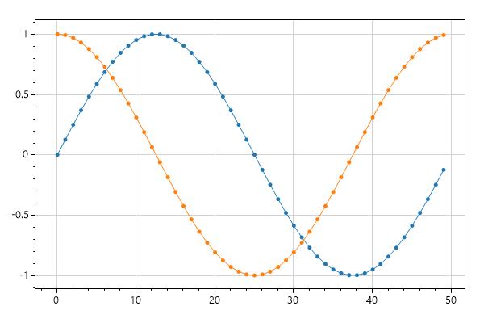

##  Automatic Margins

```cs
var plt = new ScottPlot.Plot(600, 400);
plt.PlotScatter(dataXs, dataSin);
plt.PlotScatter(dataXs, dataCos);
plt.AxisAuto(0, .5); // no horizontal padding, 50% vertical padding
plt.SaveFig(fileName);
```


##  Defined Axis Limits

```cs
var plt = new ScottPlot.Plot(600, 400);
plt.PlotScatter(dataXs, dataSin);
plt.PlotScatter(dataXs, dataCos);
plt.Axis(2, 8, .2, 1.1); // x1, x2, y1, y2
plt.SaveFig(fileName);
```


##  Zoom and Pan

```cs
var plt = new ScottPlot.Plot(600, 400);
plt.PlotScatter(dataXs, dataSin);
plt.PlotScatter(dataXs, dataCos);
plt.AxisZoom(2, 2);
plt.AxisPan(-10, .5);
plt.SaveFig(fileName);
```

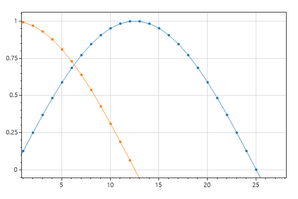

##  Legend

```cs
var plt = new ScottPlot.Plot(600, 400);
plt.PlotScatter(dataXs, dataSin, label: "first");
plt.PlotScatter(dataXs, dataCos, label: "second");
plt.Legend(location: ScottPlot.legendLocation.lowerLeft);
plt.SaveFig(fileName);
```

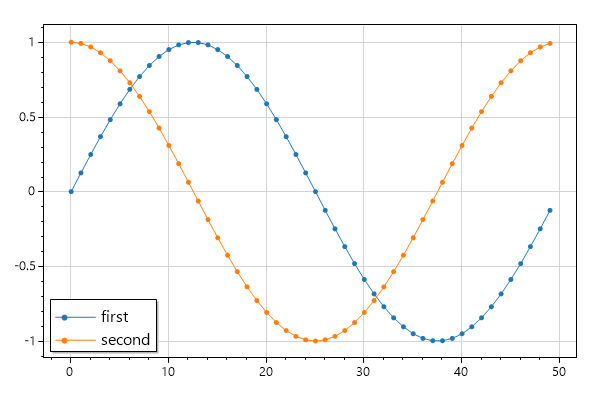

##  Custom Marker Shapes

```cs
var plt = new ScottPlot.Plot(600, 400);
plt.PlotScatter(dataXs, dataSin, label: "sin", markerShape: ScottPlot.MarkerShape.openCircle);
plt.PlotScatter(dataXs, dataCos, label: "cos", markerShape: ScottPlot.MarkerShape.filledSquare);
plt.Legend();
plt.SaveFig(fileName);
```


## Styling Scatter Plots

```cs
var plt = new ScottPlot.Plot(600, 400);
plt.PlotScatter(dataXs, dataSin, color: Color.Magenta, lineWidth: 0, markerSize: 10);
plt.PlotScatter(dataXs, dataCos, color: Color.Green, lineWidth: 5, markerSize: 0);
plt.AxisAuto(0); // no horizontal margin (default 10% vertical margin)
plt.SaveFig(fileName);
```


## Plot XY Data

```cs
var plt = new ScottPlot.Plot(600, 400);
plt.PlotScatter(dataRandom1, dataRandom2);
plt.SaveFig(fileName);
```

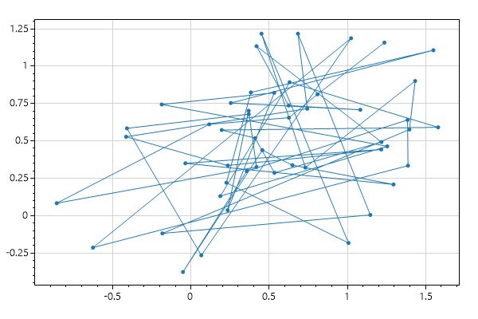

## Plot Lines Only

```cs
var plt = new ScottPlot.Plot(600, 400);
plt.PlotScatter(dataRandom1, dataRandom2, markerSize: 0);
plt.PlotScatter(dataRandom3, dataRandom4, markerSize: 0);
plt.SaveFig(fileName);
```


## Plot Points Only

```cs
var plt = new ScottPlot.Plot(600, 400);
plt.PlotScatter(dataRandom1, dataRandom2, lineWidth: 0);
plt.PlotScatter(dataRandom3, dataRandom4, lineWidth: 0);
plt.SaveFig(fileName);
```


## Styling XY Plots

```cs
var plt = new ScottPlot.Plot(600, 400);
plt.PlotScatter(dataRandom1, dataRandom2, color: Color.Magenta, lineWidth: 3, markerSize: 15);
plt.PlotScatter(dataRandom3, dataRandom4, color: Color.Green, lineWidth: 3, markerSize: 15);
plt.SaveFig(fileName);
```


## Plotting Points

```cs
var plt = new ScottPlot.Plot(600, 400);
plt.PlotScatter(dataXs, dataSin);
plt.PlotScatter(dataXs, dataCos);
plt.PlotPoint(25, 0.8);
plt.PlotPoint(30, 0.3, color: Color.Magenta, markerSize: 15);
plt.SaveFig(fileName);
```

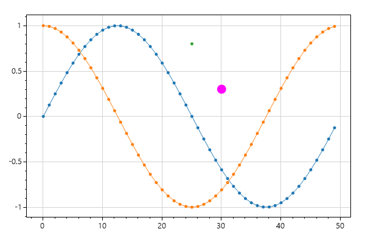

## Plotting Text

```cs
var plt = new ScottPlot.Plot(600, 400);
plt.PlotScatter(dataXs, dataSin);
plt.PlotScatter(dataXs, dataCos);
plt.PlotPoint(25, 0.8);
plt.PlotPoint(30, 0.3, color: Color.Magenta, markerSize: 15);
plt.PlotText("important point", 25, 0.8);
plt.PlotText("more important", 30, .3, fontSize: 16, bold: true);
plt.SaveFig(fileName);
```

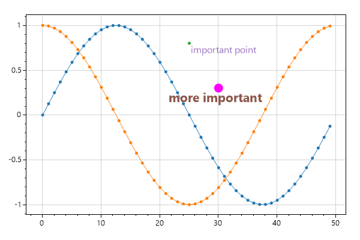

## Clearing Plots

```cs
var plt = new ScottPlot.Plot(600, 400);
plt.PlotScatter(dataXs, dataSin);
plt.PlotScatter(dataXs, dataCos);
plt.Clear();
plt.PlotScatter(dataRandom3, dataRandom4);
plt.SaveFig(fileName);
```


## Modifying Plotted Data

```cs
var plt = new ScottPlot.Plot(600, 400);
plt.PlotScatter(dataXs, dataSin);
plt.PlotScatter(dataXs, dataCos);

// Even after an array is given to ScottPlot plotted, its contents 
// can be updated and they will be displayed at the next render.
// This is epsecially useful to know for creating live data displays.
for (int i = 10; i < 20; i++)
{
    dataSin[i] = i / 10.0;
    dataCos[i] = 2 * i / 10.0;
}

plt.SaveFig(fileName);

PrepareDataSmall(); // hide
```

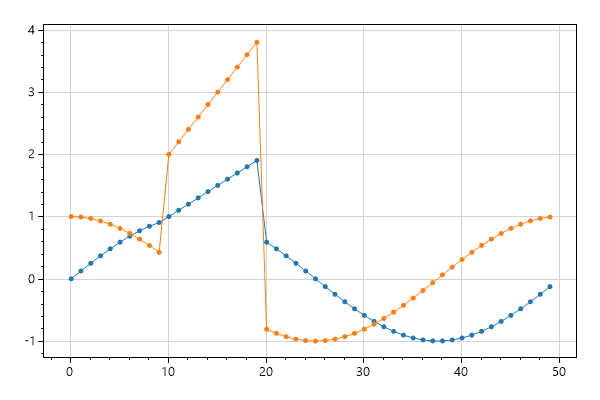

## Small Plot

```cs
var plt = new ScottPlot.Plot(200, 150);
plt.PlotScatter(dataXs, dataSin);
plt.PlotScatter(dataXs, dataCos);
plt.SaveFig(fileName);
```


##  Title and Axis Labels

```cs
var plt = new ScottPlot.Plot(600, 400);
plt.PlotScatter(dataXs, dataSin);
plt.PlotScatter(dataXs, dataCos);

plt.Title("Very Complicated Data");
plt.XLabel("Experiment Duration");
plt.YLabel("Productivity");

plt.SaveFig(fileName);
```


##  Extra Padding

```cs
var plt = new ScottPlot.Plot(600, 400);
plt.PlotScatter(dataXs, dataSin);
plt.PlotScatter(dataXs, dataCos);

plt.Title("Very Complicated Data");
plt.XLabel("Experiment Duration");
plt.YLabel("Productivity");

plt.TightenLayout(padding: 40);

plt.SaveFig(fileName);
```

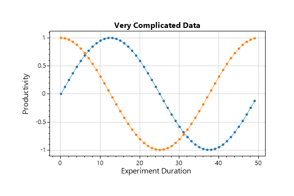

## Custom Colors

```cs
var plt = new ScottPlot.Plot(600, 400);

Color figureBgColor = ColorTranslator.FromHtml("#001021");
Color dataBgColor = ColorTranslator.FromHtml("#021d38");
plt.Style(figBg: figureBgColor, dataBg: dataBgColor);
plt.Grid(color: ColorTranslator.FromHtml("#273c51"));
plt.Ticks(color: Color.LightGray);
plt.PlotScatter(dataXs, dataSin);
plt.PlotScatter(dataXs, dataCos);
plt.Title("Very Complicated Data", Color.White);
plt.XLabel("Experiment Duration", Color.LightGray);
plt.YLabel("Productivity", Color.LightGray);
plt.SaveFig(fileName);
```


## Frameless Plot

```cs
var plt = new ScottPlot.Plot(600, 400);
Color figureBgColor = ColorTranslator.FromHtml("#001021");
Color dataBgColor = ColorTranslator.FromHtml("#021d38");
plt.Style(figBg: figureBgColor, dataBg: dataBgColor);
plt.Grid(color: ColorTranslator.FromHtml("#273c51"));
plt.Ticks(displayTicksX: false, displayTicksY: false);
plt.Frame(drawFrame: false);
plt.PlotScatter(dataXs, dataSin);
plt.PlotScatter(dataXs, dataCos);
plt.TightenLayout(padding: 0);
plt.SaveFig(fileName);
```


## Disable the Grid

```cs
var plt = new ScottPlot.Plot(600, 400);
plt.PlotScatter(dataXs, dataSin);
plt.PlotScatter(dataXs, dataCos);
plt.Grid(false);
plt.SaveFig(fileName);
```


## Corner Axis Frame

```cs
var plt = new ScottPlot.Plot(600, 400);
plt.PlotScatter(dataXs, dataSin);
plt.PlotScatter(dataXs, dataCos);
plt.Grid(false);
plt.Frame(right: false, top: false);
plt.SaveFig(fileName);
```


## Horizontal Ticks Only

```cs
var plt = new ScottPlot.Plot(600, 400);
plt.PlotScatter(dataXs, dataSin);
plt.PlotScatter(dataXs, dataCos);
plt.Grid(false);
plt.Ticks(displayTicksY: false);
plt.Frame(left: false, right: false, top: false);
plt.SaveFig(fileName);
```


## Very Large Numbers

```cs
Random rand = new Random(0);
int pointCount = 100;
double[] largeXs = ScottPlot.DataGen.Consecutive(pointCount, 1e42);
double[] largeYs = ScottPlot.DataGen.Random(rand, pointCount, 1e123);

var plt = new ScottPlot.Plot(600, 400);
plt.PlotScatter(largeXs, largeYs);
plt.SaveFig(fileName);
```

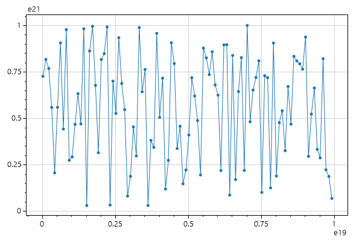

## Very Small Numbers

```cs
Random rand = new Random(1);
int pointCount = 100;
double[] smallXs = ScottPlot.DataGen.Consecutive(pointCount, 1e-42);
double[] xmallYs = ScottPlot.DataGen.Random(rand, pointCount, 1e-123);

var plt = new ScottPlot.Plot(600, 400);
plt.PlotScatter(smallXs, xmallYs);
plt.SaveFig(fileName);
```


## Signal

```cs
// PlotSignal is ideal for plotting large arrays of evenly-spaed data at high framerates.
// Note that we are testing it here by plotting an array with one million data points.
var plt = new ScottPlot.Plot(600, 400);
plt.Benchmark();
plt.PlotSignal(dataSignal, sampleRate: 20_000);
plt.SaveFig(fileName);
```


## Signal With Antialiasing Off

```cs
// A slight performance enhancement is achieved when anti-aliasing is disabled
var plt = new ScottPlot.Plot(600, 400);
plt.Benchmark();
plt.AntiAlias(true, false);
plt.PlotSignal(dataSignal, sampleRate: 20_000);
plt.SaveFig(fileName);
```


## Signal Styling

```cs
var plt = new ScottPlot.Plot(600, 400);
plt.PlotSignal(dataSignal, 20000, lineWidth: 3, color: Color.Red);
plt.SaveFig(fileName);
```


## Vertical and Horizontal Lines

```cs
var plt = new ScottPlot.Plot(600, 400);
plt.PlotScatter(dataXs, dataSin);
plt.PlotScatter(dataXs, dataCos);
plt.PlotVLine(17);
plt.PlotHLine(-.25, color: Color.Red, lineWidth: 3);
plt.SaveFig(fileName);
```


## StyleBlue1

```cs
var plt = new ScottPlot.Plot(600, 400);
plt.PlotScatter(dataXs, dataSin, label: "sin");
plt.PlotScatter(dataXs, dataCos, label: "cos");
plt.Title("Very Complicated Data");
plt.XLabel("Experiment Duration");
plt.YLabel("Productivity");
plt.Legend();
plt.Style(ScottPlot.Style.Blue1);
plt.SaveFig(fileName);
```

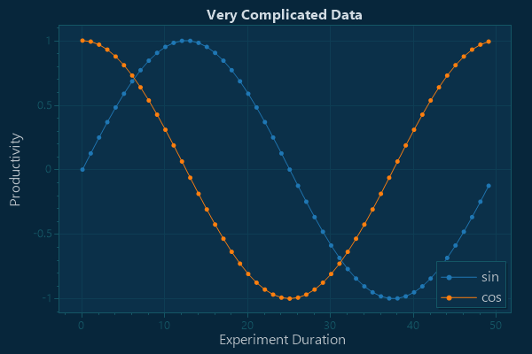

## StyleBlue2

```cs
var plt = new ScottPlot.Plot(600, 400);
plt.PlotScatter(dataXs, dataSin, label: "sin");
plt.PlotScatter(dataXs, dataCos, label: "cos");
plt.Title("Very Complicated Data");
plt.XLabel("Experiment Duration");
plt.YLabel("Productivity");
plt.Legend();
plt.Style(ScottPlot.Style.Blue2);
plt.SaveFig(fileName);
```


## StyleBlue3

```cs
var plt = new ScottPlot.Plot(600, 400);
plt.PlotScatter(dataXs, dataSin, label: "sin");
plt.PlotScatter(dataXs, dataCos, label: "cos");
plt.Title("Very Complicated Data");
plt.XLabel("Experiment Duration");
plt.YLabel("Productivity");
plt.Legend();
plt.Style(ScottPlot.Style.Blue3);
plt.SaveFig(fileName);
```


## StyleLight1

```cs
var plt = new ScottPlot.Plot(600, 400);
plt.PlotScatter(dataXs, dataSin, label: "sin");
plt.PlotScatter(dataXs, dataCos, label: "cos");
plt.Title("Very Complicated Data");
plt.XLabel("Experiment Duration");
plt.YLabel("Productivity");
plt.Legend();
plt.Style(ScottPlot.Style.Light1);
plt.SaveFig(fileName);
```


## StyleLight2

```cs
var plt = new ScottPlot.Plot(600, 400);
plt.PlotScatter(dataXs, dataSin, label: "sin");
plt.PlotScatter(dataXs, dataCos, label: "cos");
plt.Title("Very Complicated Data");
plt.XLabel("Experiment Duration");
plt.YLabel("Productivity");
plt.Legend();
plt.Style(ScottPlot.Style.Light2);
plt.SaveFig(fileName);
```


## StyleGray1

```cs
var plt = new ScottPlot.Plot(600, 400);
plt.PlotScatter(dataXs, dataSin, label: "sin");
plt.PlotScatter(dataXs, dataCos, label: "cos");
plt.Title("Very Complicated Data");
plt.XLabel("Experiment Duration");
plt.YLabel("Productivity");
plt.Legend();
plt.Style(ScottPlot.Style.Gray1);
plt.SaveFig(fileName);
```


## StyleGray2

```cs
var plt = new ScottPlot.Plot(600, 400);
plt.PlotScatter(dataXs, dataSin, label: "sin");
plt.PlotScatter(dataXs, dataCos, label: "cos");
plt.Title("Very Complicated Data");
plt.XLabel("Experiment Duration");
plt.YLabel("Productivity");
plt.Legend();
plt.Style(ScottPlot.Style.Gray2);
plt.SaveFig(fileName);
```


## StyleBlack

```cs
var plt = new ScottPlot.Plot(600, 400);
plt.PlotScatter(dataXs, dataSin, label: "sin");
plt.PlotScatter(dataXs, dataCos, label: "cos");
plt.Title("Very Complicated Data");
plt.XLabel("Experiment Duration");
plt.YLabel("Productivity");
plt.Legend();
plt.Style(ScottPlot.Style.Black);
plt.SaveFig(fileName);
```

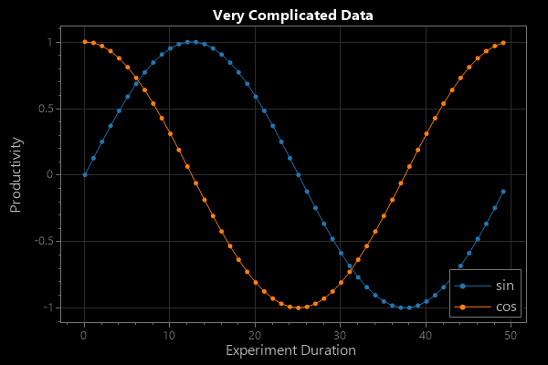

## StyleDefault

```cs
var plt = new ScottPlot.Plot(600, 400);
plt.PlotScatter(dataXs, dataSin, label: "sin");
plt.PlotScatter(dataXs, dataCos, label: "cos");
plt.Title("Very Complicated Data");
plt.XLabel("Experiment Duration");
plt.YLabel("Productivity");
plt.Legend();
plt.Style(ScottPlot.Style.Default);
plt.SaveFig(fileName);
```

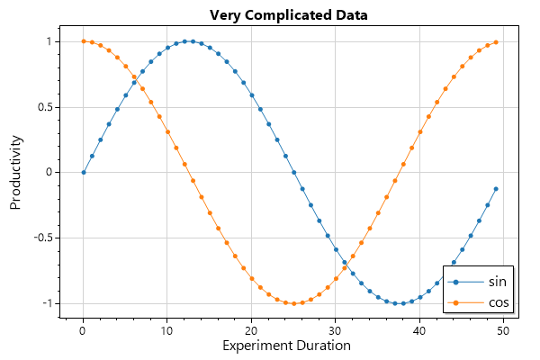

## StyleControl

```cs
var plt = new ScottPlot.Plot(600, 400);
plt.PlotScatter(dataXs, dataSin, label: "sin");
plt.PlotScatter(dataXs, dataCos, label: "cos");
plt.Title("Very Complicated Data");
plt.XLabel("Experiment Duration");
plt.YLabel("Productivity");
plt.Legend();
plt.Style(ScottPlot.Style.Control);
plt.SaveFig(fileName);
```


## Plotting With Errorbars

```cs
var plt = new ScottPlot.Plot(600, 400);
plt.Grid(false);

for (int plotNumber = 0; plotNumber < 3; plotNumber++)
{
    // create random data to plot
    Random rand = new Random(plotNumber);
    int pointCount = 20;
    double[] dataX = new double[pointCount];
    double[] dataY = new double[pointCount];
    double[] errorY = new double[pointCount];
    double[] errorX = new double[pointCount];
    for (int i = 0; i < pointCount; i++)
    {
        dataX[i] = i + rand.NextDouble();
        dataY[i] = rand.NextDouble() * 100 + 100 * plotNumber;
        errorX[i] = rand.NextDouble();
        errorY[i] = rand.NextDouble() * 10;
    }

    // demonstrate different ways to plot errorbars
    if (plotNumber == 0)
        plt.PlotScatter(dataX, dataY, lineWidth: 0, errorY: errorY, errorX: errorX,
            label: $"X and Y errors");
    else if (plotNumber == 1)
        plt.PlotScatter(dataX, dataY, lineWidth: 0, errorY: errorY,
            label: $"Y errors only");
    else
        plt.PlotScatter(dataX, dataY, errorY: errorY, errorX: errorX,
            label: $"Connected Errors");
}

plt.Title("Scatter Plot with Errorbars");
plt.Legend();
plt.SaveFig(fileName);
```

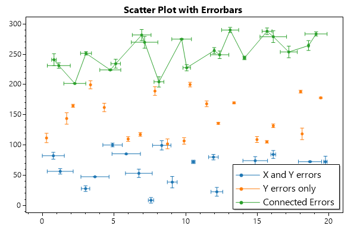

## Plot Bar Data

```cs
// create demo data to use for errorbars
double[] yErr = new double[dataSin.Length];
for (int i = 0; i < yErr.Length; i++)
    yErr[i] = dataSin[i] / 5 + .025;

var plt = new ScottPlot.Plot(600, 400);
plt.Title("Bar Plot With Error Bars");
plt.PlotBar(dataXs, dataSin, barWidth: .5, errorY: yErr, errorCapSize: 2);
plt.SaveFig(fileName);
```


## Plot Bar Data Fancy

```cs
// generate some more complex data
Random rand = new Random(0);
int pointCount = 10;
double[] Xs = new double[pointCount];
double[] dataA = new double[pointCount];
double[] errorA = new double[pointCount];
double[] XsB = new double[pointCount];
double[] dataB = new double[pointCount];
double[] errorB = new double[pointCount];
for (int i = 0; i < pointCount; i++)
{
    Xs[i] = i * 10;
    dataA[i] = rand.NextDouble() * 100;
    dataB[i] = rand.NextDouble() * 100;
    errorA[i] = rand.NextDouble() * 10;
    errorB[i] = rand.NextDouble() * 10;
}

var plt = new ScottPlot.Plot(600, 400);
plt.Title("Multiple Bar Plots");
plt.Grid(false);
// we customize barWidth and xOffset to squeeze grouped bars together
plt.PlotBar(Xs, dataA, errorY: errorA, label: "data A", barWidth: 3.2, xOffset: -2);
plt.PlotBar(Xs, dataB, errorY: errorB, label: "data B", barWidth: 3.2, xOffset: 2);
plt.Axis(null, null, 0, null);
plt.Legend();
plt.SaveFig(fileName);
```


## Step Plot

```cs
var plt = new ScottPlot.Plot(600, 400);
plt.PlotStep(dataXs, dataSin);
plt.PlotStep(dataXs, dataCos);
plt.SaveFig(fileName);
```

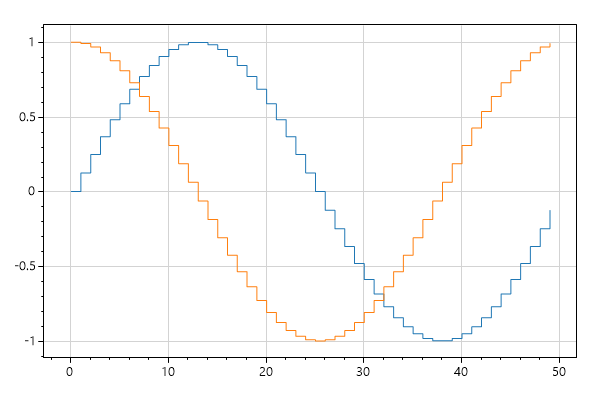

## Manual Grid Spacing

```cs
var plt = new ScottPlot.Plot(600, 400);
plt.PlotScatter(dataXs, dataSin);
plt.PlotScatter(dataXs, dataCos);
plt.Grid(xSpacing: 2, ySpacing: .1);
plt.SaveFig(fileName);
```


## Histogram

```cs
Random rand = new Random(0);
double[] values1 = ScottPlot.DataGen.RandomNormal(rand, pointCount: 1000, mean: 50, stdDev: 20);
var hist1 = new ScottPlot.Histogram(values1, min: 0, max: 100);

var plt = new ScottPlot.Plot(600, 400);
plt.Title("Histogram");
plt.YLabel("Count (#)");
plt.XLabel("Value (units)");
plt.PlotBar(hist1.bins, hist1.counts, barWidth: 1);
plt.Axis(null, null, 0, null);
plt.SaveFig(fileName);
```

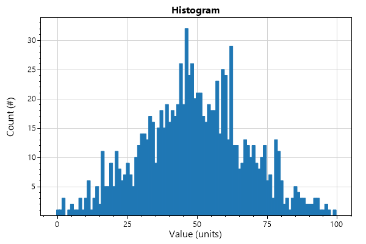

## CPH

```cs
Random rand = new Random(0);
double[] values1 = ScottPlot.DataGen.RandomNormal(rand, pointCount: 1000, mean: 50, stdDev: 20);
double[] values2 = ScottPlot.DataGen.RandomNormal(rand, pointCount: 1000, mean: 45, stdDev: 25);
var hist1 = new ScottPlot.Histogram(values1, min: 0, max: 100);
var hist2 = new ScottPlot.Histogram(values2, min: 0, max: 100);

var plt = new ScottPlot.Plot(600, 400);
plt.Title("Cumulative Probability Histogram");
plt.YLabel("Probability (fraction)");
plt.XLabel("Value (units)");
plt.PlotStep(hist1.bins, hist1.cumulativeFrac, lineWidth: 1.5, label: "sample A");
plt.PlotStep(hist2.bins, hist2.cumulativeFrac, lineWidth: 1.5, label: "sample B");
plt.Legend();
plt.Axis(null, null, 0, 1);
plt.SaveFig(fileName);
```


## Candlestick

```cs
Random rand = new Random(0);
int pointCount = 60;
ScottPlot.OHLC[] ohlcs = ScottPlot.DataGen.RandomStockPrices(rand, pointCount);

var plt = new ScottPlot.Plot(600, 400);
plt.Title("Candlestick Chart");
plt.YLabel("Stock Price (USD)");
plt.XLabel("Day (into Q4)");
plt.PlotCandlestick(ohlcs);
plt.SaveFig(fileName);
```


## OHLC

```cs
Random rand = new Random(0);
int pointCount = 60;
ScottPlot.OHLC[] ohlcs = ScottPlot.DataGen.RandomStockPrices(rand, pointCount);

var plt = new ScottPlot.Plot(600, 400);
plt.Title("Open/High/Low/Close (OHLC) Chart");
plt.YLabel("Stock Price (USD)");
plt.XLabel("Day (into Q4)");
plt.PlotOHLC(ohlcs);
plt.SaveFig(fileName);
```

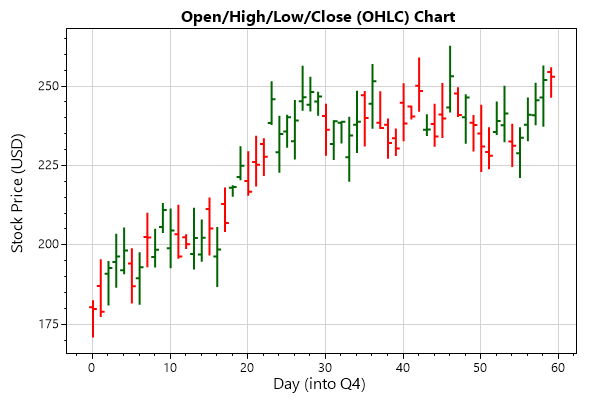

