# ScottPlot Cookbook
The ScottPlot cookbook is a collection of small code examples which demonstrate how to create various types of plots using ScottPlot.

_This cookbook was [automatically generated](/tests/Cookbook.cs) using ScottPlot 4.0.4.0_


## Quickstart

```cs
int pointCount = 50;
double[] dataXs = ScottPlot.DataGen.Consecutive(pointCount);
double[] dataSin = ScottPlot.DataGen.Sin(pointCount);
double[] dataCos = ScottPlot.DataGen.Cos(pointCount);

var plt = new ScottPlot.Plot(width, height);
plt.PlotScatter(dataXs, dataSin);
plt.PlotScatter(dataXs, dataCos);
plt.Title("ScottPlot Quickstart");
plt.XLabel("Time (seconds)");
plt.YLabel("Potential (V)");
plt.Save(600, 400, "01a_Quickstart.png");
```


## Automatic Margins

```cs
int pointCount = 50;
double[] dataXs = ScottPlot.DataGen.Consecutive(pointCount);
double[] dataSin = ScottPlot.DataGen.Sin(pointCount);
double[] dataCos = ScottPlot.DataGen.Cos(pointCount);

var plt = new ScottPlot.Plot(width, height);
plt.PlotScatter(dataXs, dataSin);
plt.PlotScatter(dataXs, dataCos);
plt.AxisAuto(0, .5); // no horizontal padding, 50% vertical padding
plt.Save(600, 400, "01b_Automatic_Margins.png");
```


## Defined Axis Limits

```cs
int pointCount = 50;
double[] dataXs = ScottPlot.DataGen.Consecutive(pointCount);
double[] dataSin = ScottPlot.DataGen.Sin(pointCount);
double[] dataCos = ScottPlot.DataGen.Cos(pointCount);

var plt = new ScottPlot.Plot(width, height);
plt.PlotScatter(dataXs, dataSin);
plt.PlotScatter(dataXs, dataCos);
plt.Axis(2, 8, .2, 1.1); // x1, x2, y1, y2
plt.Save(600, 400, "01c_Defined_Axis_Limits.png");
```

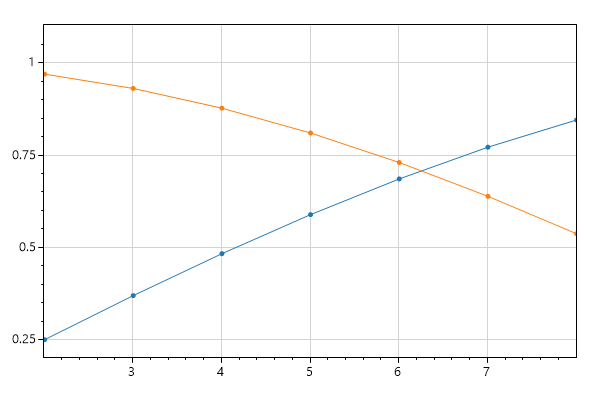


## Zoom and Pan

```cs
int pointCount = 50;
double[] dataXs = ScottPlot.DataGen.Consecutive(pointCount);
double[] dataSin = ScottPlot.DataGen.Sin(pointCount);
double[] dataCos = ScottPlot.DataGen.Cos(pointCount);

var plt = new ScottPlot.Plot(width, height);
plt.PlotScatter(dataXs, dataSin);
plt.PlotScatter(dataXs, dataCos);
plt.AxisZoom(2, 2);
plt.AxisPan(-10, .5);
plt.Save(600, 400, "01d_Zoom_and_Pan.png");
```


## Legend

```cs
int pointCount = 50;
double[] dataXs = ScottPlot.DataGen.Consecutive(pointCount);
double[] dataSin = ScottPlot.DataGen.Sin(pointCount);
double[] dataCos = ScottPlot.DataGen.Cos(pointCount);

var plt = new ScottPlot.Plot(width, height);
plt.PlotScatter(dataXs, dataSin, label: "first");
plt.PlotScatter(dataXs, dataCos, label: "second");
plt.Legend(location: ScottPlot.legendLocation.lowerLeft);
plt.Save(600, 400, "01e_Legend.png");
```


## Custom Marker Shapes

```cs
int pointCount = 50;
double[] dataXs = ScottPlot.DataGen.Consecutive(pointCount);
double[] dataSin = ScottPlot.DataGen.Sin(pointCount);
double[] dataCos = ScottPlot.DataGen.Cos(pointCount);

var plt = new ScottPlot.Plot(width, height);
plt.PlotScatter(dataXs, dataSin, label: "sin", markerShape: ScottPlot.MarkerShape.openCircle);
plt.PlotScatter(dataXs, dataCos, label: "cos", markerShape: ScottPlot.MarkerShape.filledSquare);
plt.Legend();
plt.Save(600, 400, "01f_Custom_Marker_Shapes.png");
```

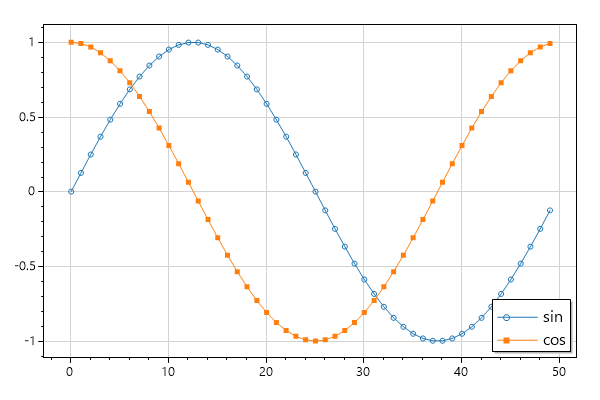


## All Marker Shapes

```cs
int pointCount = 50;
double[] dataXs = ScottPlot.DataGen.Consecutive(pointCount);
double[] dataSin = ScottPlot.DataGen.Sin(pointCount);
double[] dataCos = ScottPlot.DataGen.Cos(pointCount);

var plt = new ScottPlot.Plot(width, height);
plt.Title("ScottPlot Marker Shapes");
plt.Grid(false);

// plot a sine wave for every marker available
string[] markerShapeNames = Enum.GetNames(typeof(ScottPlot.MarkerShape));
for (int i = 0; i < markerShapeNames.Length; i++)
{
    string markerShapeName = markerShapeNames[i];
    var markerShape = (ScottPlot.MarkerShape)Enum.Parse(typeof(ScottPlot.MarkerShape), markerShapeName);
    double[] stackedSin = ScottPlot.DataGen.Sin(dataXs.Length, 2, -i);
    plt.PlotScatter(dataXs, stackedSin, label: markerShapeName, markerShape: markerShape);
}

plt.Legend(fontSize: 10);
plt.Save(600, 400, "01g_All_Marker_Shapes.png");
```


## Styling Scatter Plots

```cs
int pointCount = 50;
double[] dataXs = ScottPlot.DataGen.Consecutive(pointCount);
double[] dataSin = ScottPlot.DataGen.Sin(pointCount);
double[] dataCos = ScottPlot.DataGen.Cos(pointCount);

var plt = new ScottPlot.Plot(width, height);
plt.PlotScatter(dataXs, dataSin, color: Color.Magenta, lineWidth: 0, markerSize: 10, label: "sin");
plt.PlotScatter(dataXs, dataCos, color: Color.Green, lineWidth: 5, markerSize: 0, label: "cos");

plt.Legend(fixedLineAndMarkerSize: false);

plt.Save(600, 400, "02_Styling_Scatter_Plots.png");
```


## Plot XY Data

```cs
Random rand = new Random(0);
int pointCount = 50;
double[] dataRandom1 = ScottPlot.DataGen.RandomNormal(rand, pointCount);
double[] dataRandom2 = ScottPlot.DataGen.RandomNormal(rand, pointCount);

var plt = new ScottPlot.Plot(width, height);
plt.PlotScatter(dataRandom1, dataRandom2);
plt.Save(600, 400, "03_Plot_XY_Data.png");
```


## Plot Lines Only

```cs
Random rand = new Random(0);
int pointCount = 50;
double[] dataRandom1 = ScottPlot.DataGen.RandomNormal(rand, pointCount, 1);
double[] dataRandom2 = ScottPlot.DataGen.RandomNormal(rand, pointCount, 2);
double[] dataRandom3 = ScottPlot.DataGen.RandomNormal(rand, pointCount, 3);
double[] dataRandom4 = ScottPlot.DataGen.RandomNormal(rand, pointCount, 4);

var plt = new ScottPlot.Plot(width, height);
plt.PlotScatter(dataRandom1, dataRandom2, markerSize: 0);
plt.PlotScatter(dataRandom3, dataRandom4, markerSize: 0);
plt.Save(600, 400, "04_Plot_Lines_Only.png");
```

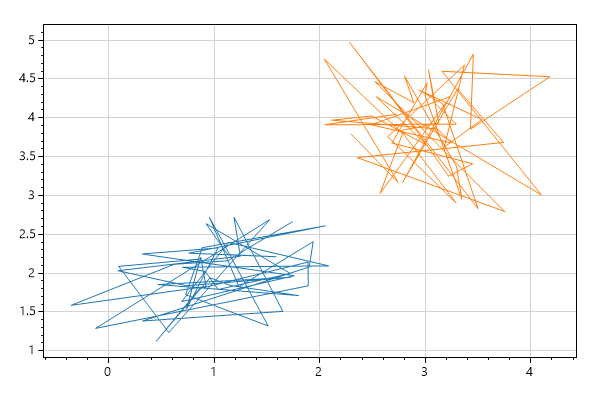


## Plot Points Only

```cs
Random rand = new Random(0);
int pointCount = 50;
double[] dataRandom1 = ScottPlot.DataGen.RandomNormal(rand, pointCount, 1);
double[] dataRandom2 = ScottPlot.DataGen.RandomNormal(rand, pointCount, 2);
double[] dataRandom3 = ScottPlot.DataGen.RandomNormal(rand, pointCount, 3);
double[] dataRandom4 = ScottPlot.DataGen.RandomNormal(rand, pointCount, 4);

var plt = new ScottPlot.Plot(width, height);
plt.PlotScatter(dataRandom1, dataRandom2, lineWidth: 0);
plt.PlotScatter(dataRandom3, dataRandom4, lineWidth: 0);
plt.Save(600, 400, "05_Plot_Points_Only.png");
```

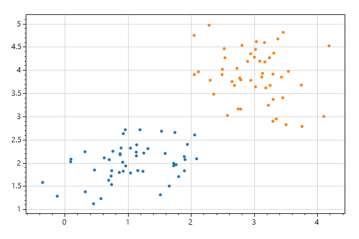


## Custom LineStyles

```cs
Random rand = new Random(0);
int pointCount = 50;
double[] dataRandom1 = ScottPlot.DataGen.RandomNormal(rand, pointCount, 1);
double[] dataRandom2 = ScottPlot.DataGen.RandomNormal(rand, pointCount, 2);
double[] dataRandom3 = ScottPlot.DataGen.RandomNormal(rand, pointCount, 3);
double[] dataRandom4 = ScottPlot.DataGen.RandomNormal(rand, pointCount, 4);

var plt = new ScottPlot.Plot(width, height);
plt.PlotScatter(dataRandom1, dataRandom2, label: "dash", lineStyle: ScottPlot.LineStyle.Dash);
plt.PlotScatter(dataRandom3, dataRandom4, label: "dash dot dot", lineStyle: ScottPlot.LineStyle.DashDotDot);
plt.Legend();
plt.Save(600, 400, "06b_Custom_LineStyles.png");
```

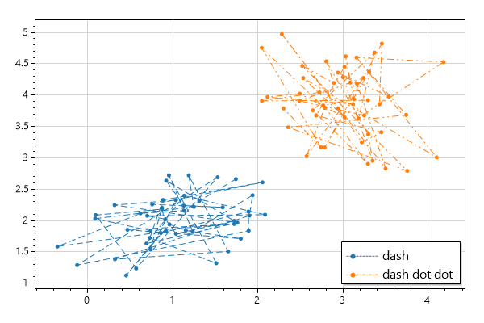


## Styling XY Plots

```cs
Random rand = new Random(0);
int pointCount = 50;
double[] dataRandom1 = ScottPlot.DataGen.RandomNormal(rand, pointCount, 1);
double[] dataRandom2 = ScottPlot.DataGen.RandomNormal(rand, pointCount, 2);
double[] dataRandom3 = ScottPlot.DataGen.RandomNormal(rand, pointCount, 3);
double[] dataRandom4 = ScottPlot.DataGen.RandomNormal(rand, pointCount, 4);

var plt = new ScottPlot.Plot(width, height);
plt.PlotScatter(dataRandom1, dataRandom2, color: Color.Magenta, lineWidth: 3, markerSize: 15);
plt.PlotScatter(dataRandom3, dataRandom4, color: Color.Green, lineWidth: 3, markerSize: 15);
plt.Save(600, 400, "06_Styling_XY_Plots.png");
```

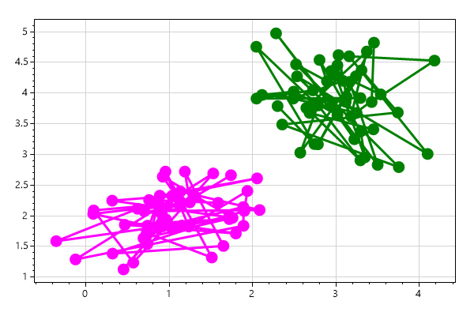


## Plotting Points

```cs
int pointCount = 50;
double[] dataXs = ScottPlot.DataGen.Consecutive(pointCount);
double[] dataSin = ScottPlot.DataGen.Sin(pointCount);
double[] dataCos = ScottPlot.DataGen.Cos(pointCount);

var plt = new ScottPlot.Plot(width, height);
plt.PlotScatter(dataXs, dataSin);
plt.PlotScatter(dataXs, dataCos);
plt.PlotPoint(25, 0.8);
plt.PlotPoint(30, 0.3, color: Color.Magenta, markerSize: 15);
plt.Save(600, 400, "07_Plotting_Points.png");
```


## Plotting Text

```cs
int pointCount = 50;
double[] dataXs = ScottPlot.DataGen.Consecutive(pointCount);
double[] dataSin = ScottPlot.DataGen.Sin(pointCount);
double[] dataCos = ScottPlot.DataGen.Cos(pointCount);

var plt = new ScottPlot.Plot(width, height);
plt.PlotScatter(dataXs, dataSin);
plt.PlotScatter(dataXs, dataCos);

plt.PlotPoint(25, 0.8, color: Color.Green);
plt.PlotText(" important point", 25, 0.8,
    color: Color.Green);

plt.PlotPoint(30, 0.3, color: Color.Black, markerSize: 15);
plt.PlotText(" default alignment", 30, 0.3,
    fontSize: 16, bold: true, color: Color.Magenta);

plt.PlotPoint(30, 0, color: Color.Black, markerSize: 15);
plt.PlotText("middle center", 30, 0,
    fontSize: 16, bold: true, color: Color.Magenta,
    alignment: ScottPlot.TextAlignment.middleCenter);

plt.PlotPoint(30, -0.3, color: Color.Black, markerSize: 15);
plt.PlotText("upper left", 30, -0.3,
    fontSize: 16, bold: true, color: Color.Magenta,
    alignment: ScottPlot.TextAlignment.upperLeft);

plt.PlotPoint(5, -.5, color: Color.Blue, markerSize: 15);
plt.PlotText(" Rotated Text", 5, -.5,
    fontSize: 16, color: Color.Blue, bold: true, rotation: -30);

plt.PlotText("Framed Text", 15, -.6,
    fontSize: 16, color: Color.White, bold: true, frame: true, frameColor: Color.DarkRed);

plt.Save(600, 400, "08_Plotting_Text.png");
```


## Clearing Plots

```cs
int pointCount = 50;
double[] dataXs = ScottPlot.DataGen.Consecutive(pointCount);
double[] dataSin = ScottPlot.DataGen.Sin(pointCount);
double[] dataCos = ScottPlot.DataGen.Cos(pointCount);

Random rand = new Random(0);
double[] dataRandom1 = ScottPlot.DataGen.RandomNormal(rand, pointCount, 1);
double[] dataRandom2 = ScottPlot.DataGen.RandomNormal(rand, pointCount, 2);

var plt = new ScottPlot.Plot(width, height);
plt.PlotScatter(dataXs, dataSin);
plt.PlotScatter(dataXs, dataCos);
plt.Clear();
plt.PlotScatter(dataRandom1, dataRandom2);
plt.Save(600, 400, "09_Clearing_Plots.png");
```


## Modifying Plotted Data

```cs
int pointCount = 50;
double[] dataXs = ScottPlot.DataGen.Consecutive(pointCount);
double[] dataSin = ScottPlot.DataGen.Sin(pointCount);
double[] dataCos = ScottPlot.DataGen.Cos(pointCount);

var plt = new ScottPlot.Plot(width, height);
plt.PlotScatter(dataXs, dataSin);
plt.PlotScatter(dataXs, dataCos);

// After an array is plotted with PlotSignal() or PlotScatter() its contents 
//   can be updated (by changing values in the array) and they will be displayed 
//   at the next render. This makes it easy to create live displays.

for (int i = 10; i < 20; i++)
{
    dataSin[i] = i / 10.0;
    dataCos[i] = 2 * i / 10.0;
}

plt.Save(600, 400, "10_Modifying_Plotted_Data.png");
```


## Modify Styles After Plotting

```cs
int pointCount = 50;
double[] dataXs = ScottPlot.DataGen.Consecutive(pointCount);
double[] dataSin = ScottPlot.DataGen.Sin(pointCount);
double[] dataCos = ScottPlot.DataGen.Cos(pointCount);

var plt = new ScottPlot.Plot(width, height);

// All Plot functions return the object that was just created.
var scatter1 = plt.PlotScatter(dataXs, dataSin);
var scatter2 = plt.PlotScatter(dataXs, dataCos);
var horizontalLine = plt.PlotHLine(0, lineWidth: 3);

// This allows you to modify the object's properties later.
scatter1.color = Color.Pink;
scatter2.markerShape = ScottPlot.MarkerShape.openCircle;
horizontalLine.position = 0.7654;

plt.Save(600, 400, "11_Modify_Styles_After_Plotting.png");
```


## Date Axis

```cs
Random rand = new Random(0);
double[] price = ScottPlot.DataGen.RandomWalk(rand, 60 * 8);
DateTime start = new DateTime(2019, 08, 25, 8, 30, 00);
double pointsPerDay = 24 * 60; // one point per minute

var plt = new ScottPlot.Plot(width, height);
plt.PlotSignal(price, sampleRate: pointsPerDay, xOffset: start.ToOADate());
plt.Ticks(dateTimeX: true);
plt.YLabel("Price");
plt.XLabel("Date and Time");

plt.Save(600, 400, "12_Date_Axis.png");
```

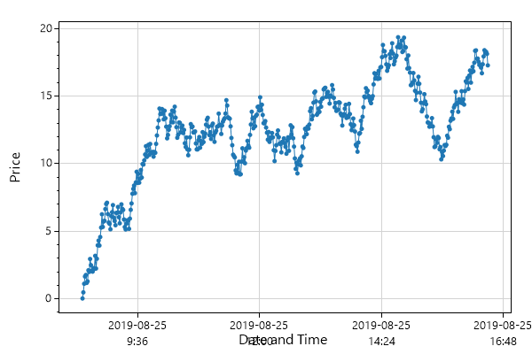


## Ruler Mode

```cs
int pointCount = 50;
double[] dataXs = ScottPlot.DataGen.Consecutive(pointCount);
double[] dataSin = ScottPlot.DataGen.Sin(pointCount);
double[] dataCos = ScottPlot.DataGen.Cos(pointCount);

var plt = new ScottPlot.Plot(width, height);
plt.PlotScatter(dataXs, dataSin);
plt.PlotScatter(dataXs, dataCos);

plt.Frame(right: false, top: false);
plt.Ticks(rulerModeX: true, rulerModeY: true); // enable ruler mode like this
plt.AxisAuto(0, 0);

plt.Save(600, 400, "13_Ruler_Mode.png");
```


## Custom Tick Labels

```cs
var plt = new ScottPlot.Plot(width, height);
plt.Title("Custom Tick Positions and Labels");
plt.PlotSignal(ScottPlot.DataGen.Sin(50));

double[] xPositions = { 7, 21, 37, 46 };
string[] xLabels = { "VII", "XXI", "XXXVII", "XLVI" };
plt.XTicks(xPositions, xLabels);

double[] yPositions = { -1, 0, .5, 1 };
string[] yPabels = { "bottom", "center", "half", "top" };
plt.YTicks(yPositions, yPabels);

plt.Save(600, 400, "14_Custom_Tick_Labels.png");
```


## Descending Ticks

```cs
var plt = new ScottPlot.Plot(width, height);

// to simulate an inverted (descending) horizontal axis, plot in the negative space
plt.PlotSignal(ScottPlot.DataGen.Sin(50), xOffset: -50);

// then invert the sign of the horizontal axis labels
plt.Ticks(invertSignX: true);
plt.Ticks(invertSignY: true);

plt.Save(600, 400, "15_Descending_Ticks.png");
```


## Small Plot

```cs
int pointCount = 50;
double[] dataXs = ScottPlot.DataGen.Consecutive(pointCount);
double[] dataSin = ScottPlot.DataGen.Sin(pointCount);
double[] dataCos = ScottPlot.DataGen.Cos(pointCount);

var plt = new ScottPlot.Plot(200, 150);
plt.PlotScatter(dataXs, dataSin);
plt.PlotScatter(dataXs, dataCos);
plt.Save(600, 400, "20_Small_Plot.png");
```


## Title and Axis Labels

```cs
int pointCount = 50;
double[] dataXs = ScottPlot.DataGen.Consecutive(pointCount);
double[] dataSin = ScottPlot.DataGen.Sin(pointCount);
double[] dataCos = ScottPlot.DataGen.Cos(pointCount);

var plt = new ScottPlot.Plot(width, height);
plt.PlotScatter(dataXs, dataSin);
plt.PlotScatter(dataXs, dataCos);

plt.Title("Very Complicated Data");
plt.XLabel("Experiment Duration");
plt.YLabel("Productivity");

plt.Save(600, 400, "21a_Title_and_Axis_Labels.png");
```


## Custom Padding

```cs
int pointCount = 50;
double[] dataXs = ScottPlot.DataGen.Consecutive(pointCount);
double[] dataSin = ScottPlot.DataGen.Sin(pointCount);
double[] dataCos = ScottPlot.DataGen.Cos(pointCount);

var plt = new ScottPlot.Plot(width, height);
plt.PlotScatter(dataXs, dataSin);
plt.PlotScatter(dataXs, dataCos);
plt.Style(figBg: Color.LightBlue);

// Layout component sizes are typically auto-calculated by TightenLayout()
// Plots without title or axis labels typically extend right to the edge of the image
// You can call Layout() to manually define the sizes of plot components
plt.Layout(yScaleWidth: 80, titleHeight: 50, xLabelHeight: 20, y2LabelWidth: 20);

plt.Save(600, 400, "21b_Custom_Padding.png");
```


## Automatic Left Padding

```cs
var plt = new ScottPlot.Plot(width, height);
Random rand = new Random(0);
double[] xs = ScottPlot.DataGen.Consecutive(100);
double[] ys = ScottPlot.DataGen.RandomWalk(rand, 100, 1e2, 1e15);
plt.PlotScatter(xs, ys);
plt.YLabel("vertical units");
plt.XLabel("horizontal units");

// this can be problematic because Y labels get very large
plt.Ticks(useOffsetNotation: false, useMultiplierNotation: false);

// tightening with a render is the best way to get the axes right
plt.TightenLayout(render: true);

plt.Save(600, 400, "21c_Automatic_Left_Padding.png");
```


## Single Axis With No Padding

```cs
var plt = new ScottPlot.Plot(width, height);
Random rand = new Random(0);
double[] xs = ScottPlot.DataGen.Consecutive(100);
double[] ys = ScottPlot.DataGen.RandomWalk(rand, 100, 1e2, 1e15);
plt.PlotScatter(xs, ys);
plt.Style(figBg: Color.LightBlue);

// customize your tick and frame style then tighten the layout
plt.Ticks(rulerModeX: true, displayTicksY: false);
plt.Frame(left: false, right: false, top: false);
plt.TightenLayout(padding: 0, render: true);

plt.Save(600, 400, "21d_Single_Axis_With_No_Padding.png");
```


## Custom Colors

```cs
int pointCount = 50;
double[] dataXs = ScottPlot.DataGen.Consecutive(pointCount);
double[] dataSin = ScottPlot.DataGen.Sin(pointCount);
double[] dataCos = ScottPlot.DataGen.Cos(pointCount);

var plt = new ScottPlot.Plot(width, height);
Color figureBgColor = ColorTranslator.FromHtml("#001021");
Color dataBgColor = ColorTranslator.FromHtml("#021d38");
plt.Style(figBg: figureBgColor, dataBg: dataBgColor);
plt.Grid(color: ColorTranslator.FromHtml("#273c51"));
plt.Ticks(color: Color.LightGray);
plt.PlotScatter(dataXs, dataSin);
plt.PlotScatter(dataXs, dataCos);
plt.Title("Very Complicated Data", color: Color.White);
plt.XLabel("Experiment Duration", color: Color.LightGray);
plt.YLabel("Productivity", color: Color.LightGray);
plt.Save(600, 400, "22_Custom_Colors.png");
```

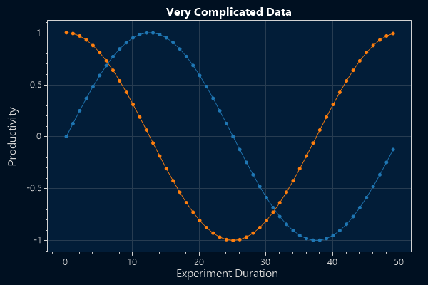


## Frameless Plot

```cs
int pointCount = 50;
double[] dataXs = ScottPlot.DataGen.Consecutive(pointCount);
double[] dataSin = ScottPlot.DataGen.Sin(pointCount);
double[] dataCos = ScottPlot.DataGen.Cos(pointCount);

var plt = new ScottPlot.Plot(width, height);
Color figureBgColor = ColorTranslator.FromHtml("#001021");
Color dataBgColor = ColorTranslator.FromHtml("#021d38");
plt.Style(figBg: figureBgColor, dataBg: dataBgColor);
plt.Grid(color: ColorTranslator.FromHtml("#273c51"));
plt.Ticks(displayTicksX: false, displayTicksY: false);

plt.Frame(drawFrame: false); // dont draw a square around the plot
plt.TightenLayout(padding: 0); // dont pad the data area at all

plt.PlotScatter(dataXs, dataSin);
plt.PlotScatter(dataXs, dataCos);
plt.Save(600, 400, "23_Frameless_Plot.png");
```


## Disable the Grid

```cs
int pointCount = 50;
double[] dataXs = ScottPlot.DataGen.Consecutive(pointCount);
double[] dataSin = ScottPlot.DataGen.Sin(pointCount);
double[] dataCos = ScottPlot.DataGen.Cos(pointCount);

var plt = new ScottPlot.Plot(width, height);
plt.PlotScatter(dataXs, dataSin);
plt.PlotScatter(dataXs, dataCos);
plt.Grid(false);
plt.Save(600, 400, "24_Disable_the_Grid.png");
```


## Corner Axis Frame

```cs
int pointCount = 50;
double[] dataXs = ScottPlot.DataGen.Consecutive(pointCount);
double[] dataSin = ScottPlot.DataGen.Sin(pointCount);
double[] dataCos = ScottPlot.DataGen.Cos(pointCount);

var plt = new ScottPlot.Plot(width, height);
plt.PlotScatter(dataXs, dataSin);
plt.PlotScatter(dataXs, dataCos);
plt.Grid(false);
plt.Frame(right: false, top: false);
plt.Save(600, 400, "25_Corner_Axis_Frame.png");
```

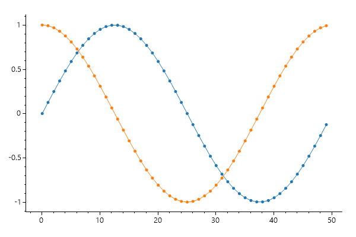


## Horizontal Ticks Only

```cs
int pointCount = 50;
double[] dataXs = ScottPlot.DataGen.Consecutive(pointCount);
double[] dataSin = ScottPlot.DataGen.Sin(pointCount);
double[] dataCos = ScottPlot.DataGen.Cos(pointCount);

var plt = new ScottPlot.Plot(width, height);
plt.PlotScatter(dataXs, dataSin);
plt.PlotScatter(dataXs, dataCos);
plt.Grid(false);
plt.Ticks(displayTicksY: false);
plt.Frame(left: false, right: false, top: false);
plt.Save(600, 400, "26_Horizontal_Ticks_Only.png");
```

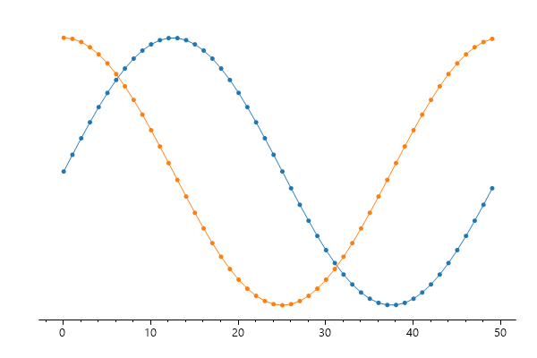


## Very Large Numbers

```cs
Random rand = new Random(0);
int pointCount = 100;
double[] largeXs = ScottPlot.DataGen.Consecutive(pointCount, 1e17);
double[] largeYs = ScottPlot.DataGen.Random(rand, pointCount, 1e21);

var plt = new ScottPlot.Plot(width, height);
plt.PlotScatter(largeXs, largeYs);
plt.Save(600, 400, "27_Very_Large_Numbers.png");
```


## Multiplier Notation Default

```cs
double[] tenMillionPoints = ScottPlot.DataGen.SinSweep(10_000_000, 8);

var plt = new ScottPlot.Plot(width, height);
plt.PlotSignal(tenMillionPoints);
plt.Save(600, 400, "28b_Multiplier_Notation_Default.png");
```

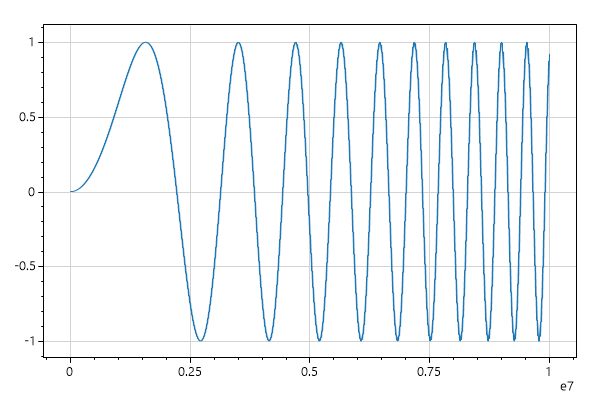


## Axis Exponent And Offset

```cs
double bigNumber = 9876;

var plt = new ScottPlot.Plot(width, height);
plt.Title("panned far and really zoomed in");
plt.Axis(bigNumber, bigNumber + .00001, bigNumber, bigNumber + .00001);
plt.Save(600, 400, "28_Axis_Exponent_And_Offset.png");
```


## Very Large Images

```cs
int pointCount = 50;
double[] dataXs = ScottPlot.DataGen.Consecutive(pointCount);
double[] dataSin = ScottPlot.DataGen.Sin(pointCount);
double[] dataCos = ScottPlot.DataGen.Cos(pointCount);

var plt = new ScottPlot.Plot(2000, 1000);
plt.PlotScatter(dataXs, dataSin);
plt.PlotScatter(dataXs, dataCos);
plt.Save(600, 400, "29_Very_Large_Images.png");
```

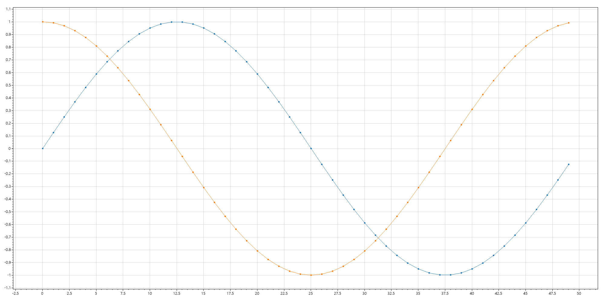


## Signal

```cs
double[] tenMillionPoints = ScottPlot.DataGen.SinSweep(10_000_000, 8);

// PlotSignal() is much faster than PlotScatter() for large arrays of evenly-spaed data.
// To plot more than 2GB of data, enable "gcAllowVeryLargeObjects" in App.config (Google it)

var plt = new ScottPlot.Plot(width, height);
plt.Title("Displaying 10 million points with PlotSignal()");
plt.Benchmark();
plt.PlotSignal(tenMillionPoints, sampleRate: 20_000);
plt.Save(600, 400, "30a_Signal.png");
```


## SignalConst

```cs
double[] tenMillionPoints = ScottPlot.DataGen.SinSweep(10_000_000, 8);

// SignalConst() is faster than PlotSignal() for very large data plots
// - its data cannot be modified after it is loaded
// - here threading was turned off so it renders properly in a console application
// - in GUI applications threading allows it to initially render faster but here it is turned off

var plt = new ScottPlot.Plot(width, height);
plt.Title("Displaying 10 million points with PlotSignalConst()");
plt.Benchmark();
plt.PlotSignalConst(tenMillionPoints, sampleRate: 20_000);
plt.Save(600, 400, "30c_SignalConst.png");
```


## Signal Styling

```cs
double[] tenMillionPoints = ScottPlot.DataGen.SinSweep(10_000_000, 8);

var plt = new ScottPlot.Plot(width, height);
plt.PlotSignal(tenMillionPoints, 20000, lineWidth: 3, color: Color.Red);
plt.Save(600, 400, "32_Signal_Styling.png");
```

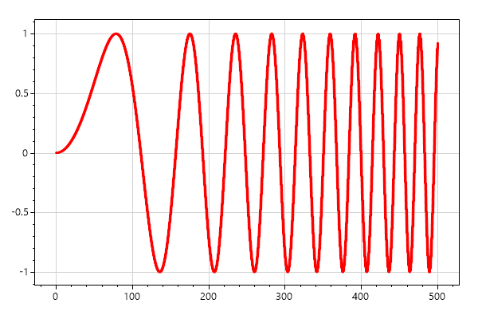


## Vertical and Horizontal Lines

```cs
int pointCount = 50;
double[] dataXs = ScottPlot.DataGen.Consecutive(pointCount);
double[] dataSin = ScottPlot.DataGen.Sin(pointCount);
double[] dataCos = ScottPlot.DataGen.Cos(pointCount);

var plt = new ScottPlot.Plot(width, height);
plt.PlotScatter(dataXs, dataSin);
plt.PlotScatter(dataXs, dataCos);
plt.PlotVLine(17);
plt.PlotHLine(-.25, color: Color.Red, lineWidth: 3);
plt.Save(600, 400, "40_Vertical_and_Horizontal_Lines.png");
```


## Axis Spans

```cs
int pointCount = 50;
double[] dataXs = ScottPlot.DataGen.Consecutive(pointCount);
double[] dataSin = ScottPlot.DataGen.Sin(pointCount);
double[] dataCos = ScottPlot.DataGen.Cos(pointCount);

var plt = new ScottPlot.Plot(width, height);

// things plotted after before spans are covered by them
plt.PlotScatter(dataXs, dataSin, label: "below",
    color: Color.Red, markerShape: ScottPlot.MarkerShape.filledCircle);

// vertical lines and horizontal spans both take X-axis positions
plt.PlotVLine(17, label: "vertical line");
plt.PlotVSpan(19, 27, label: "horizontal span", color: Color.Blue);

// horizontal lines and vertical spans both take Y-axis positions
plt.PlotHLine(-.6, label: "horizontal line");
plt.PlotHSpan(-.25, 0.33, label: "vertical span", color: Color.Green);

// things plotted after are displayed on top of the spans
plt.PlotScatter(dataXs, dataCos, label: "above",
    color: Color.Red, markerShape: ScottPlot.MarkerShape.filledSquare);

plt.Legend();

plt.Save(600, 400, "41_Axis_Spans.png");
```


## StyleBlue1

```cs
int pointCount = 50;
double[] dataXs = ScottPlot.DataGen.Consecutive(pointCount);
double[] dataSin = ScottPlot.DataGen.Sin(pointCount);
double[] dataCos = ScottPlot.DataGen.Cos(pointCount);

var plt = new ScottPlot.Plot(width, height);
plt.PlotScatter(dataXs, dataSin, label: "sin");
plt.PlotScatter(dataXs, dataCos, label: "cos");
plt.Title("Very Complicated Data");
plt.XLabel("Experiment Duration");
plt.YLabel("Productivity");
plt.Legend();
plt.Style(ScottPlot.Style.Blue1);
plt.Save(600, 400, "50_StyleBlue1.png");
```


## StyleBlue2

```cs
int pointCount = 50;
double[] dataXs = ScottPlot.DataGen.Consecutive(pointCount);
double[] dataSin = ScottPlot.DataGen.Sin(pointCount);
double[] dataCos = ScottPlot.DataGen.Cos(pointCount);

var plt = new ScottPlot.Plot(width, height);
plt.PlotScatter(dataXs, dataSin, label: "sin");
plt.PlotScatter(dataXs, dataCos, label: "cos");
plt.Title("Very Complicated Data");
plt.XLabel("Experiment Duration");
plt.YLabel("Productivity");
plt.Legend();
plt.Style(ScottPlot.Style.Blue2);
plt.Save(600, 400, "51_StyleBlue2.png");
```


## StyleBlue3

```cs
int pointCount = 50;
double[] dataXs = ScottPlot.DataGen.Consecutive(pointCount);
double[] dataSin = ScottPlot.DataGen.Sin(pointCount);
double[] dataCos = ScottPlot.DataGen.Cos(pointCount);

var plt = new ScottPlot.Plot(width, height);
plt.PlotScatter(dataXs, dataSin, label: "sin");
plt.PlotScatter(dataXs, dataCos, label: "cos");
plt.Title("Very Complicated Data");
plt.XLabel("Experiment Duration");
plt.YLabel("Productivity");
plt.Legend();
plt.Style(ScottPlot.Style.Blue3);
plt.Save(600, 400, "52_StyleBlue3.png");
```


## StyleLight1

```cs
int pointCount = 50;
double[] dataXs = ScottPlot.DataGen.Consecutive(pointCount);
double[] dataSin = ScottPlot.DataGen.Sin(pointCount);
double[] dataCos = ScottPlot.DataGen.Cos(pointCount);

var plt = new ScottPlot.Plot(width, height);
plt.PlotScatter(dataXs, dataSin, label: "sin");
plt.PlotScatter(dataXs, dataCos, label: "cos");
plt.Title("Very Complicated Data");
plt.XLabel("Experiment Duration");
plt.YLabel("Productivity");
plt.Legend();
plt.Style(ScottPlot.Style.Light1);
plt.Save(600, 400, "53_StyleLight1.png");
```

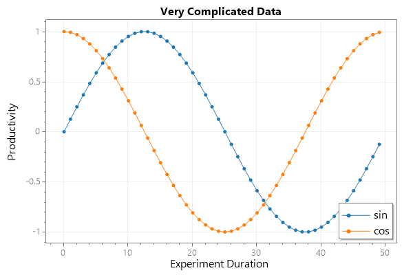


## StyleLight2

```cs
int pointCount = 50;
double[] dataXs = ScottPlot.DataGen.Consecutive(pointCount);
double[] dataSin = ScottPlot.DataGen.Sin(pointCount);
double[] dataCos = ScottPlot.DataGen.Cos(pointCount);

var plt = new ScottPlot.Plot(width, height);
plt.PlotScatter(dataXs, dataSin, label: "sin");
plt.PlotScatter(dataXs, dataCos, label: "cos");
plt.Title("Very Complicated Data");
plt.XLabel("Experiment Duration");
plt.YLabel("Productivity");
plt.Legend();
plt.Style(ScottPlot.Style.Light2);
plt.Save(600, 400, "54_StyleLight2.png");
```

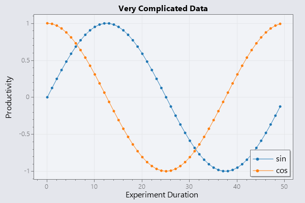


## StyleGray1

```cs
int pointCount = 50;
double[] dataXs = ScottPlot.DataGen.Consecutive(pointCount);
double[] dataSin = ScottPlot.DataGen.Sin(pointCount);
double[] dataCos = ScottPlot.DataGen.Cos(pointCount);

var plt = new ScottPlot.Plot(width, height);
plt.PlotScatter(dataXs, dataSin, label: "sin");
plt.PlotScatter(dataXs, dataCos, label: "cos");
plt.Title("Very Complicated Data");
plt.XLabel("Experiment Duration");
plt.YLabel("Productivity");
plt.Legend();
plt.Style(ScottPlot.Style.Gray1);
plt.Save(600, 400, "55_StyleGray1.png");
```

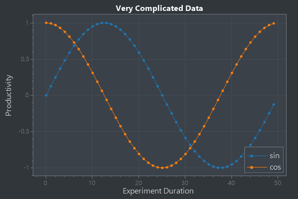


## StyleGray2

```cs
int pointCount = 50;
double[] dataXs = ScottPlot.DataGen.Consecutive(pointCount);
double[] dataSin = ScottPlot.DataGen.Sin(pointCount);
double[] dataCos = ScottPlot.DataGen.Cos(pointCount);

var plt = new ScottPlot.Plot(width, height);
plt.PlotScatter(dataXs, dataSin, label: "sin");
plt.PlotScatter(dataXs, dataCos, label: "cos");
plt.Title("Very Complicated Data");
plt.XLabel("Experiment Duration");
plt.YLabel("Productivity");
plt.Legend();
plt.Style(ScottPlot.Style.Gray2);
plt.Save(600, 400, "56_StyleGray2.png");
```

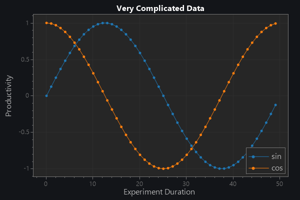


## StyleBlack

```cs
int pointCount = 50;
double[] dataXs = ScottPlot.DataGen.Consecutive(pointCount);
double[] dataSin = ScottPlot.DataGen.Sin(pointCount);
double[] dataCos = ScottPlot.DataGen.Cos(pointCount);

var plt = new ScottPlot.Plot(width, height);
plt.PlotScatter(dataXs, dataSin, label: "sin");
plt.PlotScatter(dataXs, dataCos, label: "cos");
plt.Title("Very Complicated Data");
plt.XLabel("Experiment Duration");
plt.YLabel("Productivity");
plt.Legend();
plt.Style(ScottPlot.Style.Black);
plt.Save(600, 400, "57_StyleBlack.png");
```


## StyleDefault

```cs
int pointCount = 50;
double[] dataXs = ScottPlot.DataGen.Consecutive(pointCount);
double[] dataSin = ScottPlot.DataGen.Sin(pointCount);
double[] dataCos = ScottPlot.DataGen.Cos(pointCount);

var plt = new ScottPlot.Plot(width, height);
plt.PlotScatter(dataXs, dataSin, label: "sin");
plt.PlotScatter(dataXs, dataCos, label: "cos");
plt.Title("Very Complicated Data");
plt.XLabel("Experiment Duration");
plt.YLabel("Productivity");
plt.Legend();
plt.Style(ScottPlot.Style.Default);
plt.Save(600, 400, "58_StyleDefault.png");
```


## StyleControl

```cs
int pointCount = 50;
double[] dataXs = ScottPlot.DataGen.Consecutive(pointCount);
double[] dataSin = ScottPlot.DataGen.Sin(pointCount);
double[] dataCos = ScottPlot.DataGen.Cos(pointCount);

var plt = new ScottPlot.Plot(width, height);
plt.PlotScatter(dataXs, dataSin, label: "sin");
plt.PlotScatter(dataXs, dataCos, label: "cos");
plt.Title("Very Complicated Data");
plt.XLabel("Experiment Duration");
plt.YLabel("Productivity");
plt.Legend();
plt.Style(ScottPlot.Style.Control);
plt.Save(600, 400, "59_StyleControl.png");
```


## Plotting With Errorbars

```cs
var plt = new ScottPlot.Plot(width, height);
plt.Grid(false);

for (int plotNumber = 0; plotNumber < 3; plotNumber++)
{
    // create random data to plot
    Random rand = new Random(plotNumber);
    int pointCount = 20;
    double[] dataX = new double[pointCount];
    double[] dataY = new double[pointCount];
    double[] errorY = new double[pointCount];
    double[] errorX = new double[pointCount];
    for (int i = 0; i < pointCount; i++)
    {
        dataX[i] = i + rand.NextDouble();
        dataY[i] = rand.NextDouble() * 100 + 100 * plotNumber;
        errorX[i] = rand.NextDouble();
        errorY[i] = rand.NextDouble() * 10;
    }

    // demonstrate different ways to plot errorbars
    if (plotNumber == 0)
        plt.PlotScatter(dataX, dataY, lineWidth: 0, errorY: errorY, errorX: errorX,
            label: $"X and Y errors");
    else if (plotNumber == 1)
        plt.PlotScatter(dataX, dataY, lineWidth: 0, errorY: errorY,
            label: $"Y errors only");
    else
        plt.PlotScatter(dataX, dataY, errorY: errorY, errorX: errorX,
            label: $"Connected Errors");
}

plt.Title("Scatter Plot with Errorbars");
plt.Legend();
plt.Save(600, 400, "60_Plotting_With_Errorbars.png");
```


## Plot Bar Data

```cs
int pointCount = 50;
double[] dataXs = ScottPlot.DataGen.Consecutive(pointCount);
double[] dataSin = ScottPlot.DataGen.Sin(pointCount);
double[] dataCos = ScottPlot.DataGen.Cos(pointCount);

// create demo data to use for errorbars
double[] yErr = new double[dataSin.Length];
for (int i = 0; i < yErr.Length; i++)
    yErr[i] = dataSin[i] / 5 + .025;

var plt = new ScottPlot.Plot(width, height);
plt.Title("Bar Plot With Error Bars");
plt.PlotBar(dataXs, dataSin, barWidth: .5, errorY: yErr, errorCapSize: 2);
plt.Save(600, 400, "61_Plot_Bar_Data.png");
```

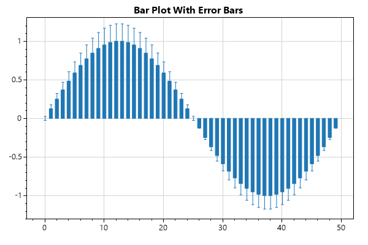


## Plot Bar Data Fancy

```cs
// generate some more complex data
Random rand = new Random(0);
int pointCount = 10;
double[] Xs = new double[pointCount];
double[] dataA = new double[pointCount];
double[] errorA = new double[pointCount];
double[] dataB = new double[pointCount];
double[] errorB = new double[pointCount];
for (int i = 0; i < pointCount; i++)
{
    Xs[i] = i * 10;
    dataA[i] = rand.NextDouble() * 100;
    dataB[i] = rand.NextDouble() * 100;
    errorA[i] = rand.NextDouble() * 10;
    errorB[i] = rand.NextDouble() * 10;
}

var plt = new ScottPlot.Plot(width, height);
plt.Title("Multiple Bar Plots");
plt.Grid(false);

// customize barWidth and xOffset to squeeze grouped bars together
plt.PlotBar(Xs, dataA, errorY: errorA, label: "data A", barWidth: 3.2, xOffset: -2);
plt.PlotBar(Xs, dataB, errorY: errorB, label: "data B", barWidth: 3.2, xOffset: 2);

plt.Axis(null, null, 0, null);
plt.Legend();

string[] labels = { "one", "two", "three", "four", "five", "six", "seven", "eight", "nine", "ten" };
plt.XTicks(Xs, labels);

plt.Save(600, 400, "62_Plot_Bar_Data_Fancy.png");
```

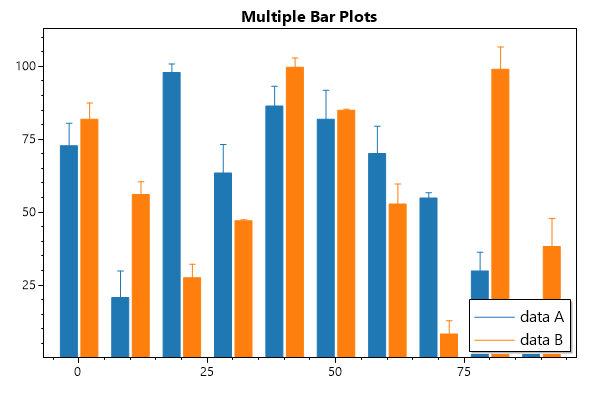


## Step Plot

```cs
int pointCount = 50;
double[] dataXs = ScottPlot.DataGen.Consecutive(pointCount);
double[] dataSin = ScottPlot.DataGen.Sin(pointCount);
double[] dataCos = ScottPlot.DataGen.Cos(pointCount);

var plt = new ScottPlot.Plot(width, height);
plt.PlotStep(dataXs, dataSin);
plt.PlotStep(dataXs, dataCos);
plt.Save(600, 400, "63_Step_Plot.png");
```


## Manual Grid Spacing

```cs
int pointCount = 50;
double[] dataXs = ScottPlot.DataGen.Consecutive(pointCount);
double[] dataSin = ScottPlot.DataGen.Sin(pointCount);
double[] dataCos = ScottPlot.DataGen.Cos(pointCount);

var plt = new ScottPlot.Plot(width, height);
plt.PlotScatter(dataXs, dataSin);
plt.PlotScatter(dataXs, dataCos);
plt.Grid(xSpacing: 2, ySpacing: .1);
plt.Save(600, 400, "64_Manual_Grid_Spacing.png");
```


## CPH

```cs
Random rand = new Random(0);
double[] values1 = ScottPlot.DataGen.RandomNormal(rand, pointCount: 1000, mean: 50, stdDev: 20);
double[] values2 = ScottPlot.DataGen.RandomNormal(rand, pointCount: 1000, mean: 45, stdDev: 25);
var hist1 = new ScottPlot.Histogram(values1, min: 0, max: 100);
var hist2 = new ScottPlot.Histogram(values2, min: 0, max: 100);

var plt = new ScottPlot.Plot(width, height);
plt.Title("Cumulative Probability Histogram");
plt.YLabel("Probability (fraction)");
plt.XLabel("Value (units)");
plt.PlotStep(hist1.bins, hist1.cumulativeFrac, lineWidth: 1.5, label: "sample A");
plt.PlotStep(hist2.bins, hist2.cumulativeFrac, lineWidth: 1.5, label: "sample B");
plt.Legend();
plt.Axis(null, null, 0, 1);
plt.Save(600, 400, "66_CPH.png");
```

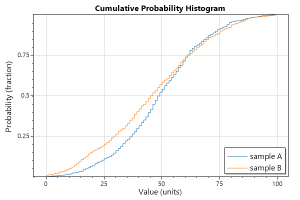


## Candlestick

```cs
ScottPlot.OHLC[] ohlcs = ScottPlot.DataGen.RandomStockPrices(rand: null, pointCount: 60, deltaMinutes: 10);

var plt = new ScottPlot.Plot(width: 800, height: 400);
plt.Title("Candlestick Chart");
plt.YLabel("Stock Price (USD)");
plt.PlotCandlestick(ohlcs);
plt.Ticks(dateTimeX: true);

plt.Save(600, 400, "67_Candlestick.png");
```

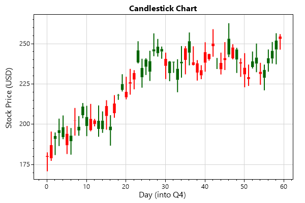


## OHLC

```cs
ScottPlot.OHLC[] ohlcs = ScottPlot.DataGen.RandomStockPrices(rand: null, pointCount: 60, deltaMinutes: 10);

var plt = new ScottPlot.Plot(width, height);
plt.Title("Open/High/Low/Close (OHLC) Chart");
plt.YLabel("Stock Price (USD)");
plt.PlotOHLC(ohlcs);
plt.Ticks(dateTimeX: true);

plt.Save(600, 400, "68_OHLC.png");
```


## Save Scatter Data

```cs
int pointCount = 50;
double[] dataXs = ScottPlot.DataGen.Consecutive(pointCount);
double[] dataSin = ScottPlot.DataGen.Sin(pointCount);

var plt = new ScottPlot.Plot(width, height);
plt.PlotScatter(dataXs, dataSin);
plt.GetPlottables()[0].SaveCSV("scatter.csv");
plt.Save(600, 400, "70_Save_Scatter_Data.png");
```


## Save Signal Data

```cs
int pointCount = 50;
double[] dataCos = ScottPlot.DataGen.Cos(pointCount);

var plt = new ScottPlot.Plot(width, height);
plt.PlotSignal(dataCos, sampleRate: 20_000);
plt.GetPlottables()[0].SaveCSV("signal.csv");
plt.Save(600, 400, "71_Save_Signal_Data.png");
```


## Custom Fonts

```cs
int pointCount = 50;
double[] dataXs = ScottPlot.DataGen.Consecutive(pointCount);
double[] dataSin = ScottPlot.DataGen.Sin(pointCount);
double[] dataCos = ScottPlot.DataGen.Cos(pointCount);

var plt = new ScottPlot.Plot(width, height);
plt.Title("Impressive Graph", fontName: "courier new", fontSize: 24, color: Color.Purple, bold: true);
plt.YLabel("vertical units", fontName: "impact", fontSize: 24, color: Color.Red, bold: true);
plt.XLabel("horizontal units", fontName: "georgia", fontSize: 24, color: Color.Blue, bold: true);
plt.PlotScatter(dataXs, dataSin, label: "sin");
plt.PlotScatter(dataXs, dataCos, label: "cos");
plt.PlotText("very graph", 25, .8, fontName: "comic sans ms", fontSize: 24, color: Color.Blue, bold: true);
plt.PlotText("so data", 0, 0, fontName: "comic sans ms", fontSize: 42, color: Color.Magenta, bold: true);
plt.PlotText("many documentation", 3, -.6, fontName: "comic sans ms", fontSize: 18, color: Color.DarkCyan, bold: true);
plt.PlotText("wow.", 10, .6, fontName: "comic sans ms", fontSize: 36, color: Color.Green, bold: true);
plt.PlotText("NuGet", 32, 0, fontName: "comic sans ms", fontSize: 24, color: Color.Gold, bold: true);
plt.Legend(fontName: "comic sans ms", fontSize: 16, bold: true, fontColor: Color.DarkBlue);
plt.Save(600, 400, "72_Custom_Fonts.png");
```


## Multiplot

```cs
Random rand = new Random(09241985);
var plt = new ScottPlot.MultiPlot(width: 800, height: 600, rows: 2, cols: 2);

plt.subplots[0].Title("Sine");
plt.subplots[0].PlotSignal(ScottPlot.DataGen.Sin(50));

plt.subplots[1].Title("Cosine");
plt.subplots[1].PlotSignal(ScottPlot.DataGen.Cos(50));

plt.subplots[2].Title("Random Points");
plt.subplots[2].PlotSignal(ScottPlot.DataGen.Random(rand, 50));

plt.subplots[3].Title("Random Walk");
plt.subplots[3].PlotSignal(ScottPlot.DataGen.RandomWalk(rand, 50));

// apply axes and layout from one plot to another one
plt.subplots[2].MatchAxis(plt.subplots[3]);
plt.subplots[2].MatchLayout(plt.subplots[3]);

plt.Save(600, 400, "73_Multiplot.png");
```


## Set Visibility

```cs
int pointCount = 50;
double[] dataXs = ScottPlot.DataGen.Consecutive(pointCount);
double[] dataSin = ScottPlot.DataGen.Sin(pointCount);
double[] dataCos = ScottPlot.DataGen.Cos(pointCount);

var plt = new ScottPlot.Plot(width, height);
var plottable1 = plt.PlotScatter(dataXs, dataSin, label: "sin");
var plottable2 = plt.PlotScatter(dataXs, dataCos, label: "cos");
plt.Legend();

// after something is plotted you can toggle its visibility
plottable1.visible = true;
plottable2.visible = false;

plt.Save(600, 400, "74_Set_Visibility.png");
```


