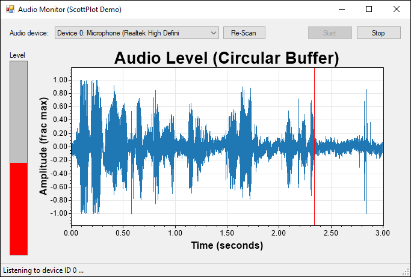
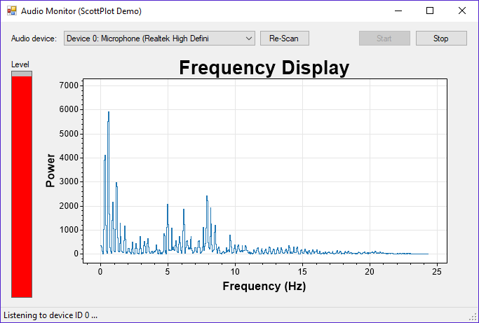

# ScottPlot Audio Demos
These examples use NAudio to access sound card data and ScottPlot to display it in real time.

Plotting PCM data with a circular buffer | Plotting frequency (FFT) data
---|---
 | 

## Requirements

You ***MUST*** have an active recording device for these demos to function! Check out your "sound" app. An active microphone must be listed in the recording tab:

