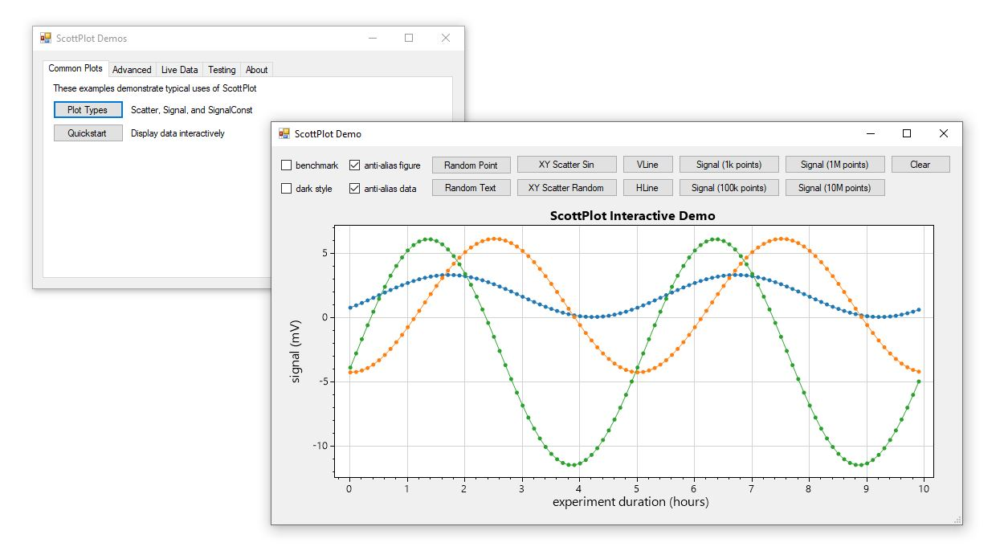

# ScottPlot Demos

This folder contains a C# project which holds several applications that demonstrate how to use various features of ScottPlot.

#### A click-to-run compiled version is available:
* [ScottPlotDemos.zip](ScottPlotDemos.zip)

#### The following resources may also be useful:
* Quickstart: [/doc/quickstart](/doc/quickstart)
* Cookbook: [/cookbook](/cookbook)
* API Documentation: [/doc](/doc)

