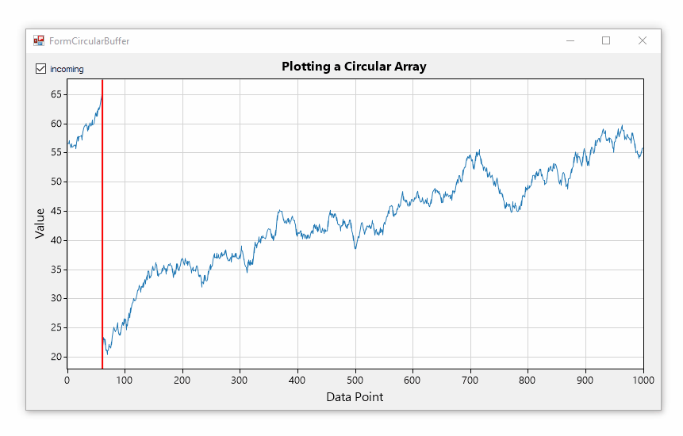
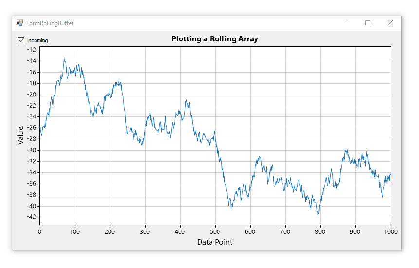
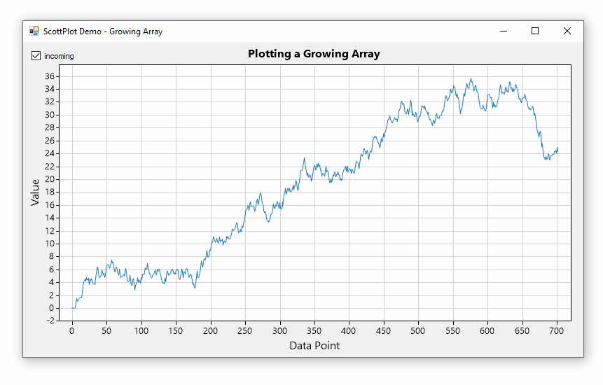

# Handing Incoming Data
This project demonstrates 3 ways of plotting continuously-updating data.

**Updating vs. Graphing:** An important concept to consider is that if data comes in slowly, you can update the plot every time data comes in. If data comes in at a very high rate, use a timer to update the plot less frequently and independent of the data updates.

**Efficiency:** When thinking about memory and resource efficiency, realize that none of it matters on a modern system if thousands of data points are being displayed. If _millions_ of data points are displayed, the consideration becomes more meaningful. 

### Circular Buffer
This is the most memory-efficient and resource-efficient method because the data array is created once and values are only copied as new data comes in. Code demonstrating this method is in [FormCircularBuffer.cs](FormCircularBuffer.cs)

### Rolling Buffer
This is just as memory-efficient as the circular buffer but is more resource-intense because every new set of incoming data triggers a copy of all of the data values in the existing array. Code demonstrating this method is in [FormRollingBuffer.cs](FormRollingBuffer.cs)

### Growing Array
This is the most memory and resource intensive option, because an entirely new full-size array is created every time data is updated. Every time new data comes in, a fully new array is created and all the old data and the new data is copied into it. This option is most likely to merit an independent timer devoted to updating the plot. Code demonstrating this method is in [FormGrowingArray.cs](FormGrowingArray.cs)

