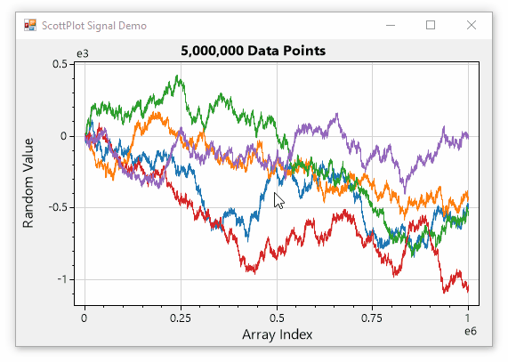

<!-- ScottPlot - Interactive Plotting Library for .NET -->

# ScottPlot

**ScottPlot is a free and open-source plotting library for .NET** that makes it easy to interactively display large datasets. Line plots, bar charts, pie graphs, scatter plots, and more can be created with just a few lines of code.

* [**ScottPlot Demo**](demo) 👈 _See what ScottPlot can do_

* [**ScottPlot Cookbook**](cookbook) 👈 _Learn how to use ScottPlot_

### Quickstart

* [Windows Forms](quickstart#windows-forms-quickstart)
* [WPF](quickstart#wpf-quickstart)
* [Avalonia](quickstart#avalonia-quickstart)
* [Console Application](quickstart#console-quickstart)

### Supported Platforms

* .NET Core 2.0 and newer
* .NET Framework 4.6.1 and newer

### ScottPlot Cookbook

The [ScottPlot Cookbook](cookbook) demonstrates how to create line plots, bar charts, pie graphs, scatter plots, and more with just a few lines of code. Every cookbook example is also included in the [ScottPlot Demo](demo) application.

### Miscellaneous

* **If you enjoy ScottPlot [give us a star on GitHub](https://github.com/swharden/ScottPlot)! ⭐**

* **New features** are listed on the [releases](https://github.com/swharden/ScottPlot/releases) page on GitHub

* **Contributions are welcome!** See [contributing.md](https://github.com/swharden/ScottPlot/blob/master/CONTRIBUTING.md) to get started

* **Build ScottPlot from source** with notes in [src/readme.md](https://github.com/swharden/ScottPlot/tree/master/src)

### About ScottPlot
ScottPlot was created by [Scott W Harden](https://www.swharden.com/wp/about-scott/) (with many contributions from the open-source community) and is provided under the permissive [MIT license](https://github.com/swharden/ScottPlot/blob/master/LICENSE).