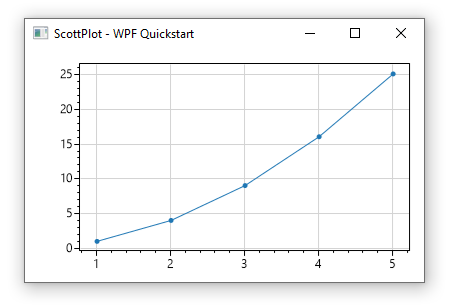
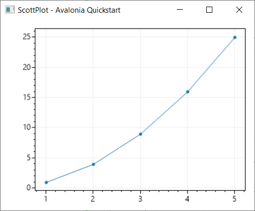

# ScottPlot Quickstart

* These examples demonstrate how to plot simple data with ScottPlot
* The **[ScottPlot Cookbook](http://swharden.com/scottplot/cookbook)** has many more advanced examples

## Console Quickstart

**Step 1:** Install ScottPlot [using NuGet](https://docs.microsoft.com/en-us/nuget/quickstart/install-and-use-a-package-in-visual-studio)

**Step 2:** Add the following to your start-up sequence:

```cs
double[] dataX = new double[] {1, 2, 3, 4, 5};
double[] dataY = new double[] {1, 4, 9, 16, 25};
var plt = new ScottPlot.Plot(400, 300);
plt.PlotScatter(dataX, dataY);
plt.SaveFig("quickstart.png");
```


## Windows Forms Quickstart

**Step 1:** Install ScottPlot.WinForms [using NuGet](https://docs.microsoft.com/en-us/nuget/quickstart/install-and-use-a-package-in-visual-studio)

**Step 2:** Drag a FormsPlot from the Toolbox onto your Form

**Step 3:** Plot some data in your start-up sequence

```cs
double[] dataX = new double[] {1, 2, 3, 4, 5};
double[] dataY = new double[] {1, 4, 9, 16, 25};
formsPlot1.plt.PlotScatter(dataX, dataY);
formsPlot1.Render();
```


## WPF Quickstart

**Step 1:** Install ScottPlot.WPF [using NuGet](https://docs.microsoft.com/en-us/nuget/quickstart/install-and-use-a-package-in-visual-studio)

**Step 2:** Add a WpfPlot to your layout area and give it a unique name
```xaml
<WpfPlot Name="wpfPlot1" />
```

**Step 3:** Plot some data in your start-up sequence

```cs
double[] dataX = new double[] {1, 2, 3, 4, 5};
double[] dataY = new double[] {1, 4, 9, 16, 25};
wpfPlot1.plt.PlotScatter(dataX, dataY);
wpfPlot1.Render();
```



## Avalonia Quickstart

**Step 1:** Install ScottPlot.Avalonia [using NuGet](https://docs.microsoft.com/en-us/nuget/quickstart/install-and-use-a-package-in-visual-studio)

**Step 2:** Add an AvaPlot to your layout area and give it a unique name
```xaml
<AvaPlot Name="avaPlot1"/>
```

**Step 3:** Plot some data in your start-up sequence

```cs
var avaplot1 = this.Find<AvaPlot>("avaPlot1");

double[] dataX = new double[] { 1, 2, 3, 4, 5 };
double[] dataY = new double[] { 1, 4, 9, 16, 25 };
avaplot1.plt.PlotScatter(dataX, dataY);
avaplot1.Render();
```


