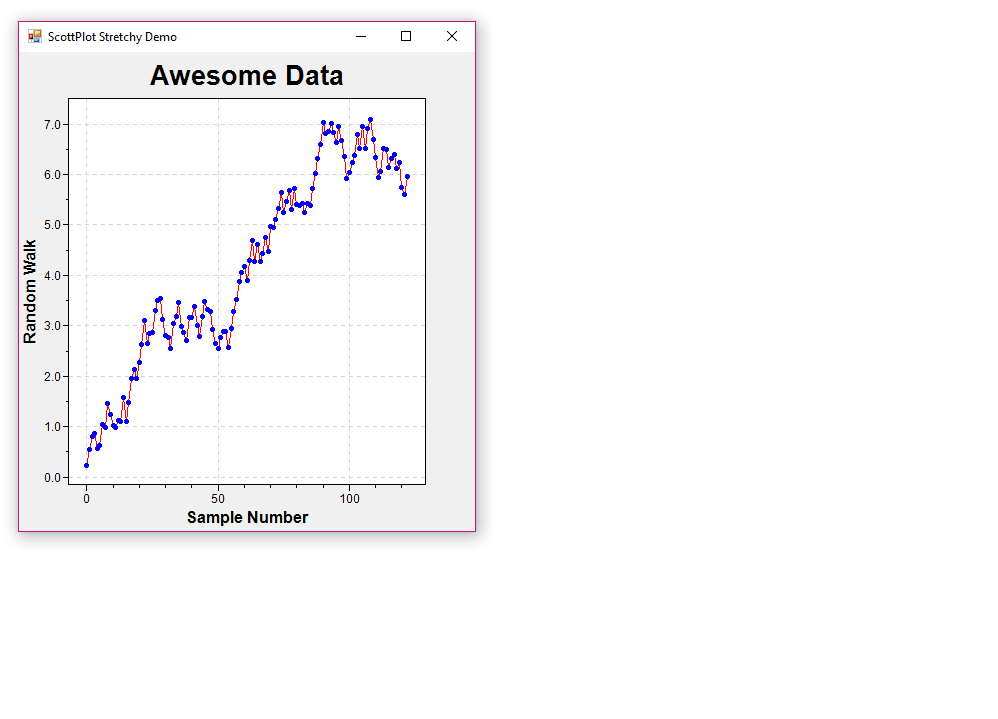

# ScottPlot Documentation
ScottPlot is under active development and evolves frequently. For now, the best way to learn how to use ScottPlot is to [review the cookbook](cookbook).

---

# Interactive Functionality
For now, the best way to learn how to make graphs responsive to realtime user input is to review the examples in the GUI folder of the ScottPlot solution.

## Mouse Actions
* left-click-drag - pans
* right-click-drag - zooms
* scroll-wheel - zooms
* double-click - shows debug information

## Interactivity Demo

