# ScottPlot Cookbook

This page was automatically generated by a the [ScottPlotTests](https://github.com/swharden/ScottPlot/tree/master/test/ScottPlotTests) program. Note that these graphs are being generated from a Console Application (not a GUI / user control).

In these examples, `xs` and `ys` are large double arrays.

## scatter.png
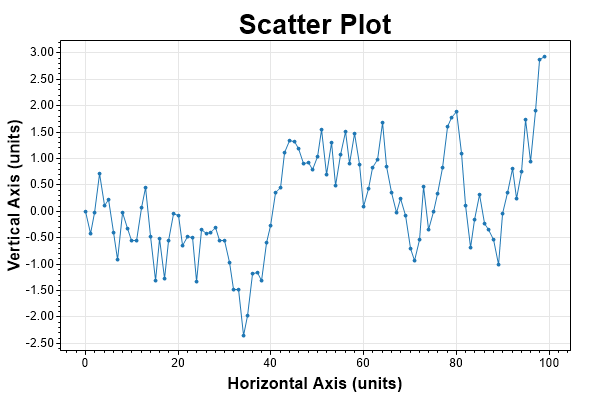
```
// Creates a scatter plot from two double arrays
var plt = new ScottPlot.Plot(600, 400);
plt.data.AddScatter(xs, ys);
plt.settings.AxisFit();
plt.settings.title = "Scatter Plot";
plt.figure.Save("scatter.png");
```

## addPoints.png
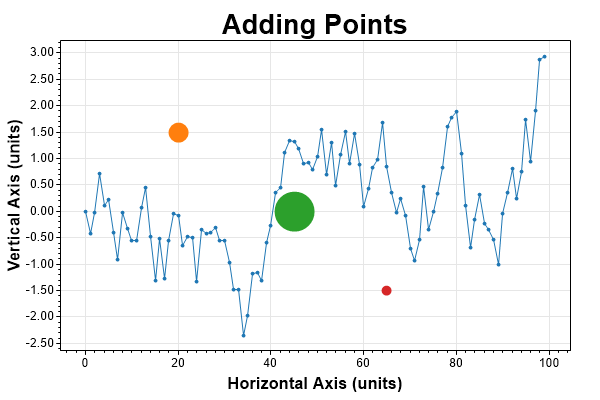
```
// manually place markers at specific points
var plt = new ScottPlot.Plot(600, 400);
plt.data.AddScatter(xs, ys);
plt.data.AddPoint(20, 1.5, markerSize: 10);
plt.data.AddPoint(45, 0, markerSize: 20);
plt.data.AddPoint(65, -1.5, markerSize: 5);
plt.settings.AxisFit();
plt.settings.title = "Adding Points";
plt.figure.Save("addPoints.png");
```

## markersOnly.png

```
// create a plot with only markers (no lines)
var plt = new ScottPlot.Plot(600, 400);
plt.data.AddScatter(xs, ys, lineWidth: 0);
plt.settings.AxisFit();
plt.settings.title = "Scatter Plot (markers only)";
plt.figure.Save("markersOnly.png");
```

## linesOnly.png
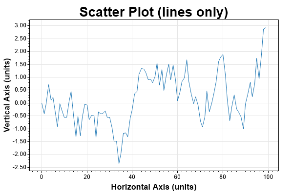
```
// create a plot with only lines (no markers)
var plt = new ScottPlot.Plot(600, 400);
plt.data.AddScatter(xs, ys, markerSize: 0);
plt.settings.AxisFit();
plt.settings.title = "Scatter Plot (lines only)";
plt.figure.Save("linesOnly.png");
```

## axisLimits.png
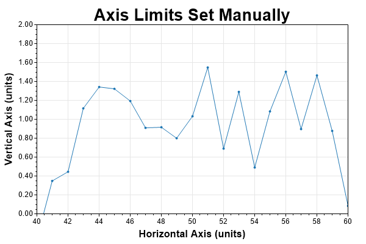
```
// manually define axis limits 
var plt = new ScottPlot.Plot(600, 400);
plt.data.AddScatter(xs, ys);
plt.settings.AxesSet(40, 60, 0, 2);
plt.settings.title = "Axis Limits Set Manually";
plt.figure.Save("axisLimits.png");
```

## labels.png
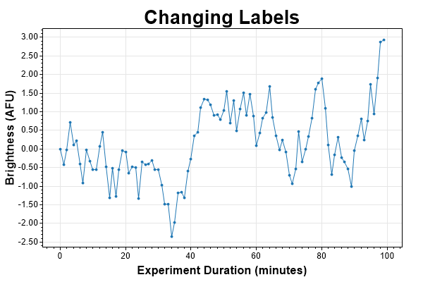
```
// axis labels can be easily changed
var plt = new ScottPlot.Plot(600, 400);
plt.data.AddScatter(xs, ys);
plt.settings.AxisFit();
plt.settings.title = "Changing Labels";
plt.settings.axisLabelY = "Brightness (AFU)";
plt.settings.axisLabelX = "Experiment Duration (minutes)";
plt.figure.Save("labels.png");
```

## scatterStyling.png
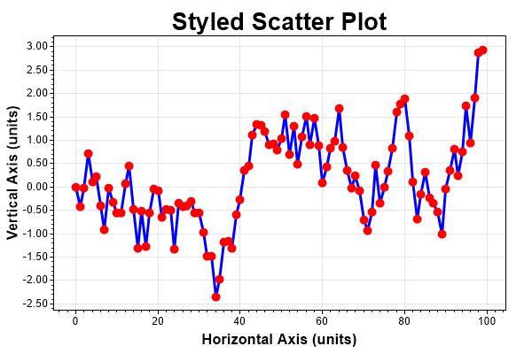
```
// styling is easy with named arguments
var plt = new ScottPlot.Plot(600, 400);
plt.data.AddScatter(xs, ys, lineWidth: 3, markerSize: 5, lineColor: Color.Blue, markerColor: Color.Red);
plt.settings.AxisFit();
plt.settings.title = "Styled Scatter Plot";
plt.figure.Save("scatterStyling.png");
```

## margins.png
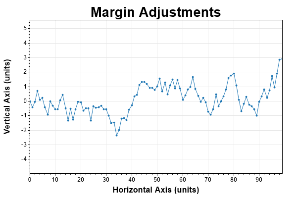
```
// The arguments of AxisFit() are X and Y margins
var plt = new ScottPlot.Plot(600, 400);
plt.data.AddScatter(xs, ys);
plt.settings.AxisFit(0, .5);
plt.settings.title = "Margin Adjustments";
plt.figure.Save("margins.png");
```

## multiPlot.png
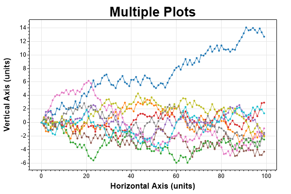
```
// multiple plots can be added to the same graph
var plt = new ScottPlot.Plot(600, 400);
for (int i = 0; i < 10; i++)
{
    var ys = DataGenerator.RandomWalk(pointCount, seed: i);
    plt.data.AddScatter(xs, ys);
}
plt.settings.AxisFit();
plt.settings.title = "Multiple Plots";
plt.figure.Save("multiPlot.png");
```

## axisLines.png
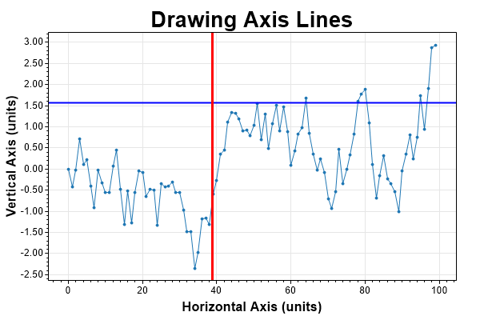
```
// horizontal and vertical axis lines extend to infinity
var plt = new ScottPlot.Plot(600, 400);
plt.data.AddScatter(xs, ys);
plt.settings.AxisFit();
plt.data.AddHorizLine(1.57, lineWidth: 2, lineColor: Color.Blue);
plt.data.AddVertLine(38.76, lineWidth: 3, lineColor: Color.Red);
plt.settings.title = "Drawing Axis Lines";
plt.figure.Save("axisLines.png");
```

## signal.png
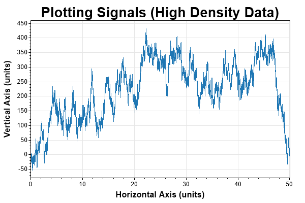
```
// signal plotting is ideal for large arrays of evenly-spaced data
var plt = new ScottPlot.Plot(600, 400);
plt.data.AddSignal(signal, sampleRateHz: 20_000);
plt.settings.AxisFit(0, .1);
plt.settings.title = "Plotting Signals (High Density Data)";
plt.figure.Save("signal.png");
```

## signalZoomed.png
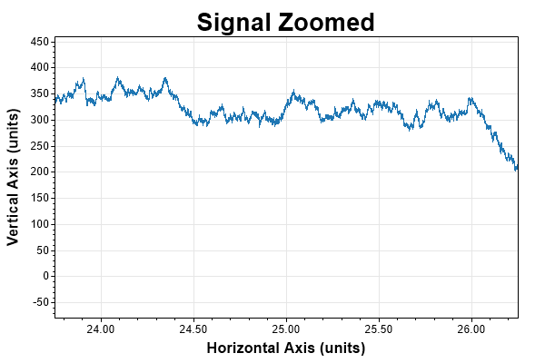
```
// demonstrate how to zoom in on portion of a signal
var plt = new ScottPlot.Plot(600, 400);
plt.data.AddSignal(signal, sampleRateHz: 20_000);
plt.settings.AxisFit(0, .1);
plt.settings.AxesZoom(20, 1);
plt.settings.title = "Signal Zoomed";
plt.figure.Save("signalZoomed.png");
```

## demo_signalZoomed2.png
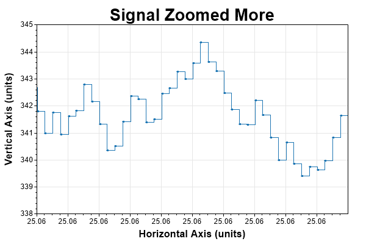
```
// at high magnification signals are representated as step plots
var plt = new ScottPlot.Plot(600, 400);
plt.data.AddSignal(signal, sampleRateHz: 20_000);
plt.settings.AxisFit(0, .1);
plt.settings.AxesSet(25.055, 25.057, 338, 345);
plt.settings.title = "Signal Zoomed More";
plt.figure.Save("demo_signalZoomed2.png");
```

## padding.png
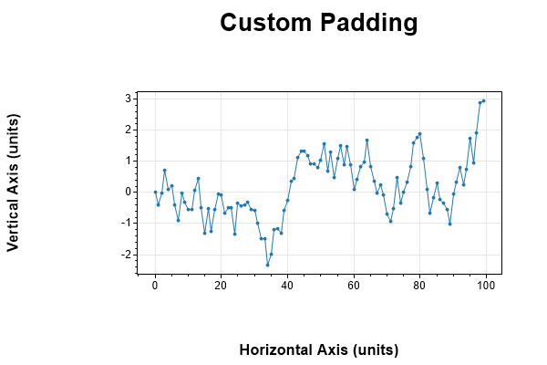
```
// padding can be changed to accomodate larger labels or ticks
var plt = new ScottPlot.Plot(600, 400);
plt.data.AddScatter(xs, ys);
plt.settings.AxisFit();
plt.settings.SetDataPadding(150, 50, 100, 100);
plt.settings.title = "Custom Padding";
plt.figure.Save("padding.png");
```

## frameless.png
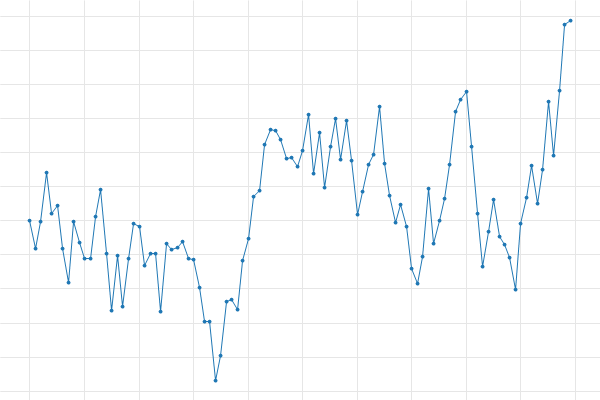
```
// one can plot just the data area without labels or ticks
var plt = new ScottPlot.Plot(600, 400);
plt.data.AddScatter(xs, ys);
plt.settings.AxisFit();
plt.settings.SetDataPadding(0, 0, 0, 0);
plt.settings.axisLabelX = "";
plt.settings.axisLabelY = "";
plt.settings.title = "";
plt.settings.drawAxes = false;
plt.figure.Save("frameless.png");
```

## backgroundFigure.png
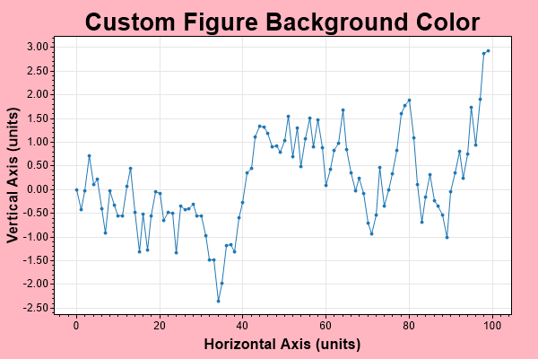
```
// the figure background color can be defined
var plt = new ScottPlot.Plot(600, 400);
plt.data.AddScatter(xs, ys);
plt.settings.AxisFit();
plt.settings.figureBgColor = Color.LightPink;
plt.settings.title = "Custom Figure Background Color";
plt.figure.Save("backgroundFigure.png");
```

## backgroundData.png
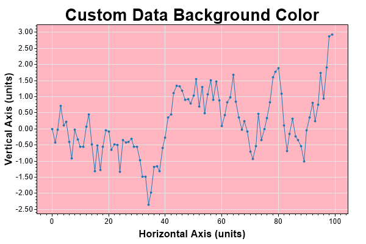
```
// the data area background color can be defined
var plt = new ScottPlot.Plot(600, 400);
plt.data.AddScatter(xs, ys);
plt.settings.AxisFit();
plt.settings.dataBgColor = Color.LightPink;
plt.settings.title = "Custom Data Background Color";
plt.figure.Save("backgroundData.png");
```

## black.png
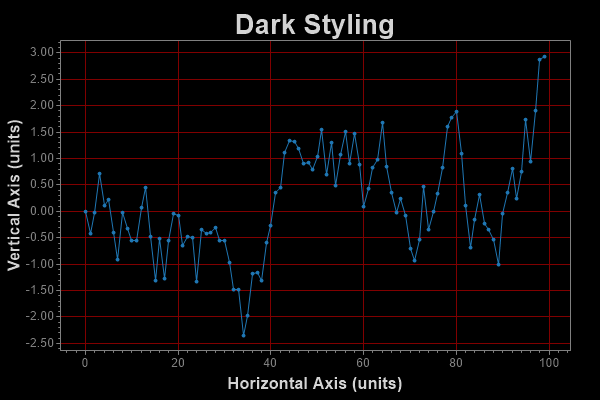
```
// demonstrate how to change all sorts of colors
var plt = new ScottPlot.Plot(600, 400);
plt.data.AddScatter(xs, ys);
plt.settings.AxisFit();
plt.settings.figureBgColor = Color.Black;
plt.settings.dataBgColor = Color.Black;
plt.settings.gridColor = Color.Maroon;
plt.settings.tickColor = Color.Gray;
plt.settings.labelColor = Color.LightGray;
plt.settings.title = "Dark Styling";
plt.figure.Save("black.png");
```

