# ScottPlot Cookbook
_This cookbook was automatically generated by [cookbook.csproj](/demos/ScottPlotCookbook) on May 5, 2019_

##  Scatter Sin

```cs
var plt = new ScottPlot.Plot(600, 400);
plt.PlotScatter(dataXs, dataSin);
plt.PlotScatter(dataXs, dataCos);
plt.AxisAuto();
plt.SaveFig(fileName);
```

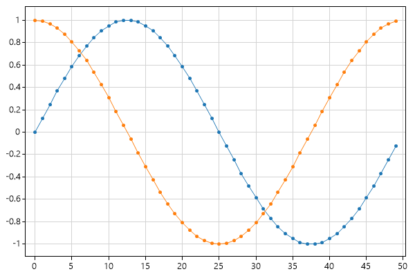

##  Automatic Margins

```cs
var plt = new ScottPlot.Plot(600, 400);
plt.PlotScatter(dataXs, dataSin);
plt.PlotScatter(dataXs, dataCos);
plt.AxisAuto(0, .5); // no horizontal padding, 50% vertical padding
plt.SaveFig(fileName);
```

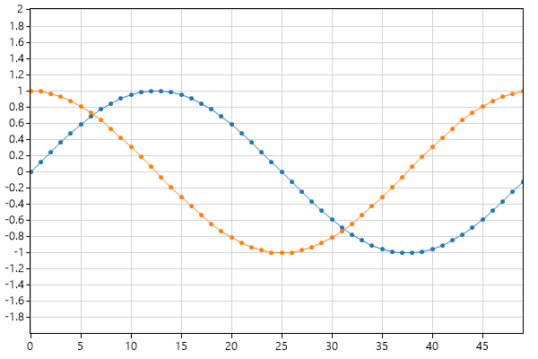

##  Defined Axis Limits

```cs
var plt = new ScottPlot.Plot(600, 400);
plt.PlotScatter(dataXs, dataSin);
plt.PlotScatter(dataXs, dataCos);
plt.Axis(2, 8, .2, 1.1); // x1, x2, y1, y2
plt.SaveFig(fileName);
```


##  Zoom and Pan

```cs
var plt = new ScottPlot.Plot(600, 400);
plt.PlotScatter(dataXs, dataSin);
plt.PlotScatter(dataXs, dataCos);
plt.AxisAuto();
plt.AxisZoom(2, 2);
plt.AxisPan(-10, .5);
plt.SaveFig(fileName);
```

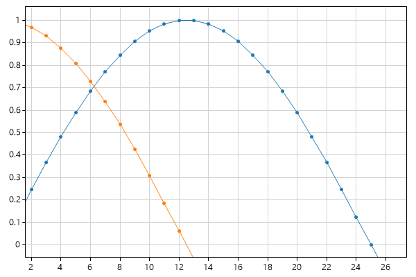

##  Legend

```cs
var plt = new ScottPlot.Plot(600, 400);
plt.PlotScatter(dataXs, dataSin, label: "first");
plt.PlotScatter(dataXs, dataCos, label: "second");
plt.AxisAuto();
plt.Legend();
plt.SaveFig(fileName);
```

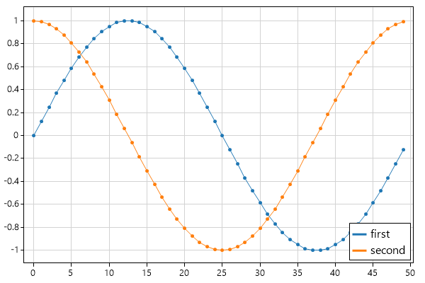

## Styling Scatter Plots

```cs
var plt = new ScottPlot.Plot(600, 400);
plt.PlotScatter(dataXs, dataSin, color: Color.Magenta, lineWidth: 0, markerSize: 10);
plt.PlotScatter(dataXs, dataCos, color: Color.Green, lineWidth: 5, markerSize: 0);
plt.AxisAuto(0); // no horizontal margin (default 10% vertical margin)
plt.SaveFig(fileName);
```

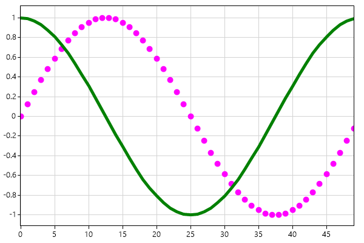

## Plot XY Data

```cs
var plt = new ScottPlot.Plot(600, 400);
plt.PlotScatter(dataRandom1, dataRandom2);
plt.AxisAuto();
plt.SaveFig(fileName);
```

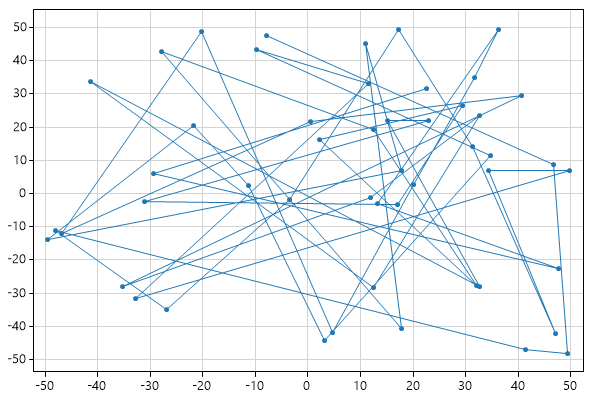

## Plot Lines Only

```cs
var plt = new ScottPlot.Plot(600, 400);
plt.PlotScatter(dataRandom1, dataRandom2, markerSize: 0);
plt.PlotScatter(dataRandom3, dataRandom4, markerSize: 0);
plt.AxisAuto();
plt.SaveFig(fileName);
```

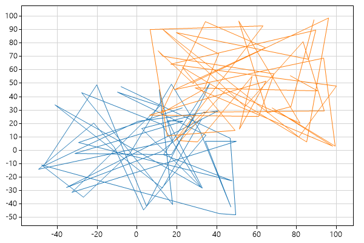

## Plot Points Only

```cs
var plt = new ScottPlot.Plot(600, 400);
plt.PlotScatter(dataRandom1, dataRandom2, lineWidth: 0);
plt.PlotScatter(dataRandom3, dataRandom4, lineWidth: 0);
plt.AxisAuto();
plt.SaveFig(fileName);
```

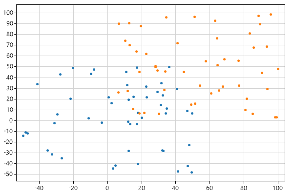

## Styling XY Plots

```cs
var plt = new ScottPlot.Plot(600, 400);
plt.PlotScatter(dataRandom1, dataRandom2, color: Color.Magenta, lineWidth: 3, markerSize: 15);
plt.PlotScatter(dataRandom3, dataRandom4, color: Color.Green, lineWidth: 3, markerSize: 15);
plt.AxisAuto();
plt.SaveFig(fileName);
```

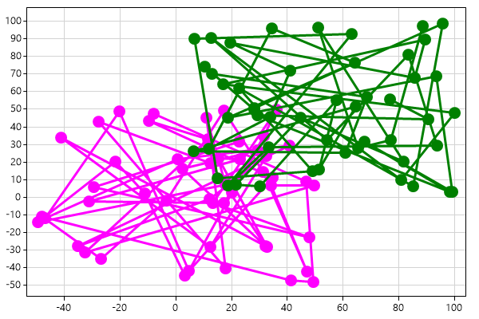

## Plotting Points

```cs
var plt = new ScottPlot.Plot(600, 400);
plt.PlotScatter(dataXs, dataSin);
plt.PlotScatter(dataXs, dataCos);
plt.PlotPoint(25, 0.8);
plt.PlotPoint(30, 0.3, color: Color.Magenta, markerSize: 15);
plt.AxisAuto(0);
plt.SaveFig(fileName);
```

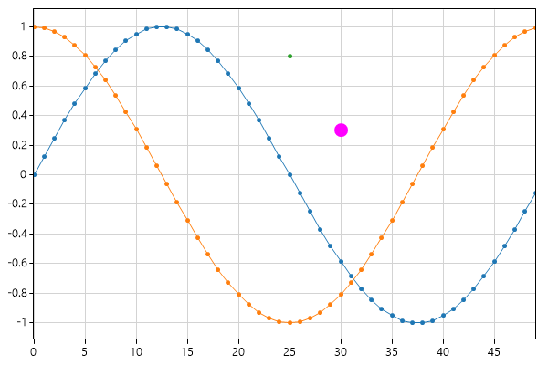

## Plotting Text

```cs
var plt = new ScottPlot.Plot(600, 400);
plt.PlotScatter(dataXs, dataSin);
plt.PlotScatter(dataXs, dataCos);
plt.PlotPoint(25, 0.8);
plt.PlotPoint(30, 0.3, color: Color.Magenta, markerSize: 15);
plt.PlotText("important point", 25, 0.8);
plt.PlotText("more important", 30, .3, fontSize: 16, bold: true);
plt.AxisAuto(0);
plt.SaveFig(fileName);
```


## Clearing Plots

```cs
var plt = new ScottPlot.Plot(600, 400);
plt.PlotScatter(dataXs, dataSin);
plt.PlotScatter(dataXs, dataCos);
plt.Clear();
plt.PlotScatter(dataRandom3, dataRandom4);
plt.AxisAuto();
plt.SaveFig(fileName);
```

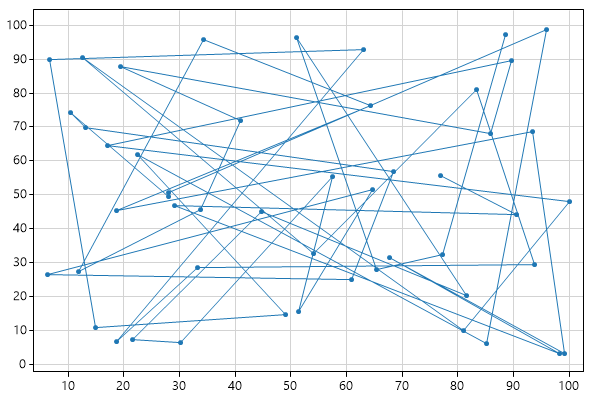

## Modifying Plotted Data

```cs
var plt = new ScottPlot.Plot(600, 400);
plt.PlotScatter(dataXs, dataSin);
plt.PlotScatter(dataXs, dataCos);

// Even after an array is given to ScottPlot plotted, its contents 
// can be updated and they will be displayed at the next render.
// This is epsecially useful to know for creating live data displays.
for (int i = 10; i < 20; i++)
{
    dataSin[i] = i / 10.0;
    dataCos[i] = 2 * i / 10.0;
}

plt.AxisAuto();
plt.SaveFig(fileName);
```

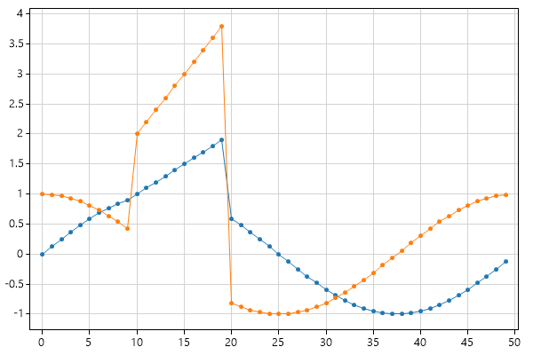

## Small Plot

```cs
var plt = new ScottPlot.Plot(200, 150);
plt.PlotScatter(dataXs, dataSin);
plt.PlotScatter(dataXs, dataCos);
plt.AxisAuto(0);
plt.SaveFig(fileName);
```

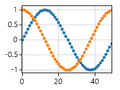

##  Title and Axis Labels

```cs
var plt = new ScottPlot.Plot(600, 400);
plt.PlotScatter(dataXs, dataSin);
plt.PlotScatter(dataXs, dataCos);
plt.AxisAuto(0);

plt.Title("Very Complicated Data");
plt.XLabel("Experiment Duration");
plt.YLabel("Productivity");

plt.SaveFig(fileName);
```

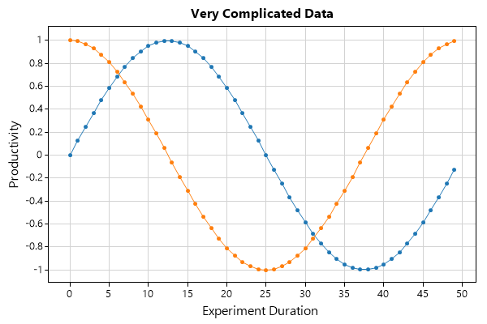

##  Extra Padding

```cs
var plt = new ScottPlot.Plot(600, 400);
plt.PlotScatter(dataXs, dataSin);
plt.PlotScatter(dataXs, dataCos);
plt.AxisAuto(0);

plt.Title("Very Complicated Data");
plt.XLabel("Experiment Duration");
plt.YLabel("Productivity");
plt.TightenLayout(padding: 40);

plt.SaveFig(fileName);
```

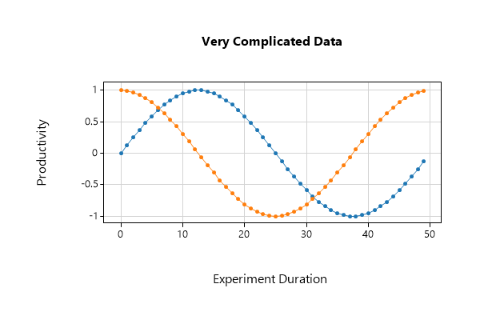

## Custom Colors

```cs
var plt = new ScottPlot.Plot(600, 400);

Color figureBgColor = ColorTranslator.FromHtml("#001021");
Color dataBgColor = ColorTranslator.FromHtml("#021d38");
plt.Background(figureBgColor, dataBgColor);
plt.Grid(color: ColorTranslator.FromHtml("#273c51"));
plt.Ticks(color: Color.LightGray);
plt.PlotScatter(dataXs, dataSin);
plt.PlotScatter(dataXs, dataCos);
plt.Title("Very Complicated Data", Color.White);
plt.XLabel("Experiment Duration", Color.LightGray);
plt.YLabel("Productivity", Color.LightGray);
plt.AxisAuto();
plt.SaveFig(fileName);
```

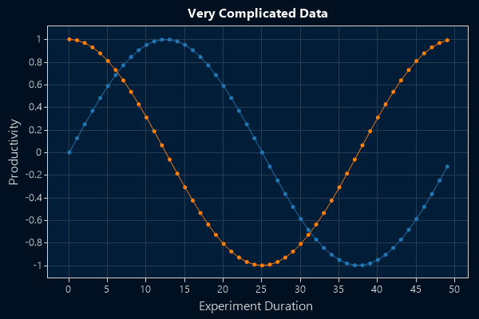

## Frameless Plot

```cs
var plt = new ScottPlot.Plot(600, 400);
Color figureBgColor = ColorTranslator.FromHtml("#001021");
Color dataBgColor = ColorTranslator.FromHtml("#021d38");
plt.Background(figureBgColor, dataBgColor);
plt.Grid(color: ColorTranslator.FromHtml("#273c51"));
plt.Ticks(displayTicksX: false, displayTicksY: false);
plt.Frame(drawFrame: false);
plt.TightenLayout(padding: 0);
plt.PlotScatter(dataXs, dataSin);
plt.PlotScatter(dataXs, dataCos);
plt.AxisAuto(0);
plt.SaveFig(fileName);
```

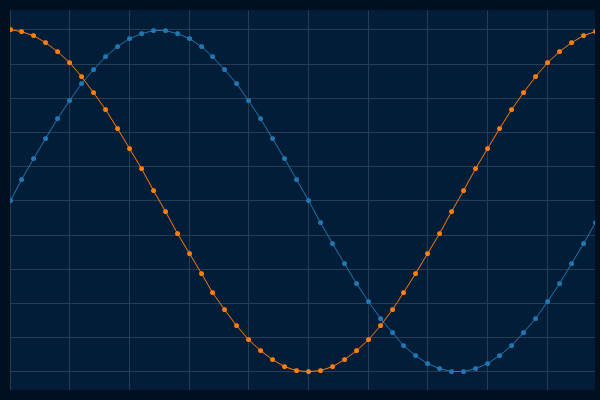

## Disable the Grid

```cs
var plt = new ScottPlot.Plot(600, 400);
plt.PlotScatter(dataXs, dataSin);
plt.PlotScatter(dataXs, dataCos);
plt.AxisAuto(0);
plt.Grid(false);
plt.SaveFig(fileName);
```

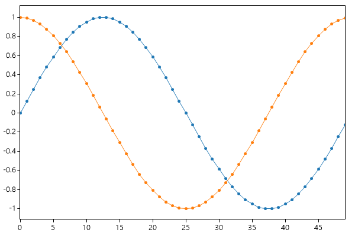

## Corner Axis Frame

```cs
var plt = new ScottPlot.Plot(600, 400);
plt.PlotScatter(dataXs, dataSin);
plt.PlotScatter(dataXs, dataCos);
plt.AxisAuto();
plt.Grid(false);
plt.Frame(byAxis: new bool[] { true, false, true, false });
plt.SaveFig(fileName);
```

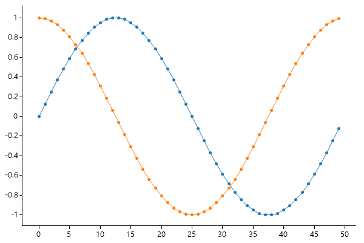

## Horizontal Ticks Only

```cs
var plt = new ScottPlot.Plot(600, 400);
plt.PlotScatter(dataXs, dataSin);
plt.PlotScatter(dataXs, dataCos);
plt.AxisAuto();
plt.Grid(false);
plt.Ticks(displayTicksY: false);
plt.Frame(byAxis: new bool[] { false, false, true, false });
plt.SaveFig(fileName);
```

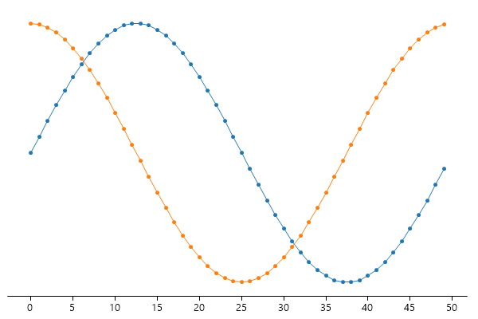

## Signal

```cs
// PlotSignal is ideal for plotting large arrays of evenly-spaed data at high framerates.
// Note that we are testing it here by plotting an array with one million data points.
var plt = new ScottPlot.Plot(600, 400);
plt.Benchmark();
plt.PlotSignal(dataSignal, sampleRate: 20_000);
plt.AxisAuto();
plt.SaveFig(fileName);
```

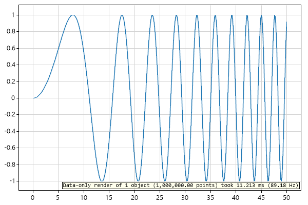

## Signal With Antialiasing Off

```cs
// A slight performance enhancement is achieved when anti-aliasing is disabled
var plt = new ScottPlot.Plot(600, 400);
plt.Benchmark();
plt.AntiAlias(true, false);
plt.PlotSignal(dataSignal, sampleRate: 20_000);
plt.AxisAuto();
plt.SaveFig(fileName);
```

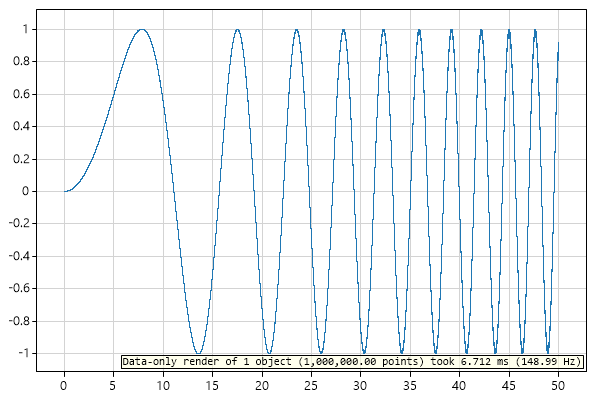

## Signal Styling

```cs
var plt = new ScottPlot.Plot(600, 400);
plt.PlotSignal(dataSignal, 20000, linewidth: 3, color: Color.Red);
plt.AxisAuto();
plt.SaveFig(fileName);
```


## Vertical and Horizontal Lines

```cs
var plt = new ScottPlot.Plot(600, 400);
plt.PlotScatter(dataXs, dataSin);
plt.PlotScatter(dataXs, dataCos);
plt.PlotVLine(17);
plt.PlotHLine(-.25, color: Color.Red, lineWidth: 3);
plt.AxisAuto();
plt.SaveFig(fileName);
```

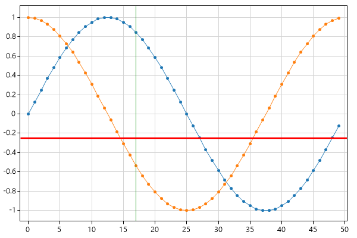

## StyleBlue1

```cs
var plt = new ScottPlot.Plot(600, 400);
plt.PlotScatter(dataXs, dataSin, label: "sin");
plt.PlotScatter(dataXs, dataCos, label: "cos");
plt.Title("Very Complicated Data");
plt.XLabel("Experiment Duration");
plt.YLabel("Productivity");
plt.Legend();
plt.Style(ScottPlot.Style.Blue1);
plt.AxisAuto(0);
plt.SaveFig(fileName);
```

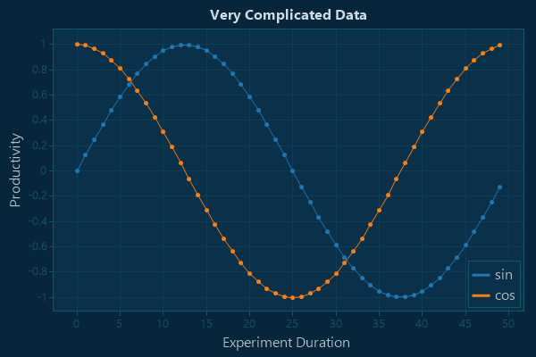

## StyleBlue2

```cs
var plt = new ScottPlot.Plot(600, 400);
plt.PlotScatter(dataXs, dataSin, label: "sin");
plt.PlotScatter(dataXs, dataCos, label: "cos");
plt.Title("Very Complicated Data");
plt.XLabel("Experiment Duration");
plt.YLabel("Productivity");
plt.Legend();
plt.Style(ScottPlot.Style.Blue2);
plt.AxisAuto(0);
plt.SaveFig(fileName);
```

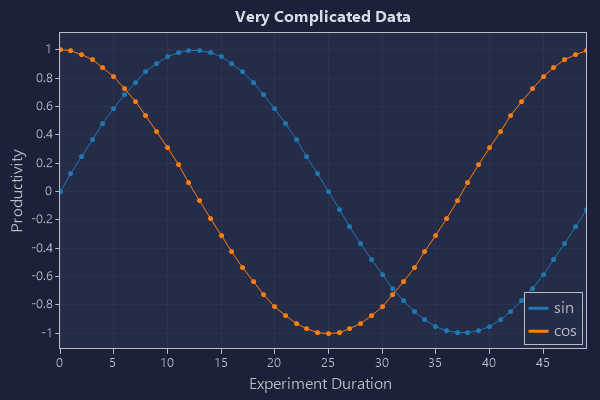

## StyleBlue3

```cs
var plt = new ScottPlot.Plot(600, 400);
plt.PlotScatter(dataXs, dataSin, label: "sin");
plt.PlotScatter(dataXs, dataCos, label: "cos");
plt.Title("Very Complicated Data");
plt.XLabel("Experiment Duration");
plt.YLabel("Productivity");
plt.Legend();
plt.Style(ScottPlot.Style.Blue3);
plt.AxisAuto(0);
plt.SaveFig(fileName);
```

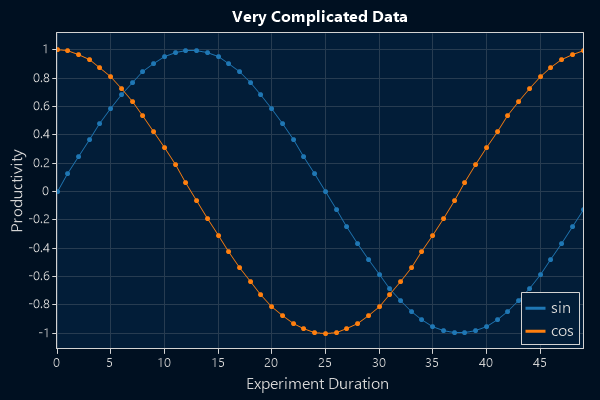

## StyleLight1

```cs
var plt = new ScottPlot.Plot(600, 400);
plt.PlotScatter(dataXs, dataSin, label: "sin");
plt.PlotScatter(dataXs, dataCos, label: "cos");
plt.Title("Very Complicated Data");
plt.XLabel("Experiment Duration");
plt.YLabel("Productivity");
plt.Legend();
plt.Style(ScottPlot.Style.Light1);
plt.AxisAuto(0);
plt.SaveFig(fileName);
```

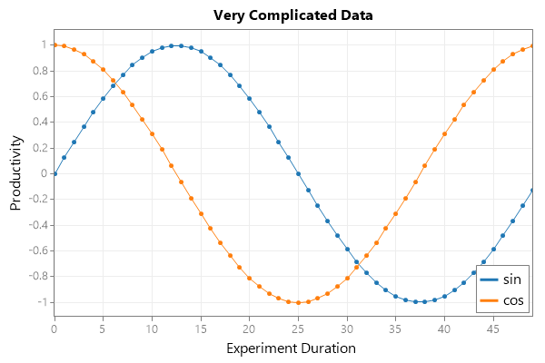

## StyleLight2

```cs
var plt = new ScottPlot.Plot(600, 400);
plt.PlotScatter(dataXs, dataSin, label: "sin");
plt.PlotScatter(dataXs, dataCos, label: "cos");
plt.Title("Very Complicated Data");
plt.XLabel("Experiment Duration");
plt.YLabel("Productivity");
plt.Legend();
plt.Style(ScottPlot.Style.Light2);
plt.AxisAuto(0);
plt.SaveFig(fileName);
```

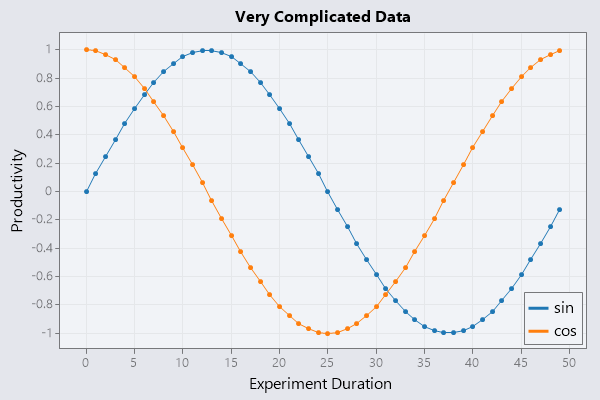

## StyleGray1

```cs
var plt = new ScottPlot.Plot(600, 400);
plt.PlotScatter(dataXs, dataSin, label: "sin");
plt.PlotScatter(dataXs, dataCos, label: "cos");
plt.Title("Very Complicated Data");
plt.XLabel("Experiment Duration");
plt.YLabel("Productivity");
plt.Legend();
plt.Style(ScottPlot.Style.Gray1);
plt.AxisAuto(0);
plt.SaveFig(fileName);
```

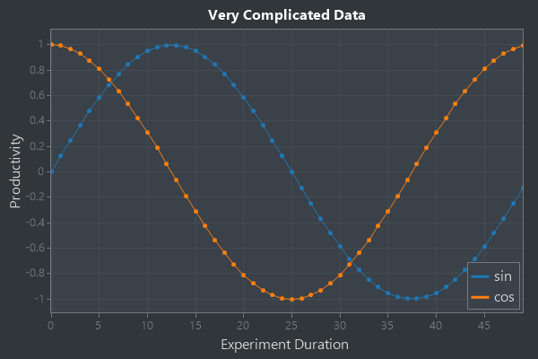

## StyleGray2

```cs
var plt = new ScottPlot.Plot(600, 400);
plt.PlotScatter(dataXs, dataSin, label: "sin");
plt.PlotScatter(dataXs, dataCos, label: "cos");
plt.Title("Very Complicated Data");
plt.XLabel("Experiment Duration");
plt.YLabel("Productivity");
plt.Legend();
plt.Style(ScottPlot.Style.Gray2);
plt.AxisAuto(0);
plt.SaveFig(fileName);
```

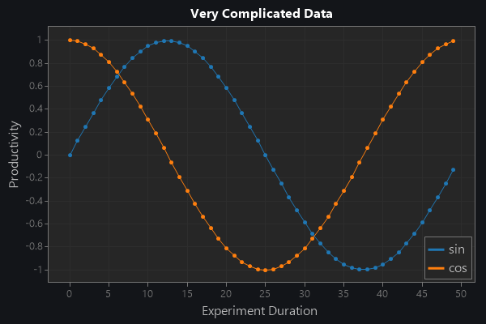

## StyleBlack

```cs
var plt = new ScottPlot.Plot(600, 400);
plt.PlotScatter(dataXs, dataSin, label: "sin");
plt.PlotScatter(dataXs, dataCos, label: "cos");
plt.Title("Very Complicated Data");
plt.XLabel("Experiment Duration");
plt.YLabel("Productivity");
plt.Legend();
plt.Style(ScottPlot.Style.Black);
plt.AxisAuto(0);
plt.SaveFig(fileName);
```

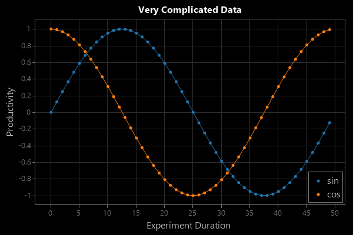

## StyleDefault

```cs
var plt = new ScottPlot.Plot(600, 400);
plt.PlotScatter(dataXs, dataSin, label: "sin");
plt.PlotScatter(dataXs, dataCos, label: "cos");
plt.Title("Very Complicated Data");
plt.XLabel("Experiment Duration");
plt.YLabel("Productivity");
plt.Legend();
plt.Style(ScottPlot.Style.Default);
plt.AxisAuto(0);
plt.SaveFig(fileName);
```

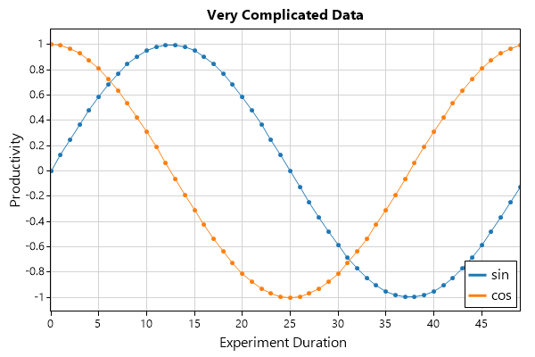

