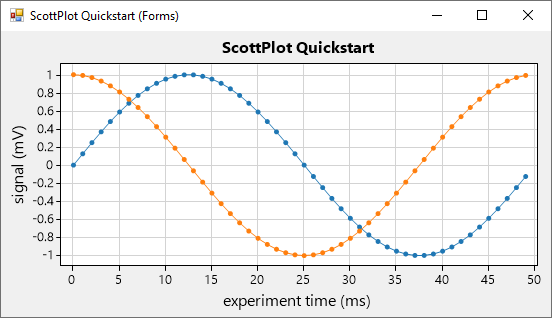

# ScottPlot Quickstarts

The following code examples demonstrate how to get ScottPlot up and running with minimum complexity. The following resources may also be useful:
* Cookbook: [/cookbook](/cookbook)
* Demos: [/demos](/demos)
* API Documentation: [/doc](/doc)

## QuickStart: Console Application

```cs
// generate some data to plot
int pointCount = 100;
double[] dataXs = new double[pointCount];
double[] dataSin = new double[pointCount];
double[] dataCos = new double[pointCount];
for (int i = 0; i < pointCount; i++)
{
    dataXs[i] = i;
    dataSin[i] = Math.Sin(i * 2 * Math.PI / pointCount);
    dataCos[i] = Math.Cos(i * 2 * Math.PI / pointCount);
}

// plot the data
var plt = new ScottPlot.Plot(500, 300);
plt.PlotScatter(dataXs, dataSin);
plt.PlotScatter(dataXs, dataCos);
plt.Title("ScottPlot Quickstart (console)");
plt.XLabel("experiment time (ms)");
plt.YLabel("signal (mV)");
plt.SaveFig("console.png");
```


## Quickstart: WinForms Application

1. Install ScottPlot using NuGet
2. Drag/Drop the FormsPlot (from the toolbox) onto your Form
3. Add the following code to your startup sequence:

```cs
// generate some data to plot
int pointCount = 100;
double[] dataXs = new double[pointCount];
double[] dataSin = new double[pointCount];
double[] dataCos = new double[pointCount];
for (int i = 0; i < pointCount; i++)
{
	dataXs[i] = i;
	dataSin[i] = Math.Sin(i * 2 * Math.PI / pointCount);
	dataCos[i] = Math.Cos(i * 2 * Math.PI / pointCount);
}

// plot the data
formsPlot1.plt.PlotScatter(dataXs, dataSin);
formsPlot1.plt.PlotScatter(dataXs, dataCos);
formsPlot1.plt.XLabel("experiment time (ms)");
formsPlot1.plt.YLabel("signal (mV)");
formsPlot1.plt.Title("ScottPlot Quickstart");
formsPlot1.Render();
```



### WPF Application

Using the WPF user control is the same as the WinForms user control. Virtually all your interaction is with the `plt` object contained inside the user control (use it just like `plt` is used in the [cookbook](/cookbook)), then optionally force a render with `wpfPlot1.render()`. 

* add the `xmlns` namespace and assembly reference to your `Window`
* add `<ScottPlot:WpfPlot Name="wpfPlot1"/>` to your layout
* interact with `wpfPlot1.plt` in code

_note: This procedure works even if WpfPlot does not appear in the toolbox._

#### MainWindow.xaml

```xaml
<Window x:Class="WpfApp4.MainWindow"
        xmlns="http://schemas.microsoft.com/winfx/2006/xaml/presentation"
        xmlns:x="http://schemas.microsoft.com/winfx/2006/xaml"
        xmlns:d="http://schemas.microsoft.com/expression/blend/2008"
        xmlns:mc="http://schemas.openxmlformats.org/markup-compatibility/2006"
        xmlns:local="clr-namespace:WpfApp4"
        xmlns:ScottPlot="clr-namespace:ScottPlot;assembly=ScottPlot"
        mc:Ignorable="d"
        Title="MainWindow" Height="450" Width="800">
    <Grid>
        <ScottPlot:WpfPlot Name="wpfPlot1"/>
    </Grid>
</Window>
```

#### MainWindow.xaml.cs

```cs
public MainWindow()
{
    InitializeComponent();
    wpfPlot1.plt.Title("WPF Demo");
    wpfPlot1.plt.YLabel("signal level");
    wpfPlot1.plt.XLabel("horizontal units");
    Random rand = new Random();
    wpfPlot1.plt.PlotSignal(ScottPlot.DataGen.RandomWalk(rand, 10_000));
    wpfPlot1.plt.PlotSignal(ScottPlot.DataGen.RandomWalk(rand, 10_000));
    wpfPlot1.plt.PlotSignal(ScottPlot.DataGen.RandomWalk(rand, 10_000));
    wpfPlot1.plt.AxisAuto();
    wpfPlot1.Render();
}
```


