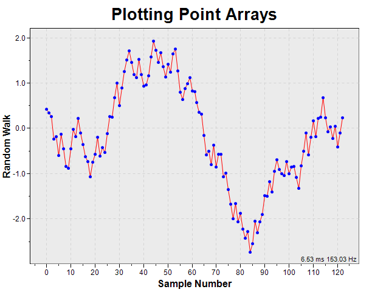

# ScottPlot Automated Test Sequence
_Figures are generated by [program.cs](/src/Examples/console/ConsoleApp1/Program.cs) and report by [update.py](update.py)_
## test00.png

```C#
public static void test00_directDrawLine()
{
    // create a new ScottPlot figure
    Figure fig = new Figure(640, 480);
    fig.title = "Direct Graphics Drawing";
    fig.yLabel = "Pure Awesomeness";
    fig.xLabel = "Relative Time (years)";
    fig.Axis(-15, 35, -10, 110); // x1, x2, y1, y2
    fig.BenchmarkThis();

    // draw a line directly on the Graphics object in AXIS units
    Point pt1 = new Point(fig.xAxis.UnitToPx(0), fig.yAxis.UnitToPx(13));
    Point pt2 = new Point(fig.xAxis.UnitToPx(32), fig.yAxis.UnitToPx(98));
    fig.gfxGraph.DrawLine(new Pen(new SolidBrush(Color.Blue), 5), pt1, pt2);

    // save the file
    fig.Save("test00.png");
}
```

## test01.png

```C#
public static void test01_doubleArray()
{

    // create a new ScottPlot figure
    Figure fig = new Figure(640, 480);
    fig.title = "Plotting Point Arrays";
    fig.yLabel = "Random Walk";
    fig.xLabel = "Sample Number";

    // generate data
    int pointCount = 123; // number of points which will be in this graph
    double[] Xs = gen.Sequence(pointCount); // create a series of Xs
    double[] Ys = gen.RandomWalk(pointCount);
    fig.ResizeToData(Xs, Ys, .9, .9);

    // make the plot
    fig.BenchmarkThis();
    fig.PlotLines(Xs, Ys, 1, Color.Red);
    fig.PlotScatter(Xs, Ys, 5, Color.Blue);
    
    // save the file
    fig.Save("test01.png");
}
```

