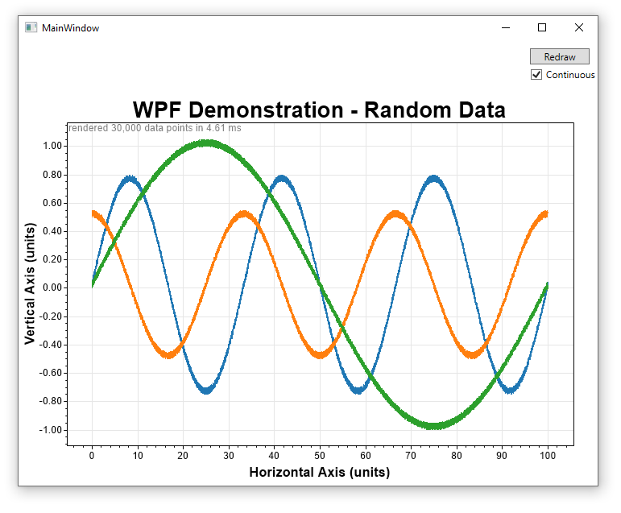

# Use ScottPlot in WPF Applications

While ScottPlot was designed for Console Applications and Windows Forms Applications in mind, a WPF example has been created. The basic concept is that you create a ScottPlot and render its output as a `Bitmap` (just like you would in a Console Application). Convert the `Bitmap` to a `BitmapImage` and apply that to the `Source` property of a `Image` object.

## Compiled Demo (EXE)
This is a compiled WPF application using ScottPlot to plot some random data.
* [ScottPlotWPFdemo.exe.zip](ScottPlotWPFdemo.exe.zip)



## XAML
```XAML
<Window x:Class="WpfLineTest.MainWindow"
        xmlns="http://schemas.microsoft.com/winfx/2006/xaml/presentation"
        xmlns:x="http://schemas.microsoft.com/winfx/2006/xaml"
        xmlns:d="http://schemas.microsoft.com/expression/blend/2008"
        xmlns:mc="http://schemas.openxmlformats.org/markup-compatibility/2006"
        xmlns:local="clr-namespace:WpfLineTest"
        mc:Ignorable="d"
        Title="MainWindow" Height="592.487" Width="734.618">
    <Grid>
        <CheckBox Name="cbContinuous" Content="Continuous" HorizontalAlignment="Right" Margin="0,35,0,0" Width="84" Checked="CbContinuous_Checked" Unchecked="CbContinuous_Unchecked" Grid.Column="1"/>
        <Button Content="Redraw" HorizontalAlignment="Right" Margin="0,10,10,0" VerticalAlignment="Top" Width="74" Click="Button_Click" Grid.Column="1" Height="20"/>
        <Canvas Name="myCanvas" Margin="0,62,0,0">
            <Image Name="imagePlot" Width="{Binding ActualWidth}" Height="{Binding ActualHeight}"/>
        </Canvas>
    </Grid>
</Window>
```

## C#
```cs
private void PlotRandomData()
{
    // create random X/Y data
    int dataPointCount = 10_000;
    double[] ys1 = new double[dataPointCount];
    double[] ys2 = new double[dataPointCount];
    double[] ys3 = new double[dataPointCount];
    for (int i = 0; i < dataPointCount; i++)
    {
        ys1[i] = .75 * Math.Sin(i / (double)dataPointCount * 2 * Math.PI * 3) + rand.NextDouble() / 20;
        ys2[i] = .5 * Math.Cos(i / (double)dataPointCount * 2 * Math.PI * 3) + rand.NextDouble() / 20;
        ys3[i] = Math.Sin(i / (double)dataPointCount * 2 * Math.PI * 1) + rand.NextDouble() / 20;
    }

    // create the scottPlot and render it onto a Canvas
    ScottPlot.Plot sp1 = new ScottPlot.Plot((int)myCanvas.ActualWidth, (int)myCanvas.ActualHeight);
    sp1.data.AddSignal(ys1, 100);
    sp1.data.AddSignal(ys2, 100);
    sp1.data.AddSignal(ys3, 100);
    sp1.settings.title = "WPF Demonstration - Random Data";
    sp1.settings.benchmarkShow = true;
    sp1.settings.AxisFit();
    System.Drawing.Bitmap bmp = sp1.figure.GetBitmap(true);
    BitmapImage bmpImage = bmpImageFromBmp(bmp);
    imagePlot.Source = bmpImage;
}

public BitmapImage bmpImageFromBmp(System.Drawing.Bitmap bmp)
{
    System.IO.MemoryStream stream = new System.IO.MemoryStream();
    ((System.Drawing.Bitmap)bmp).Save(stream, System.Drawing.Imaging.ImageFormat.Bmp);
    BitmapImage bmpImage = new BitmapImage();
    bmpImage.BeginInit();
    stream.Seek(0, System.IO.SeekOrigin.Begin);
    bmpImage.StreamSource = stream;
    bmpImage.EndInit();
    return bmpImage;
}
```