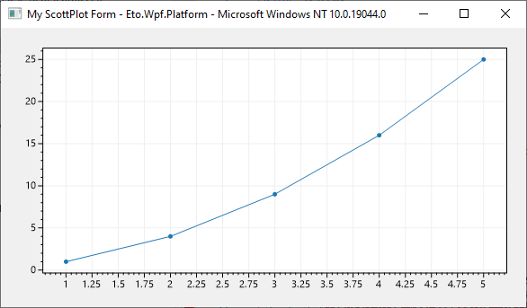
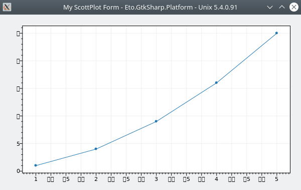

**ScottPlot is a free and open-source plotting library for .NET** that makes it easy to interactively display large datasets. This package provides an Eto control for interactive manipulation of ScottPlot plots.

## Eto Quickstart

Use NuGet to install [`ScottPlot.Eto`](https://www.nuget.org/packages/ScottPlot.Eto), then add a `ScottPlot.Eto.PlotView` Control to your Form or Container by using the following example:  
```cs
   var eto_platform = Eto.Platform.Instance.ToString();
   var os_platform = System.Environment.OSVersion.ToString();
   this.Title = $"My ScottPlot Form - {eto_platform} - {os_platform}";

   var plotView = new ScottPlot.Eto.PlotView();

   double[] xs = new double[] { 1, 2, 3, 4, 5 };
   double[] ys = new double[] { 1, 4, 9, 16, 25 };
   plotView.Plot.AddScatter(xs, ys);

   this.Content = plotView;
```




## ScottPlot Cookbook

The [**ScottPlot Cookbook**](https://swharden.com/scottplot/cookbook) demonstrates how to create line plots, bar charts, pie graphs, scatter plots, and more with just a few lines of code.

[](https://swharden.com/scottplot/cookbook)